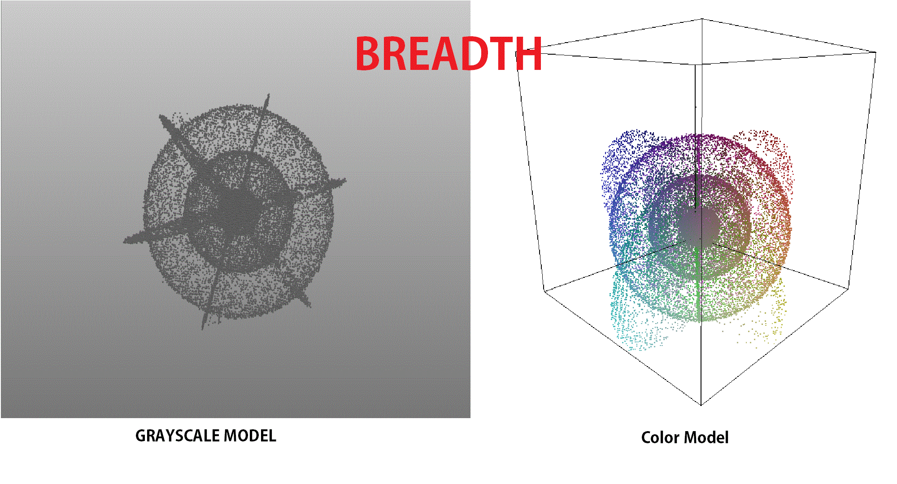
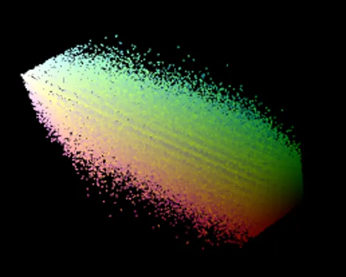

# 3D composite
A 3D composite is created by plotting the colors of each pixel in a [composite image](Video_Composites "wikilink") on a 3D graph, mapping RGB values to XYZ positions.

Many of the video composites produce shapes in 3D. For example, [BREADTH](BREADTH "wikilink") is an atom-like shape with nested spheres of increasingly higher density, surrounded by 3 rings. And [JALVINSACH](JALVINSACH "wikilink") has the outline of some cubes.

## Viewing
The "path=" file can be changed to any other .stl file on tomasf's website:
> `http://tomasf.se/projects/semi/stl.html?path=(NAME OF COMPOSITE)_composite3D.stl`
>
> Like <http://tomasf.se/projects/semi/stl.html?path=BREADTH_composite3D.stl>

Slower, but with color and alternate viewing modes: <https://unfavorablesemicircle.github.io/3d-viewer/>

3D composites can also be produced with MATLAB or Octave.

## Arrows
Some 3D composites seem to contain an arrow shape similar to the ♐ symbol for Saggitarius. It is unknown if this is intentional but it could be representing the Saggitarius (latin for *archer*) arrow which appears so often in video titles.

## See also
* [Composite visual overview](Composite_visual_overview))
