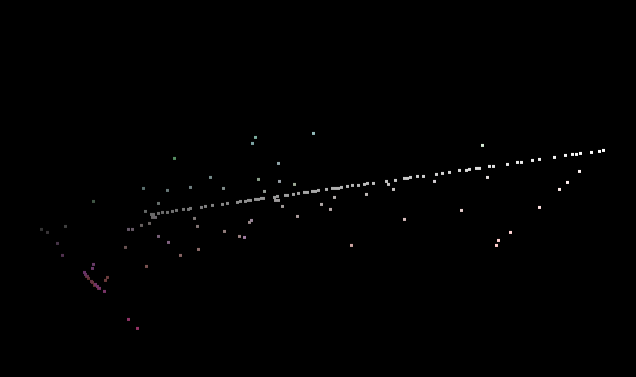

# ♐574016

♐574016 is a video posted to the [Twitter](Twitter "wikilink") account on June 16, 2016.

## Description of video

The video is 0:26 in duration. the video contains a series of colored
frames, in the "classic" mode. It's notable for being a
longer-than-usual video for twitter and not explicitly a part of any
series. It was posted after a month-long hiatus in postings on the
twitter account, shortly after the posting of ♐NIL 30662 (the belated
last tweet in the ♐[NIL](NIL "wikilink") series) and ♐658427.

## Audio

♐574016 has a [Handshake](Handshake "wikilink") at the start, and the
[Unknown Voice](Unknown_Voice "wikilink").

## Composite Image

### actual size

### enlarged

## 3-D Composite

## Link to tweet

<https://twitter.com/unfavorablesemi/status/743534572923719680>
