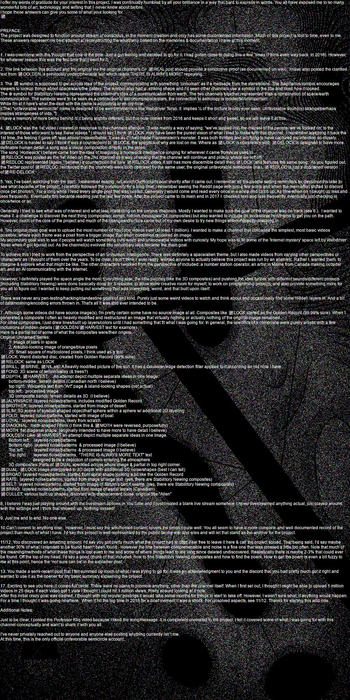
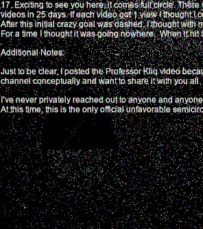

# ♐️ANSWERS

♐️ANSWERS was the title of a tweet posted to the ([@unfavorablesem](https://twitter.com/unfavorablesem)) Twitter account on June 9, 2022. It was in respose to a list of questions submitted by Discord users (see below) and _prima facie_ brings closure to the mysteries of Unfavorable Semicircle. (Though see "Questions of Authenticity" below.)

## Transcription of text in image

_**Note:** for additional clarity the questions that triggered these responses are included **in bold** before the responses._

> <code>I offer my words of gratitude for your interest in this project. I was continually humbled by all your brilliance in a way that hard to express in words. You all have exposed me to so many wonderful bits of art, technology, and writing that I never knew about before. </code>

> <code>I hope these answers can give you some of what your looking for.</code>

> <code>♐</code>

> <code></code>

> <code>PREFACE:</code>

> <code>The project was designed to function around stream of conscious, in the moment creation and only has some documented information. Much of this project was lost to time, even to me. These answers represent my best attempt at reconstructing the what/why based on the memories & documentation I have at this moment.</code>

**1. Why did you decide to come public now?**

> <code>1. I was overcome with the thought that now is the time. Just a gut feeling and decided to go for it. I had gotten close to doing this a few times (I think even way back in 2016). However, for whatever reason this was the first time that I went for it.</code>

**2.  If you are truly UFSC, can you share conclusive proof? Source-code and a source-image (“composite”) that result in a reproducible video, for example? Or how to find something new in the videos the community isn’t already aware of?**

> <code>2. The link between this account and the original via the original channel's G+ ♐REAL post should provide a conclusive proof (as documented on wiki). I have also posted the clarified text from ♐GOLDEN, a previously undecipherable text which reads "THERE IS ALWAYS MORE" repeating.</code>

**3.  What is the meaning of sagittarius and gemini for the project?**

> <code>3. The ♐ symbol is supposed to get across idea of the project communicating something "unhuman" as if a message from the stars/aliens. The Sagittarius symbol encourages viewers to lookup things about space/stars/the galaxy. The symbol also had a striking shape and I'd seen other channels use a symbol in the title and liked how it looked.</code>

> <code>The ⊕ symbol for Stabilitory Newing represented the channel's idea of a communication from earth. The two channels together represented then a combination of space/earth communication. The symbols were to be seen as a connection to astronomy/space/stars, the connection to astrology is incidental/unimportant.</code>

> <code>While I'm at it here's what the deal with the name is according to an old note:</code>

> <code>[(The) "unfavorable semicircle" name is designed to be weird/mysterious like Webdriver Torso. It implies ½ of the picture is only ever seen. Unfavorable sound(s) strange/perhaps implies strangeness of vids. "]</code>

> <code>I have a memory of more being behind it/ it being slightly different, but this note comes from 2016 and keeps it short and sweet, so we will leave it at this.</code>

**4.  What is the relationship between LOCK, DELOCK, and REDLOC?**

> <code>4. ♐LOCK was the 1st video I created in response to the channels attention. It was mainly a way of saying: "we've tapped into the interest of the people/we've locked on" to the interest of those who want to see these videos." I should say I think ♐LOCK may have been the purest vision of what I tried to make with this channel. I remember watching it back the 1st time, the feeling it gave off was almost indescribable. It was as if I had made Frankenstein's monster. It was both thrilling and terrifying to have captured my intention so closely. </code>

> <code>♐DELOCK is harder to say. I think it was a counterpoint to ♐LOCK, the specifics of why are lost on me. Where as ♐LOCK is completely wild, ♐DELOCK is designed to have more definable human detail: a song and a visual composition directly in the video.</code>

> <code>The song 'Homesick' I believe came from the idea of imagining a homesick intelligence longing for wherever it came from was used to.</code>

> <code>♐RELOCK was posted as the 1st video on the 2nd channel as a way of saying that the channel will continue and pickup where we left off.</code>

> <code>♐REDLOC represented (again, i believe) a counterpoint to the new ♐RELOCK video. It still has more discernible detail than ♐LOCK and features the same song. As you figured out, the Twitter post of ♐REDLOC reinforced that the channels were both operated by the same user, the original unfavorable semicircle (me). ♐REDLOC is just a shortened version of ♐RE-DELOCK.</code>

**5.  The community has suspected there was some back-and-forth between people trying to solve the project and UFSC. Were you actively watching the solving effort? If so, what were your thoughts and how did it affect the ongoing project?**

> <code>5. Yes, I've been watching from the start. I remember seeing /u/LaunchOurRockets' post shortly after it came out. I remember all the people setting reminders for days/months later to see what became of the project. I carefully followed the community for a long time. I remember seeing the Reddit page with just a few posts and when the main effort shifted to discord (nice pet photos!). For a long while I read every single post that was posted. Generally I would come and read every once in a while and catch up. As time when on I caught up less and less frequently. Eventually this became reading just the last few posts. After the project came to its main end in 2017 I checked less and less frequently, eventually just checking in once/twice or so.</code>

> <code>Generally I tried to see what was of interest and what less interesting on the various channels. Mostly I wanted to make sure the goal of the channel was on track (see 6.). I wanted to make it a challenge to discover the next thing (composites, songs, hidden messages/ 3d composites) but also wanted to include an occasional hint/theme to get you on the path.</code>

> <code>However, much of the core of the project and much of the changes/structure came out of my own desire to try new things without directly checking in.</code>

**6.  What was the goal of UFSC?**

> <code>6. The original main goal was to upload the most number of YouTube videos ever (at least 1 million). I wanted to make a channel that uploaded the simplest, most basic videos possible, where each frame was a pixel from a bigger image that when combined rendered an image.</code>

> <code>My secondary goal was to see if people will watch something truly weird and unknowable videos with curiosity. My hope was to fill some of the 'Internet mystery' space left by Webdriver Torso when it got figured out. As the channel(s) evolved this secondary idea became the main goal.</code>

> <code>To achieve this I tried to work from the perspective of an unhuman intelligence. There was definitely a space/alien theme, but I also made videos from varying other perspectives or 'characters' as I thought of them over the years. To be clear, I don't think I ever really wanted anyone to actually believe this project was run by an alien/etc. Rather I wanted them to imagine & explore what that might be like. The other characters I worked from the perspective of included: a number station operator, an artist in Maine from Canada making outsider art, and an AI communicating with the Internet.</code>

> <code>However, I definitely played the space angle the most. Everything else, the little puzzles (like the 3D composites) and pushing the idea further with different sounds/different projects (including Stabilitory Newing) were done basically done for 3 reasons: to allow more creative room for myself, to work on programming projects, and also provide something more for you all to figure out. I wanted to keep putting out something that was interesting, weird, and that built upon itself.</code>

> <code>There was never any pen-testing/hacking/clandestine goals of any kind. Purely just some weird videos to watch and think about and occasionally find some hidden layers in. And a bit of datamoshing/encoding errors thrown in. That's all it was and ever intended to be.</code>

**7.  What's the source image(s) for each composite?**

> <code>7. Although some videos did have source image(s), I'm pretty certain some have no source image at all. Composites like ♐LOCK started as the Golden Record (99.99% sure). When I generated a composite I often so heavily modified and restructured an image that virtually nothing or actually nothing of the original image remained.</code>

> <code>For other composites, I just drew lines/built up layers/colors until I had something that fit what I was going for. In general, the specifics of a composite were purely artistic with a few inclusions of hidden details (♐GOLDEN/♐HARVEST text for example).</code>

> <code>Here is a partial list of some of what the composites were/their origins.</code>

> <code>Original Unnamed Series:</code>

> <code>    1: Image of stars in space</code>

> <code>    2: Arecibo-looking image of orange/blue pixels</code>

> <code>    25: Small square of multicolored pixels, I think used as a test</code>

> <code>♐LOCK: Weird distorted disc, created from Golden Record (99% sure)</code>

> <code>♐RELOCK: same as LOCK</code>

> <code>♐BRILL, ♐BRINE, ♐NIL etc: A heavily modified picture of the sun. It has a Gaussian/edge detection filter applied to it according to an old note I have.</code>

> <code>♐FOND: 3D scene of terrain/valley (& trees?)</code>

> <code>♐DEPTH, ♐HARVEST: An attempt depict multiple seperate ideas in one image.</code>

> <code>    bottom-middle: terrain details (Canadian north I believe</code>

> <code>    top right: Wikipedia text from "Art" page and island-looking shapes (not actual)</code>

> <code>    top left: processed image</code>

> <code>    3D composite bands: terrain details as 3D (I believe)</code>

> <code>♐JALVINSACH: layered noise/patterns, includes modified Golden Record</code>

> <code>♐BROTHER: layered noise/patterns, started from image of desert</code>

> <code>♐SLIM: 3D scene of eyeball shaped object/half sphere within a sphere w/ additional 2D layering</code>

> <code>♐FOLD: layered noise/patterns, started with image of boat</code>

> <code>♐LOYAL: layered noise/patterns, likely from scratch</code>

> <code>♐DIAGONAL: moth-shaped I think (I think this & ♐MOTH were reversed, purposefully)</code>

> <code>♐MOTH: flat diagonal shape (originally intended to have more to have detail I believe)</code>

> <code>♐GOLDEN: Like ♐HARVEST an attempt depict multiple seperate ideas in one image.</code>

> <code>    Bottom left: layered noise/patterns</code>

> <code>    Bottom right: layered noise/patterns & processed image (I believe)</code>

> <code>    Top left: layered noise/patterns & processed image (I believe)</code>

> <code>    Top right: layered noise/patterns, "THERE IS ALWAYS MORE TEXT" text</code>

> <code>    designed to be a depiction of comets entering the atmosphere</code>

> <code>    3D composites: Parts of ♐DUAL speckled across whole image & partial in top right corner.</code>

> <code>♐DUAL: ♐LOCK image interpreted to 3D depth with additional 3D noise/shapes (best I can tell)</code>

> <code>♐BROAD: layered noise/patterns, started from spiral shape looking a bit like the Golden Record</code>

> <code>♐RATE: layered noise/patterns, started from image of large text (yes, there are Stabilitory Newing composites)</code>

> <code>♐BELT: layered noise/patterns, started from image of Saturn's belt it seems (yes, there are Stabilitory Newing composites)</code>

> <code>♐BRING: layered noise/patterns, started from image of aerial terrain (Canadian)</code>

> <code>♐CULLET: various built up shapes, disoriented with displacement noise, original title "Allen"</code>

**8.  What was on the livestream everyone missed?**

> <code>8. I believe I was just playing around with the livestream options in YouTube and it just created a blank live stream somehow. I never livestreamed anything actual, just played around with the settings and I think that showed up. Nothing missed!</code>

**9.  Was this a solo effort or were multiple people involved, directly or indirectly?**

> <code>9. Just me end to end. No one else.</code>

**10.  Would you be willing to release an archive of all the content created for UFSC? Many would appreciate a centralized location to explore, admire, and mess about with this material.**

> <code>10.Can't commit to anything else. However, I must say the wiki/hosted content covers the project quite well. You all seem to have a more complete and well documented record of the project than much of what I have. I'd say this project is well represented by the public facing wiki and sites and will let that stand as the archive for the project.</code>

**11. You mention a poem that wasn’t found, what else did you intend to be found that wasn’t?**

**12.  How much did we get right? How much have we missed?**

> <code>11/12. You discovered an amazing amount. I'd say you got pretty much what the project had to offer. Feel free to leave it here and call the project solved. That being said, I'd say maybe another 30% of what I intended to be found hasn't been found. However the line between comprehensible and noise is a fine one that was crossed a little too often. Note that much of the meaning/methods of what these things is lost even to me and some of where things lead to are long since deleted undiscovered. Realistically there is maybe 2-3% that could ever be found. Off the top of my head, I'd say a good chunk of that includes: how to find Stabilitory Newing composites and how to find the poem. How to get to the poem is even a bit fuzzy to me at this point, hence the 'not sure can be' in the explainer post.</code>

**13.  Why did you quote me out of nowhere? It was past midnight and I get a ping suddenly UFSC comes out of nowhere and tweets what I said in Discord months ago lol**

> <code>13. You made a semi-recent post that I felt summed up much of what I was trying to go for. It was an acknowledgement to you and the discord that you had pretty much got it right and wanted to use it as the opener for my basic summary explaining the project.</code>

**17.  Hey, I'm /u/LaunchOurRocket, the Reddit user who "discovered" your work back in 2015. I found your original channel totally by accident, and I'm wondering... Did you start uploading with a plan to promote anything? How long did you think it would take for your project to get noticed? Are there aspects of it people still haven't solved?**

> <code>17. Exciting to see you here, it comes full circle. There were no plans to promote anything, other than the channel itself. When I first set out, I thought I might be able to upload 1 million videos in 25 days. If each video got 1 view I thought I could hit 1 million views. Pretty absurd looking at it now.</code>

> <code>After this inital crazy goal was dashed, I thought with my regular postings it would take some months for things to start to take off. However, I wasn't sure what, if anything would happen.</code>

> <code>For a time I thought it was going nowhere. When it hit the big time in 2016 for a brief moment it was a shock. For unsolved aspects, see 11/12. Thanks for starting this wild ride.</code>

> <code></code>

> <code>Additional Notes:</code>

> <code></code>

> <code>Just to be clear, I posted the Professor Kliq vieo because I liked the song/message. It is completely unrelated to the project. I felt it covered some of what I was going for with this channel conceptually and want to share it with you all.</code>

> <code></code>

> <code>I've never privately reached out to anyone and anyone else posting anything currently isn't me.</code>

> <code>At this time, this is the only official unfavorable semicircle account.</code>

_transcription by Discord user &&_

## Full list of submitted questions

_see_ [unfavorablesem AMA](unfavorablesem_AMA)

## Revelations from this message

- that there are unfound [Stabilitory newing](Stabilitory_newing) composites
- that there is a "hidden poem" somewhere in the videos
- "There was never any pen-testing/hacking/clandestine goals of any kind."

## Questions of authenticity

Further research (and, ultimately, personal opinion) will determine if this poster is the "real" maker of UFSC. It is not impossible that the "legitimate" Twitter account was hacked or taken control of by a third party, so the internal evidence and "new" revelations from the tweets will have to be weighed to determine whether or not this was a reliable account.

The possibility that this message was written by one member of a larger team or someone only tangentially connected to the original creators (perhaps oven without their full consent) has also been discussed.

One of the main arguments against the authenticity of the message is the missed opportunity to hand over proof in the form of details about the methods and tools used to create the videos, which would have established the author as genuine. Whether this was deliberately done out of artistic integrity or because the message's author does not have access to such tools and knowledge remains unknown.

The subsequent discovery of [audio composites](audio_composites) seems to contradict the claim that no major discoveries were left to be made in the UFSC investigation.

The discovery of the claimed [Stabilitory Newing](Stabilitory_newing) composites in 2025 conversely adds to the authenticity of the message.

## Background image

Behind the text is an image "in the style of UFSC", which may warrant further analysis. Discord user noxxy observed there is a "sneaky semicircle ♐ icon in the bottom left" of the image.

