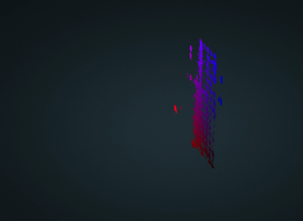
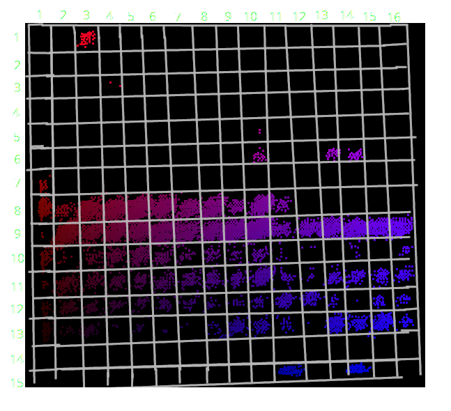

# ♐AZO

♐AZO is a series of videos uploaded to the [3rd youtube channel](3rd_youtube_channel). It began on May 3rd, 2018,
four days after ♐[NEO](NEO) was posted.
♐[DIFF](DIFF) would be posted 19 days later. It is the
first series posted since ♐[STRAND](STRAND), and the first
post-[Reset](RESET_STRANGE_YD) series on youtube. The series
has apparently ended with ♐AZO 4 on May 7th, 2018.

This video or series has a composite with an "interesting" [video scope](Video_scopes).

## Characteristics

The videos have a series of flashing solid colored frames and no audio.

Each video seems to be uploaded at the exact same time, exactly one day
apart.

The videos each have near-identical content (and generate similar 3-D
composites) but, unusually for a UFSC series, all have different
lengths:

  - ♐AZO 0 is 1:48:42 (195651 frames)
  - ♐AZO 1 is 1:40:20 (180615 frames)
  - ♐AZO 2 is 1:39:23 (178910 frames)
  - ♐AZO 3 is 1:36:31 (173745 frames)
  - ♐AZO 4 is 49:14 (88623 frames)

Discord user pamkatherabbit has observes that there are also frames with
pixels that are next to the main image (which is unusual for UFSC).

## Meaning of name

"Azo" or "AZO" has [several meanings](https://en.wikipedia.org/wiki/Azo), none of which seem
obviously connected to UFSC's usual themes.

## 2D composites

♐AZO 1 composite by Discord user kingrodian:

Discord user kingrodian has noted that when separating into color
channels, there is pretty much no data in green. (Compare and contrast
with ♐[NEO](NEO), which similarly has no blue.)

## 3D composites
♐AZO 3-D composite by Discord user Tukkek:

The 3D composite for ♐AZO is visually similar to the one for
♐[NEO](NEO), looking like a "keyboard" that is nearly flat in the third dimension.

Animation of 3D composites ♐AZO 0 to 2 by Discord user Extra:

Discord user Kingrodian has observed that the data points seem to be clustered in a 16×16 grid:

## Videos in the series
- [♐AZO 0](https://www.youtube.com/watch?v=gZ5qUx1h9m8)
- [♐AZO 1](https://www.youtube.com/watch?v=-KE9J1KpUEM)
- [♐AZO 2](https://www.youtube.com/watch?v=bHUAUa2mbLA)
- [♐AZO 3](https://www.youtube.com/watch?v=TTaNJGkTGxQ)
- [♐AZO 4](https://youtu.be/CHBKIHVsVoU)
