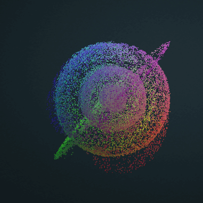
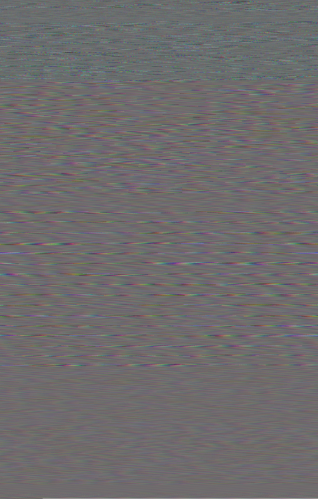
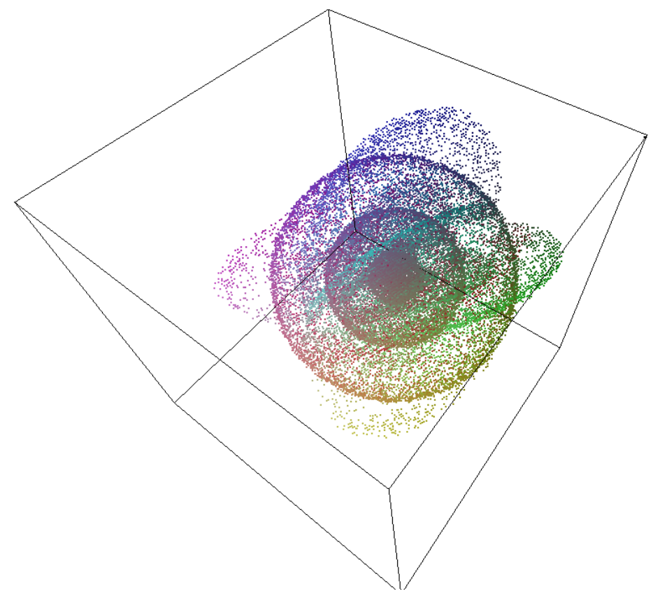

# BREADTH

## Overview
♐BREADTH is series of two videos uploaded to the second YouTube account. ♐BREADTH 0 was posted on December 5, 2016 (the day after ♐[FOLD](FOLD) was posted). ♐BREADTH 1 was posted on December 6, 2016 (the day before ♐[STEM](STEM) was posted).

This series is noteworthy for its role in the discovery of [3D Composites](3D_Composite).

An animated version generated by Extra of the 3D composite:

## Description of videos
The videos are approximately 7:18:06 in length and contain a series of rapidly-flashing frames.

The videos have a silent stereo audio track.

## Possible relationship to other UFSC videos
* "breadth" seems clearly conceptually related to ♐[DEPTH](DEPTH) (and, following on that logic, ♐[SLIM](SLIM) may be a stand-in for the third dimension.)
* another form of this same word was used for the name of the ♐[BROAD](BROAD) series.

## 2D composites
♐BREADTH composite by Thomas F:

This composite was made at 1,000 pixels in width. Tt is assumed that there is no "correct" width as the important data is in the 3D composite.

## 3D composite
Screens of 3D ♐BREADTH composite:

As a [3D Composite](3D_Composite), BREADTH forms an atom-like shape with nested spheres of increasingly higher density, and 3 disks surrounding them.

## Links
* Tomas F's composite viewer, http://tomasf.se/projects/semi/stl.html?path=BREADTH_composite3D.stl.
* ♐BREADTH 0, https://youtu.be/XXtBbxrz6Fg.
* ♐BREADTH 1, https://youtu.be/qZcRpPg44ns.
