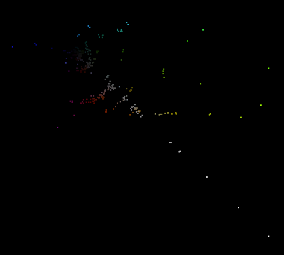

# BRILL

♐BRILL is a series of videos that was uploaded to the first and second
YouTube accounts between February 14 and March 9, 2016. The original
youtube account was suspended on February 25th, after more than
twenty-nine thousand BRILL videos were posted. The series began with
♐[BRILL B](BRILL_B "wikilink"), then began with numbered videos
counting up from ♐BRILL 0. (the last was ♐BRILL 29273.) The second
youtube account, after posting ♐[RELOCK](RELOCK "wikilink"), ♐[BRILL
49999](BRILL_49999 "wikilink") and ♐[N\* BRILL](N*_BRILL "wikilink"),
resumed from ♐BRILL 49999 (a "regular" BRILL video different than
♐[BRILL 49999](BRILL_49999 "wikilink")) and continued to ♐BRILL 50099.

## Description of video

"Typical" BRILL videos are five seconds in duration, contain a single
colored frame, and have the [Unknown Voice](Unknown_Voice "wikilink")
speaking a single letter or number.

## Composite

<http://tomasf.se/projects/semi/BRILL_composite.png>

The [BRILL Composite](BRILL_Composite "wikilink") page has more
information on the similarities to other video composites.

## 3d Composite

## Transcription

There is a transcription of these videos
[here](http://tomasf.se/projects/semi/transcription.html).

## Relationship to special ♐BRILL videos and to ♐BRINE

*is ♐[N\* BRILL](N*_BRILL "wikilink") a compilation of the individual
videos? Do the ♐[BRINE](BRINE "wikilink") videos, which create a similar
composite, have the same data? This requires further investigation.*

## Possible meanings of name

### Relationship to brill tagging

*please expand*

\[<https://en.wikipedia.org/wiki/Brill_tagger>|
<https://en.wikipedia.org/wiki/Brill_tagger>\]

### Brill.com

Apparently <https://brill.com> is a large scholarly repository. UFSC
could be using information in these videos to point to data within this
system to use as a complex cypher incapable of being easily reasoned.
Definitely worth checking out.

### Brill (fish)

Brill are a type "[species of flatfish](https://en.wikipedia.org/wiki/Brill_(fish)) in the turbot family... found... primarily in deeper offshore waters."
* this could [connect them to the astrological sign of Pisces](Astrology "wikilink").
* it also creates a connection to ♐[BRINE](BRINE "wikilink"), as brill live in saltwater.

### Hearthstone

Brill is the name of a town in the Warcraft fictional universe, also shared by [Hearthstone](Hearthstone "wikilink").
