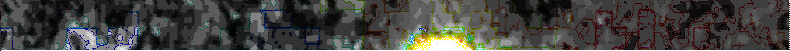
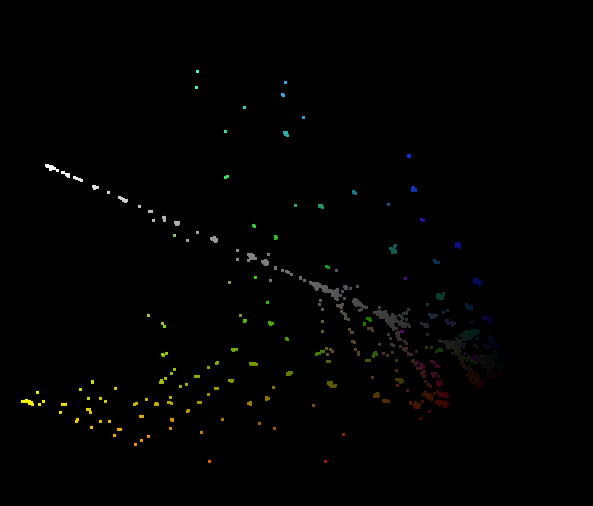

# BRILL 49999 (Long)

♐BRILL 49999 is a video posted to the second youtube account on February
25, 2016. (There is also a [short video](BRILL_49999_\(Short\) "wikilink") with the same name that is a
regular member of the [BRILL](BRILL "wikilink") series.)

{{\#ev:youtube|<https://youtu.be/HYZdgJ-7zLk>}} [Original Link](https://youtu.be/D9X9r2QYFlc)

## Description of video

The video is 21:55 in duration. It has a stereo audio track. the right
channel has data transmission sounds and the left channel has what
appears to be a distorted/warbled version of the right channel. The
audio also contains shifting amounts of [DC offset](DC_offset "wikilink").

### Spoken numbers

In the right channel, several series of numbers are spoken. At about
1:44: "8999", and about 16:35: "4999". (There are possibly more.)

However, at around 10:30 it seems that "0" is spoken in the left
channel, followed by "2999" in the right.

### Morse

At around 1:11 to 1:33 there is morse-code-like sounds. [Isolated audio](https://clyp.it/qnupmnrh)

### Visual Oddities

Discord user its a-me markio has noted that some of the "keyholes"/dots
have a trailing effect. (These may also appear in other videos — further
research is required.)

## Composite Image

<http://tomasf.se/projects/semi/BRILL49999_composite.png>

Alternate width of 789.5:

BRILL 49999 is part of the [BRILL Composite](BRILL_Composite "wikilink")
group.

## 3D Composite

## relationship to [BRILL](BRILL "wikilink") series

*please expand\!*

