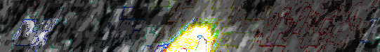
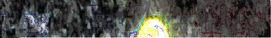

# BRINE
## Overview
♐BRINE is a [series](List_of_Series "wikilink") of sixteen videos that
was uploaded to the [second YouTube account](Real_and_Fake_channels "wikilink") between May 15 and May 23,
2016.

The videos all have a duration of 3:01 and a series of rapidly-flashing
frames.

## Composites

Regular, http://tomasf.se/projects/semi/BRINE_composite.png.

Brightness:
http://tomasf.se/projects/semi/BRINE_composite_brightness.png.

Hue, http://tomasf.se/projects/semi/BRINE_composite_hue.png.

All, http://tomasf.se/projects/semi/BRINE_composite_adjusted.png.

Alternate width of 540.5:

BRINE is part of the [BRILL Composite](BRILL_Composite "wikilink") group.

3D composite by Lukidot:

## Meaning of name
* "Brine" is one of several nautical-themed UFSC titles. (*See also ♐[HULL](HULL "wikilink") and ♐[PORT](PORT "wikilink").*)
  * Deep ocean fish (such as ♐[BRILL](BRILL "wikilink")) live in brine.

## Playback errors
Out of all the videos on Unfavorable Semicircle, this series seems to
have the most playback errors, particularly on console and mobile
devices.

## Audio
> ben's fractals: Asked a person who knows a lot more about radio stuff than i do and he said this about brine's audio:
> 
> "I feel like the file is FM like its a recording of something using FM mode"
>
> "definetly some kind of phase shift keying"

## Links
* BRINE 0, https://www.youtube.com/watch?v=cSHu0M0jJRI
* BRINE 1, https://www.youtube.com/watch?v=MJHPcdBuQFo
* BRINE 2, https://www.youtube.com/watch?v=8IFXh_87c4o
* BRINE 3, https://www.youtube.com/watch?v=-q9aFyZcgJ0
* BRINE 4, https://www.youtube.com/watch?v=KuEb_ktmZmg
* BRINE 5, https://www.youtube.com/watch?v=C_fsWfDX8nU
* BRINE 6, https://www.youtube.com/watch?v=VoyCqn0jlRU
* BRINE 7, https://www.youtube.com/watch?v=SbhVt0VKPvM
* BRINE 8, https://www.youtube.com/watch?v=dM17sYXXLos
* BRINE 9, https://www.youtube.com/watch?v=rLtAuguFtAA
* BRINE 10, https://www.youtube.com/watch?v=rwZ-JWuLaM0
* BRINE 11, https://www.youtube.com/watch?v=ME2x6UiUoOM
* BRINE 12, https://www.youtube.com/watch?v=2bkOyzaMo2E
* BRINE 13, https://www.youtube.com/watch?v=Q9sb5h0kGPo
* BRINE 14, https://www.youtube.com/watch?v=U0pb1JXuftk
* BRINE 15, https://www.youtube.com/watch?v=QwgQQwZwipk

All links are now defunct due to the "[strange reset](RESET_STRANGE_YD "wikilink")".
