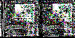
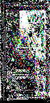

# BRING

##Table of Contents
- [BRING](#bring)
  * [Overview](#overview)
  * [Description of video](#description-of-video)
  * [Audio & analysis](#audio---analysis)
  * [Significance of name and relationship to other videos](#significance-of-name-and-relationship-to-other-videos)
  * [Composites](#composites)
    + [2D Composite](#2d-composite)
    + [3D Composite](#3d-composite)

## Overview

♐BRING is a video posted to the second youtube account on June 2, 2017.
It was the first video posted on the main account since
♐[LANYARD](LANYARD), twenty-one days earlier. In the
interim, ⊕[RATE](RATE) and ⊕[BELT](BELT) were
posted to [Stabilitory newing](Stabilitory_newing).

## Description of video

The video is 6:10 in length, with a series of rapidly-flashing frames in
the "traditional" UFSC style.

## Audio & analysis

The audio is in mono, with a heavily-distorted track. (The audio is
5.736 dB above clipping.)

## Significance of name and relationship to other videos

The significance of the name 'bring' is as yet unclear. It falls into an
unusually number of series and videos that begin with the letters B and
R (♐[BRILL](BRILL), ♐[BRINE](BRINE),
♐[BROTHER](BROTHER), ♐[BREADTH](BREADTH), and
♐[BROAD](BROAD)).

At 6:10, the video is identical in length to the videos in [Stabilitory newing](Stabilitory_newing)'s contemporaneous ⊕[BELT](BELT)
series.

* The name could also be a reference to [Erland Samuel Bring](http://www-history.mcs.st-and.ac.uk/Biographies/Bring.html), a
Swedish mathematician, historian and astronomer who is remembered for the development of the algebraic concept known as [Bring radicals](https://en.wikipedia.org/wiki/Bring_radical).

## Composites

### 2D Composite

*♐BRING composite by extra, width 147 pixels*

*♐BRING composite by extra, width 73.5 pixels*

### 3D Composite

*videos of this style generally do not create 3-D composites.*
