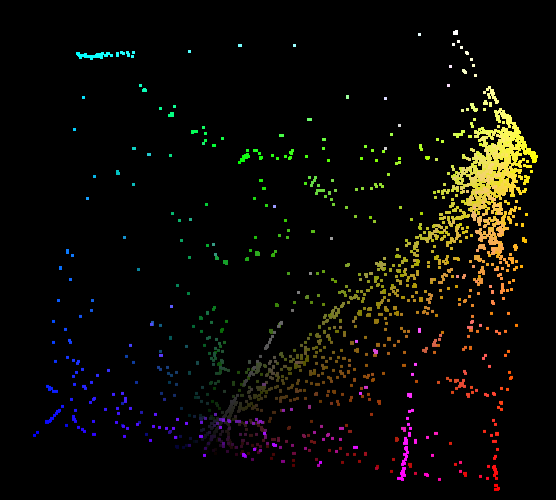

# BROAD

♐BROAD is series that was uploaded to the second YouTube account. ♐BROAD
0 was posted on March 30, 2017 (the day after ♐[HULL](HULL "wikilink")
was posted). The series has apparently ended with the posting of ♐BROAD
9 on April 4, 2017. This was the last video posted before a 38-day
"pause" from UFSC, when ♐[LANYARD](LANYARD "wikilink") was posted.

## Description of videos

♐BROAD videos are 55:33 (3,333 seconds and 100,000 frames) in length and
contains a series of rapidly-flashing frames.

### Audio analysis

The audio is a mono track of a thrumming noise, which gets more intense
about sixteen minutes in. There is a two-second gap of silence just
before the 33 minute mark, and the final section (2:13 in duration) is
silent.

Testing has shown that the audio in ♐BROAD 0 to 4 are identical.

## Possible relationship to other UFSC videos

  - ♐[BREADTH](BREADTH "wikilink") is derived from the word "broad".

## 2D Composite
♐BROAD composite (0 to 9):

A "narrow" version of the composite where empty (black) lines and columns are progressively removed:

Possible text from the narrow composite ("DOG" and "LUNA")?:

> Broomstick: i can almost see "DOG" and "LUNA" out of both of those
> 
> tukkek: isnt there a hero called Luna who rides a dog in DOTA... a game originally released as a mod for Warcraft 3, which is in the same universe as [Hearthstone](Hearthstone)...? 

## 3D composite

## Links
* ♐BROAD 0, https://youtu.be/pyxlwyGrvPI.
* ♐BROAD 1, https://youtu.be/oYn8rNQxlCo.
* ♐BROAD 2, https://youtu.be/iK4Zf3eGEwY.
* ♐BROAD 3, https://youtu.be/vG40u3OFTd0.
* ♐BROAD 4, https://youtu.be/EHeIMy7TvOI.
* ♐BROAD 5, https://youtu.be/jWc3-9pE4Jw.
* ♐BROAD 6, https://youtu.be/h-bQJxa26t4.
* ♐BROAD 7, https://youtu.be/8KFRu4IzcC0.
* ♐BROAD 8, https://youtu.be/6FLRRkIP7Yc.
* ♐BROAD 9, https://youtu.be/I1n5TaloJZ0.
