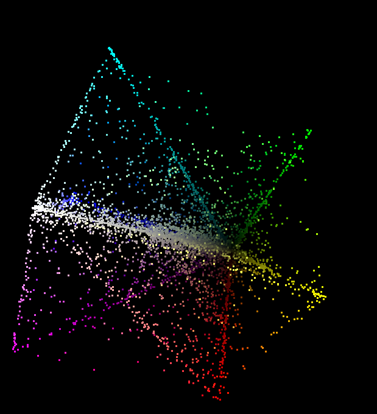

# BROTHER
## Overview
♐BROTHER is a series of videos uploaded to the second YouTube account.
♐BROTHER 0 was posted on September 23, 2016 (the same date as
♐[RECOVER](RECOVER)) and ♐BROTHER 15 was posted on October
5, 2016. After a short silence, the series was followed by
♐[HARVEST](HARVEST) on October 10, 2016. Although it was
assumed that set of sixteen videos meant the series was complete,
♐BROTHER 16 was posted on November 14, 2016.

⊕BROTHER is also the first series posted to the [Stabilitory newing](Stabilitory_newing) channel.

## Description of main channel videos
The videos have a duration of 6:05 (on youtube) and a series of
rapidly-flashing frames.

This series' videos also have a stereo audio track with different sounds
in L and R channels. (Discord user 59ekim has noted "the left channel is
a square wave merged with the right channel's audio"). The audio in
♐BROTHER 1 appears to be a more distorted version of the audio in
♐BROTHER 0. Further analysis is required on the audio in this series.

## 2D composite
Combined and complete ♐BROTHER composite (to ♐BROTHER 31):

## 3D composite

## Significance of composite image
There appears to be an image of a flat key on the left side of the
composite; the shape to the right of it can be interpreted as a
three-dimensional object.

## Irregularities
- Two identical versions of ♐BROTHER 2 were uploaded eight hours apart.
- There was a gap of more than a month between ♐BROTHER 15 + ♐BROTHER 16

## Stabilitory newing series
[Stabilitory newing](Stabilitory_newing) posted 56 videos (0-55), titled with a leading ⊕. There may be some "fraternal" relationship between the two series.

### Description of Stabilitory newing videos

- Many of the Stabilitory newing videos have identical audio to each other
- Some of the audio produces French or English auto-generated subtitles on YouTube.
- ⊕BROTHER 55 seems to have issues playing past 1:39, despite having a length of 3 minutes.

### Auto-generated subtitles in Stabilitory newing BROTHER videos
Classification of audio based on the aforementioned French and English subtitles (⊕BROTHER X).

~~~
au retour… 0 3 6 11 20 28

all roar oh 1 10

2x oh 2 8 19 25 49 52

pour un oui 4 12 14 33 40

3x oh 5 7 18 26 41 46 47

NO SUBS 9 16 22 30 34

public le rens 13 24 27 29 42 43 44

vie pour perdre 15 17 21 23 31 36 51

NO SUBS2 32 35 37 38 39 50

rien pour un oui 45 55

Oh 400 48 53 54
~~~

### Composite
> N25_CT13: brother, 100x100, third column

## Possible astrological connections
The [astrological sign of Gemini](https://en.wikipedia.org/wiki/Gemini_(astrology)) is, by its nature, associated with brothers.

## Links
* [Recursive composites](recursive_composites)
* [Astrology](Astrology)
* ♐BROTHER 0, https://youtu.be/CZhfDh5QtAM
* ♐BROTHER 1, https://youtu.be/r0NhOvQXavo
* ♐BROTHER 2 (first upload), https://youtu.be/mRR3qssmF3A
* ♐BROTHER 2 (second upload), https://youtu.be/hgxBC1Y5h30
* ♐BROTHER 3, https://youtu.be/4hHBEJe_AB8
* ♐BROTHER 4, https://youtu.be/jM4zcHTybY8
* ♐BROTHER 5, https://youtu.be/4k3CtSNqLpc
* ♐BROTHER 6, https://youtu.be/5PzB1DL5KKY
* ♐BROTHER 7, https://youtu.be/zz1m9m-Z_J4
* ♐BROTHER 8, https://youtu.be/TSJS2Tux95U
* ♐BROTHER 9, https://youtu.be/x7lt_iEtQG8
* ♐BROTHER 10, https://youtu.be/LPsA5KCyuoI
* ♐BROTHER 11, https://youtu.be/443Tj72UZvg
* ♐BROTHER 12, https://youtu.be/ojxlJhr1wyk
* ♐BROTHER 13, https://youtu.be/RTZT2m-RAh0
* ♐BROTHER 14, https://youtu.be/jz1WXkZGYEY
* ♐BROTHER 15, https://youtu.be/-jx_EEKHnVQ
* ♐BROTHER 16, https://youtu.be/iWv53T1IVas
* ♐BROTHER 17, https://youtu.be/5TryJ7ScD74
* ♐BROTHER 18, https://youtu.be/KDxIJmJy-aM
* ♐BROTHER 19, https://youtu.be/uqLijLJ36FQ
* ♐BROTHER 20, https://youtu.be/-M6BWNAGWT4
* ♐BROTHER 21, https://youtu.be/hT7RonpeX4k
* ♐BROTHER 22, https://youtu.be/MWOHihtED7k
* ♐BROTHER 23, https://youtu.be/csGSins5kFk
* ♐BROTHER 24, https://youtu.be/ViokMyFr-f4
* ♐BROTHER 25, https://youtu.be/xi9FUkLsKCk
* ♐BROTHER 26, https://youtu.be/V84aPCDjqwo
* ♐BROTHER 27, https://youtu.be/1IiWzMVIowU
* ♐BROTHER 28, https://youtu.be/nxtei2UZlY8
* ♐BROTHER 29, https://youtu.be/i4NuIORIwvI
* ♐BROTHER 30, https://youtu.be/hDrvoif4X64
* ♐BROTHER 31, https://youtu.be/mibS4C4fdSM
