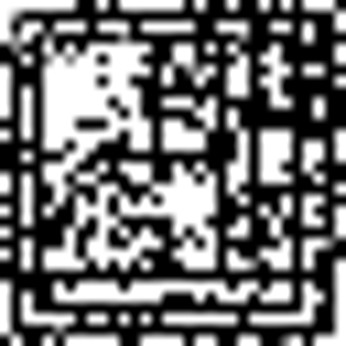
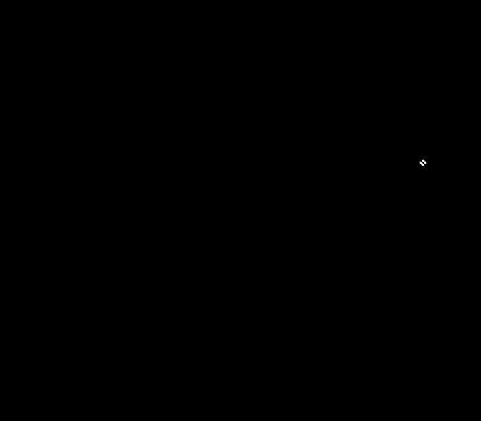

# CAB

♐CAB is a series of videos that was uploaded to on
March 26, 2016. It is the fourth series posted in the Twitter account
and a departure from the earlier ones. It was posted during a busy
period for UFSC that included ♐[ZUFCHO](ZUFCHO "wikilink"),
♐[LONE](LONE "wikilink"), ♐[WINGSET](WINGSET "wikilink"),
♐[RETIO](RETIO "wikilink") and ♐[LIMIT](LIMIT "wikilink") on the main
channel (as well as the ♐[MUL](MUL "wikilink") series on Twitter).

The videos in this series differ from the "classic" UFSC style: they are
slightly longer at five seconds and the [Unknown Voice](Unknown_Voice "wikilink") has been replaced by a series of
static-laden bursts.

Cab is one of the earliest series to feature the [handshake](Handshake), being up-loaded a week or-so after its debut in [Zufcho](ZUFCHO). Cab 267, for example ends with a hand-shake.

## "It's binary"

[Investigation confirmed](https://www.reddit.com/r/UnfavorableSemicircle/comments/4c8jjk/its_binary/)
that the CAB files contained audible binary (*i.e.* were broken into
eight "bits" that were on or off). It was further observed that there
were nineteen distinct binary patterns. An [online spreadsheet](https://docs.google.com/spreadsheets/d/1FllOeyy1GVwHB6AXcAHcHV5RTWfzRmc9wmlYG0BEa5E/edit#gid=0)
was created to document the transcription of the files.

What these bytes combine into is not yet known.

.

## Possible meanings

CAB is also an [archive file format](https://en.wikipedia.org/wiki/Cabinet_\(file_format\)), although
it was determined that the data in these files does not conform to the
format. (citation needed)

## Composites

Created from each frame of all CABs ("using all of the frames from every video for each pixel"):

> N25_CT13: CAB composite. Gray pixels are the missing videos from the archive.  I used the videos' mode value of each pixel for the first frame, like the most used color.

### 3D composite

