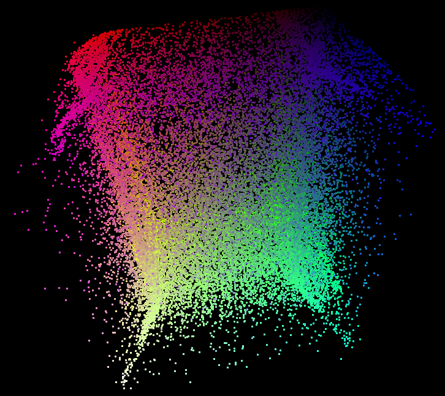

♐CFO is a video posted to the [3rd youtube channel](3rd_youtube_channel "wikilink") on August 17, 2018. It was
posted 83 days (or 2 months and 22 days) after ♐[DIFF](DIFF "wikilink").
It is 1:05:56 in length and consists of a series of flashing colored
frames. ♐[GEN](GEN "wikilink") would follow 58 days later.

{{\#ev:youtube|<https://www.youtube.com/watch?v=dklWhhjfArs>}}

## Audio

This video has no audio.

## Composite

### 2-D Composite

(*composite by discord user mark america great again*)

It has been noted by Discord user ShadowMorphyn that there are three
sphere distortions in this composite.

### 3-D Composite

(*3-D composite by discord user tukkek*)

(*3-D composite by discord user tukkek – alternate rendering*)

It has been noted by Discord user tukkek that the 3-D composite has "an
internal structure... \[that\] looks like a cradle".

## Possible Meanings of Name

  - [Chief financial officer](https://en.wikipedia.org/wiki/Chief_financial_officer)
  - [Carrier frequency offset](https://en.wikipedia.org/wiki/Carrier_frequency_offset)
  - "Child Furniture Object", as suggested by Discord user
    HolySnickerPuffs
