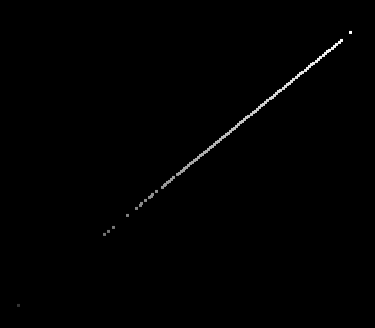

# COEF

♐COEF is a video posted to the [3rd youtube channel](3rd_youtube_channel "wikilink") account on March 29, 2018. It
is 4:12 long and contains a series of rapidly-flashing images. It was
posted three days after ♐[ZORO](ZORO "wikilink") was posted and deleted.
♐[NEO](NEO "wikilink") would follow it one month later.

{{\#ev:youtube|<https://youtu.be/GJvERY41FqA>}}

## Audio
The audio track contains a constant, very loud stream of sounds. Discord user Unstable Olding notes that "it seems like a combination of PORT, RETIO and the voice used in DEPTH".

> ben's fractals: The audio in COEF sounds like someone playing with the delay time of a high-feedback comb filter(or delay)
>
> Because at many points it goes to that annoying high pitch frequency probably meaning that Unfavourable semicircle reached the min. possible delay time for it
>
> I'm gonna do a quick example in FL studio
>
> Not exactly very close but it's sort of there - 4 different comb filters on top of one another where i change the frequency of them in realtime

https://github.com/ufscwiki/Unfavorable-Semicircle-Wiki/tree/master/docs/COEF.flac

## Composites

(*COEF unadjusted composite by discord user Mark Aardvark*)

(*COEF adjusted composite by discord user Mark Aardvark*)

### 3-D Composite

## Meaning of Title

  - "COEF" is a common abbreviation for "coefficient", a
    "[multiplicative factor in some term of a polynomial, a series or any expression](https://en.wikipedia.org/wiki/Coefficient)".

