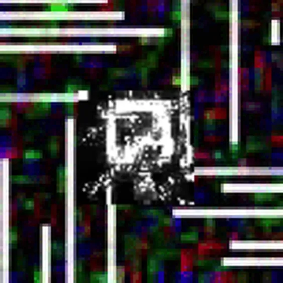
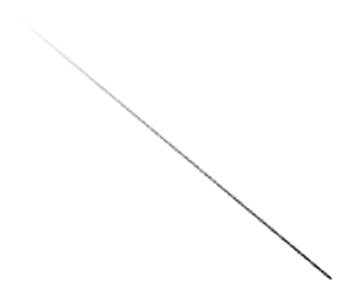
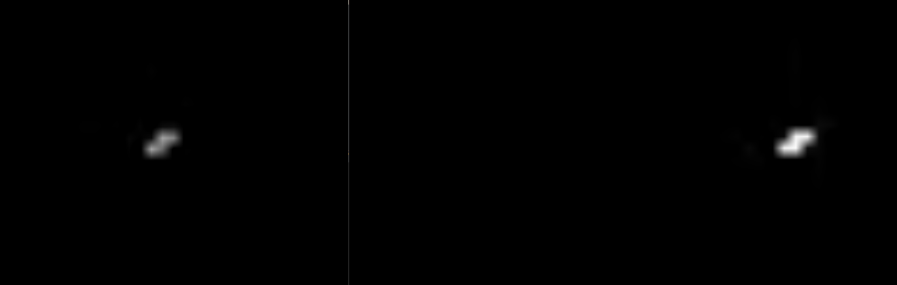

# CRIMP
♐CRIMP is a video posted to the second [second YouTube account](Real_and_Fake_channels "wikilink") account on November 25,
2016.

{{\#ev:youtube|<https://www.youtube.com/watch?v=3Blb3kzJU4I>}} [Original Link](https://youtu.be/Oh5MZWl2S8o)

## Description of video
The video is 1:34 in length. The visuals contain a series of white
shapes on a black background. Unusually, the audio is "synced" to the
visuals (*i.e.* the soundtrack is quiet while the screen is static.)

## Audio analysis
The audio track is highly amplified like many other videos and has a
motor like with a clicking noise every repeating several times per
second.

## Composites
> N25_CT13: overlayed all of the frames together including the visual hand-shake and got this.

> N25_CT13: also here's the taken maximum of each frame.

`Lukidot` has matched Crimp's composite to [Delock](DELOCK).

3D composites by Lukidot:

## Frame image

*♐CRIMP frames*

The patterns in the video can be observed in this image which shows all
the frames in sequence.

## Relationship with ♐RECOVER

Discord user `N25_CT13` notes:

> also about those videos
> 
> both of them have the same flickering thing
> 
> [recover](RECOVER "wikilink") is on the left and crimp is on the right
> 
> recover has the thing at around 3 seconds and crimp has it at the start
> 
> when the things flicker there is a pixel match

Perhaps the names of these videos ("crimp" or "to compress" and "recover" or "return to original state") imply a similar dynamic to that of [♐LOCK](LOCK "wikilink")-[♐DELOCK](DELOCK "wikilink")-[♐RELOCK](RELOCK "wikilink").
