# Composite visual overview
## Introduction
Composites are images created by extracting frames (generally keyframes) from videos posted by Unfavorable Semicircle and arranging those extracted frames in a grid. The width of the grid used is usually established by internal evidence within an image (creating straight lines, for example).

***This page is a work in progress\!***

Blank spots on this chart could mean:

  - no composite has been made for that video
  - a composite has been made, but no image has been uploaded to this
    wiki
  - it wouldn't make sense to made a composite of that video
  
## Archive of composites
* a downloadable archive of 2D and 3D composites can be found [here](composites-2021-04-28.zip).

## Original youtube channel: Non-series videos

| Video or series                                       | [2D composite](Video_Composites) | [3D composite](3D_Composite) |
| ----------------------------------------------------- | ------------------------------------------------------------------------------------------- | ------------- |
| ♐[LOCK](LOCK)                              |                              |  |
| ♐[DELOCK](DELOCK)                          |                                                                                             |               |
| [♐ (nameless video)](♐_\(nameless_video\)) |                                                                                             |               |
| ♐[PER](PER)                                |                                                                                             |               |
| ♐[BRILL B](BRILL_B)                        |                                                                                             |               |
| ♐[QUOT](QUOT)                              | 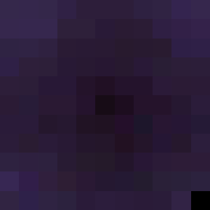 |               |

## Original youtube channel: Series

| Video or series                                    | 2D composite                                 | 3D composite- |
| -------------------------------------------------- | ---------------------------------------      | ------------- |
| [Original unnamed series](Original_unnamed_series) | 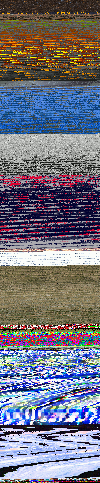      |               |
| ♐[BRILL](BRILL)                                    | 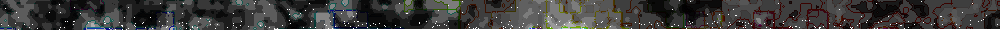 |               |
| ♐[OR](OR)                                          | *n/a*                                        | *n/a*         |

## Second youtube channel: Non-series videos

<table>
<thead>
<tr class="header">
<th>
Video or series
</th>
<th>
2D composite
</th>
<th>
3D composite
</th>
</tr>
</thead>
<tbody>
<tr class="odd">
<td>
♐<a href="RELOCK">RELOCK</a>
</td>
<td><figure>
<figcaption>RELOCK_composite.png</figcaption>
</figure></td>
<td></td>
</tr>
<tr class="even">
<td>
♐<a href="BRILL_49999">BRILL 49999</a>
</td>
<td><figure>
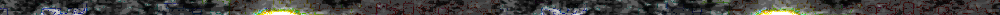<figcaption>BRILL49999_composite.png</figcaption>
</figure></td>
<td></td>
</tr>
<tr class="odd">
<td>
♐<a href="N*_BRILL">N* BRILL</a>
</td>
<td><figure>
<figcaption>BRILLN_composite.png</figcaption>
</figure></td>
<td></td>
</tr>
<tr class="even">
<td>
♐<a href="REDLOC">REDLOC</a>
</td>
<td><figure>
<figcaption>REDLOC_composite.png</figcaption>
</figure></td>
<td></td>
</tr>
<tr class="odd">
<td>
♐<a href="ZUFCHO">ZUFCHO</a>
</td>
<td></td>
<td></td>
</tr>
<tr class="even">
<td>
♐<a href="LONE">LONE</a>
</td>
<td></td>
<td></td>
</tr>
<tr class="odd">
<td>
♐<a href="WINGSET">WINGSET</a>
</td>
<td></td>
<td></td>
</tr>
<tr class="even">
<td>
♐<a href="RETIO">RETIO</a>
</td>
<td></td>
<td></td>
</tr>
<tr class="odd">
<td>
♐<a href="LIMIT">LIMIT</a>
</td>
<td></td>
<td></td>
</tr>
<tr class="even">
<td>
♐<a href="SQEN">SQEN</a>
</td>
<td></td>
<td></td>
</tr>
<tr class="odd">
<td>
♐<a href="RESQEN">RESQEN</a>
</td>
<td></td>
<td></td>
</tr>
<tr class="even">
<td>
♐<a href="CREM">CREM</a>
</td>
<td></td>
<td></td>
</tr>
<tr class="odd">
<td>
♐<a href="LOVE">LOVE</a>
</td>
<td></td>
<td></td>
</tr>
<tr class="even">
  <td>
♐<a href="JALVINSACH">JALVINSACH</a>
</td>
  <td>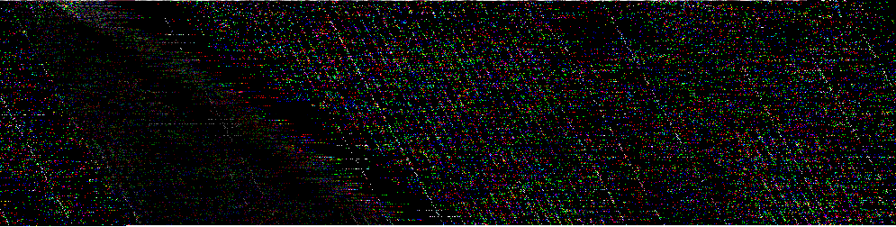</td>
  <td>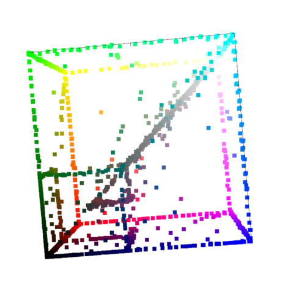</td>
</tr>
<tr class="odd">
<td>
♐<a href="MAX_TEND">MAX TEND</a>
</td>
<td></td>
<td></td>
</tr>
<tr class="even">
<td>
♐<a href="RECOVER">RECOVER</a>
</td>
<td><figure>
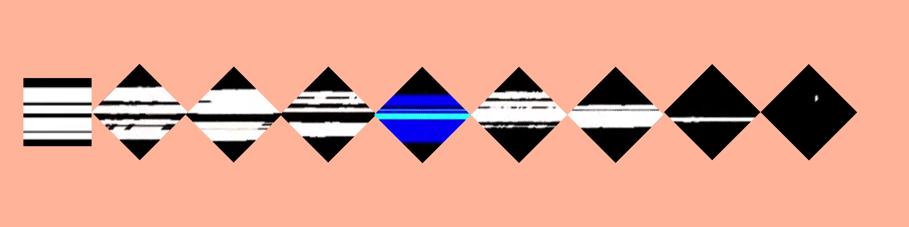<figcaption>Recover-still-frames-horizontal.png</figcaption>
</figure></td>
<td></td>
</tr>
<tr class="odd">
<td>
♐<a href="HARVEST">HARVEST</a>
</td>
<td><figure>
<figcaption>HARVEST_composite.png</figcaption>
</figure></td>
<td></td>
</tr>
<tr class="even">
<td>
♐<a href="RAPID">RAPID</a>
</td>
<td><figure>
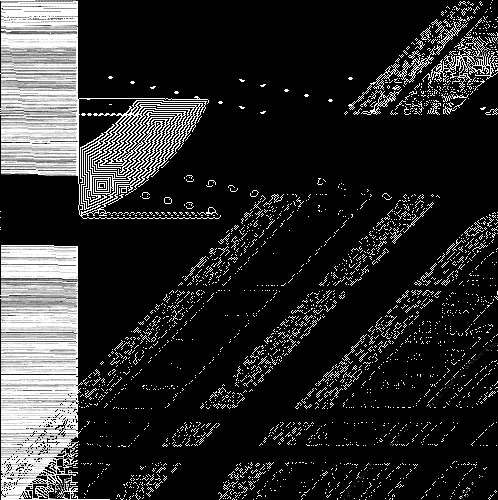<figcaption>RAPID_composite.png</figcaption>
</figure></td>
<td></td>
</tr>
<tr class="odd">
  <td>
♐<a href="CRIMP">CRIMP</a>
</td>
  <td></td>
  <td></td>
</tr>
<tr class="even">
<td>
♐<a href="FOLD">FOLD</a>
</td>
<td><figure>
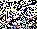<figcaption>FOLD_37.png</figcaption>
</figure></td>
<td></td>
</tr>
<tr class="odd">
<td>
♐<a href="STEM">STEM</a>
</td>
<td><figure>
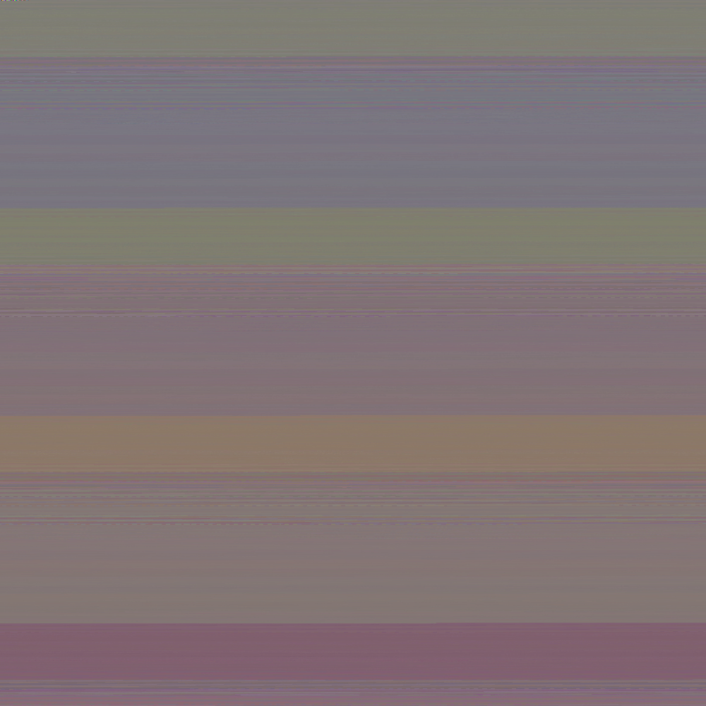<figcaption>STEM_Composite_by_hellajt.png</figcaption>
</figure></td>
<td></td>
</tr>
<tr class="even">
<td>
♐<a href="UPRIGHT">UPRIGHT</a>
</td>
<td>
<em>Impossible</em>
</td>
<td></td>
</tr>
<tr class="odd">
<td>
♐<a href="DIAGONAL">DIAGONAL</a>
</td>
<td><figure>
<figcaption>Diagonal_-_horizontal_composite.png</figcaption>
</figure></td>
<td><figure>
<figcaption>DIAGONAL_-_screecap_of_vantjac%27s_3D_render.png</figcaption>
</figure></td>
</tr>
<tr class="even">
<td>
♐<a href="GOLDEN">GOLDEN</a>
</td>
<td><figure>
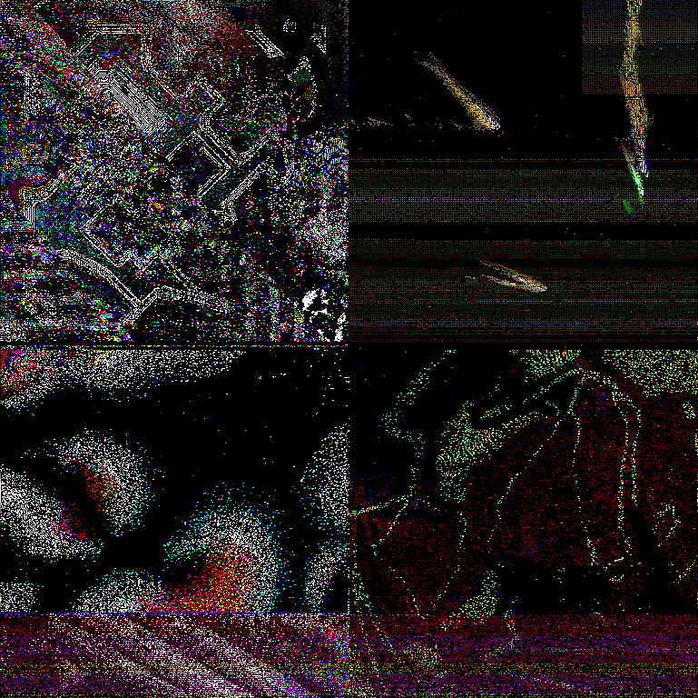<figcaption>GOLDEN.png</figcaption>
</figure></td>
<td></td>
</tr>
<tr class="odd">
<td>
♐<a href="HULL">HULL</a>
</td>
<td></td>
<td>
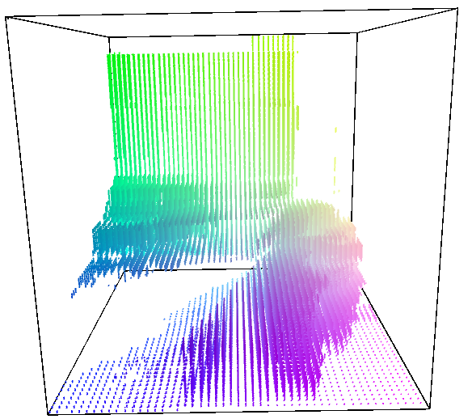 
Visualization of each frame's contents rather than mean RGB
</td>
</tr>
</tbody>
</table>

## Second youtube channel: Series

| Video or series                                               | 2D composite                                                                                                 | 3D composite-                                                                                                                 |
| ------------------------------------------------------------- | ------------------------------------------------------------------------------------------------------------- | ------------------------------------------------------------------------------------------------------------------------------ |
| ♐[BRINE](BRINE)                                    |                                             |                                                                                                                                |
| ♐[FEND](FEND)                                      | 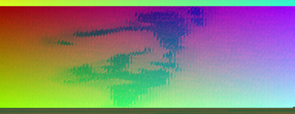  | 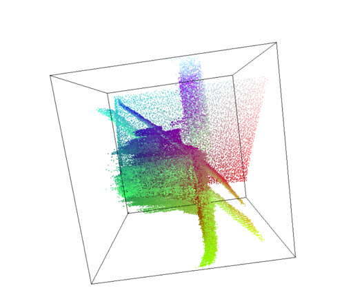                         |
| ♐[FOND](FOND)                                      | 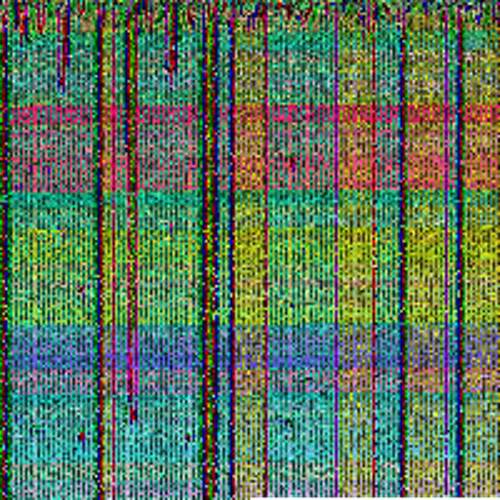                                               | 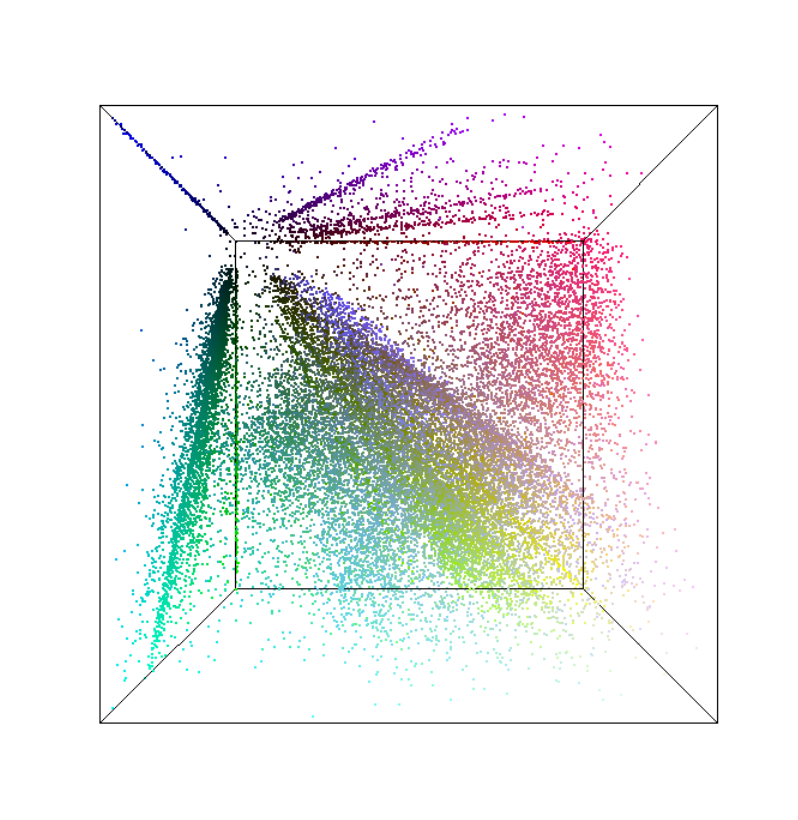                         |
| [Numbered Videos](Numbered_videos_\(2nd_channel\)) | 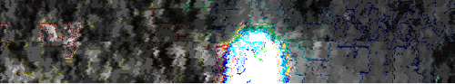 |                                                                                                                                |
| ♐[BROTHER](BROTHER)                                | 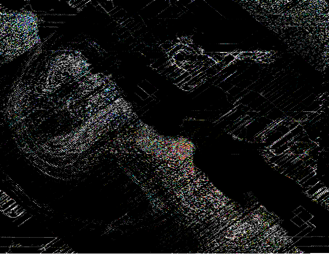                                      |                                                                                                                                |
| ♐[SLIM](SLIM)                                      | 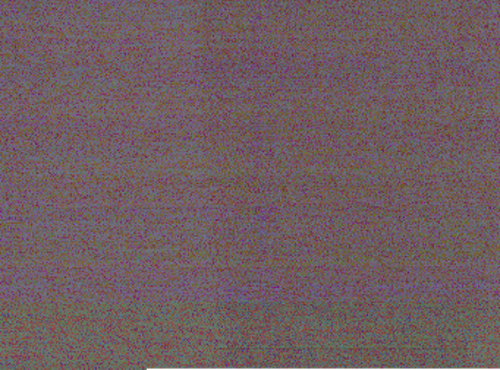                                               |                                                                                                                                |
| ♐[LOCUS](LOCUS)                                    |          |                                                                                                                                |
| ♐[CLEAN](CLEAN)                                    |                       |                                                                                                                                |
| ♐[BREADTH](BREADTH)                                |                                       | 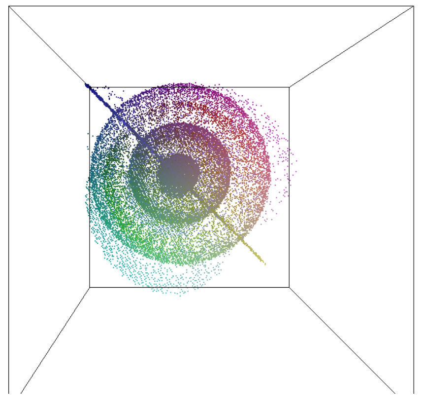            |
| ♐[MOTH](MOTH)                                      |                                                                                                               | 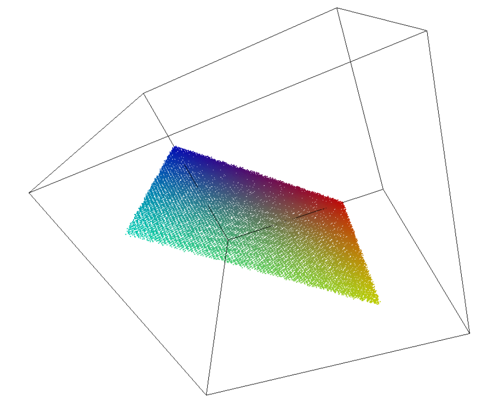                     |
| ♐[DUAL](DUAL)                                      |                                                               | 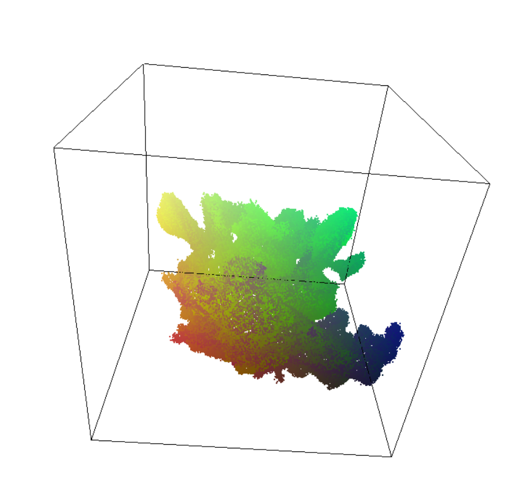 |
| ♐[BROAD](BROAD)                                    | 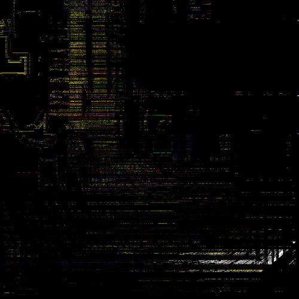                                               |                                                                                                                                |

## [Stabilitory newing](Stabilitory_newing): non-series videos

| Video or series          | 2D composite                    | 3D composite |
| ------------------------ | -------------                    | ------------- |
| ⊕[RATE](RATE) |     | *none yet*    |

## [Stabilitory newing](Stabilitory_newing): series

| Video or series                | 2D composite                     | 3D composite |
| ------------------------------ | --------------------------------- | ------------- |
| ⊕[BROTHER](BROTHER) | 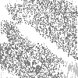 | *none yet*    |
| ⊕[BELT](BELT)       | 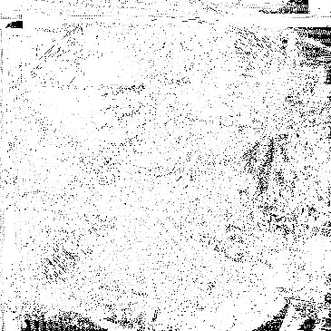     |               |

## [3rd youtube channel](3rd_youtube_channel): Non-series videos

| Video or series          | 2D composite                                                                                     | 3D composite                                                                                                |
| ------------------------ | ------------------------------------------------------------------------------------------------- | ------------------------------------------------------------------------------------------------------------ |
| ♐[PORT](PORT) | 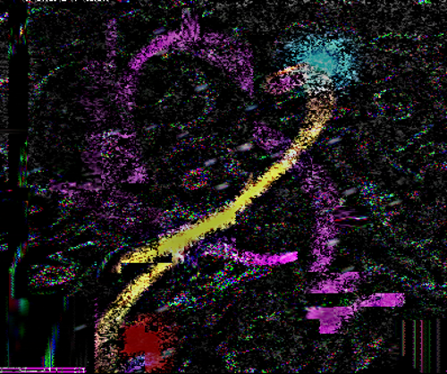   | *none yet*                                                                                                   |
| ♐[RUN](RUN)   | 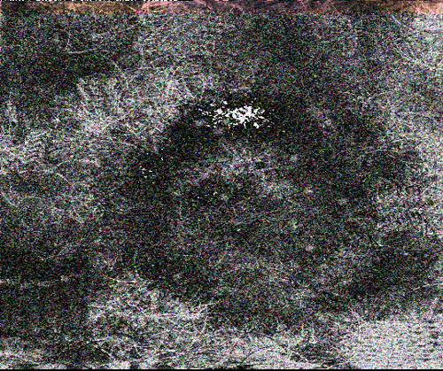                 | 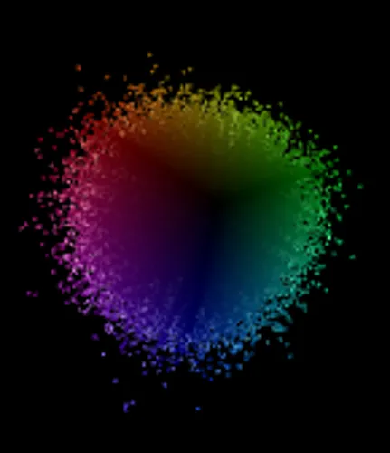                                                                                                   |
| ♐[NODE](NODE) | 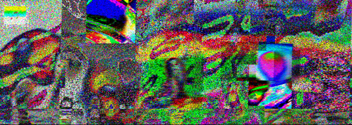   | 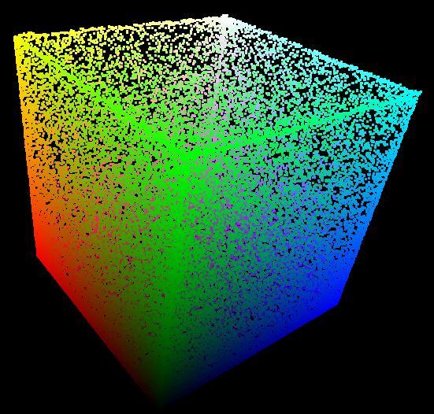 |
| ♐[SERN](SERN) | *Impossible*                                                                                      | *Impossible*                                                                                                 |
| ♐[ZORO](ZORO) | *Impossible*                                                                                      | *Impossible*                                                                                                 |
| ♐[COEF](COEF) | 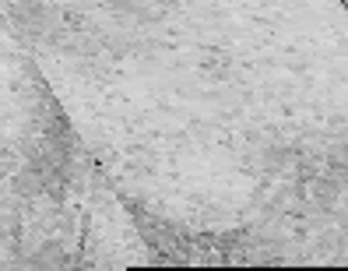 | *none yet*                                                                                                   |
| ♐[NEO](NEO)   | 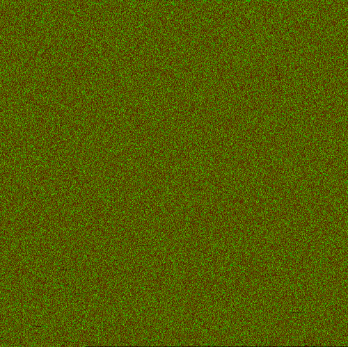                                                   |                                                                        |
| ♐[DIFF](DIFF) | 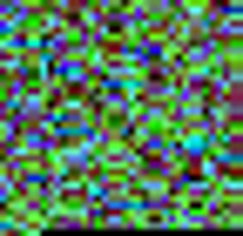 | 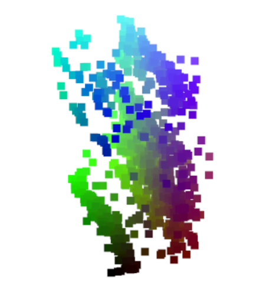                                                                                                                                                        |
| ♐[CFO](CFO)   | 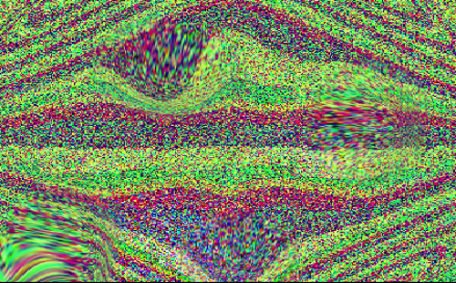                                      | 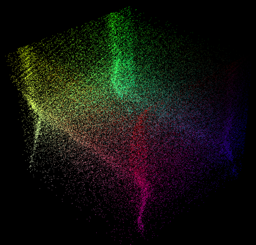                                                                 |
| ♐[GEN](GEN)   |       |                                                                        |
| ♐[ROOT](ROOT)  | 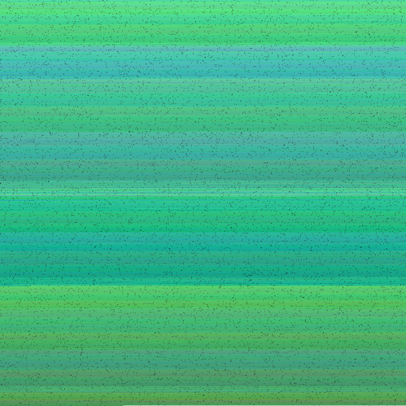      | 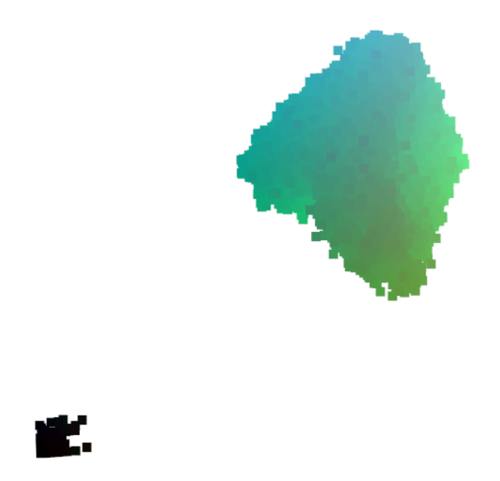                                                                       |

## [3rd youtube channel](3rd_youtube_channel): Series

| Video or series        | 2D composite                                                                                                          | 3D composite                                 |
| ---------------------- | ---------------------------------------------------------------------------------------------------------------------- | --------------------------------------------- |
| ♐[AZO](AZO) | 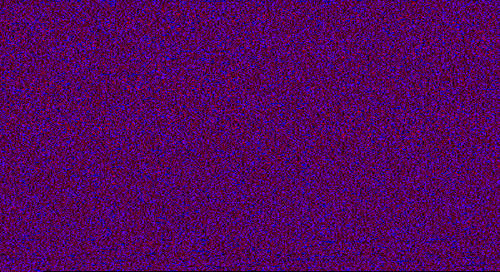 | 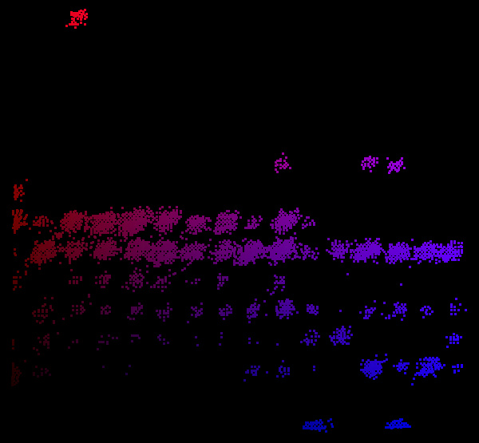 |

*images for ♐AZO currently show AZO 0 only*

## Twitter, pre-"[strange reset](RESET_STRANGE_YD)": Non-series videos

| Video or series              | 2D composite                                                         | 3D composite                                   |
| ---------------------------- | --------------------------------------------------------------------- | ----------------------------------------------- |
| ♐[574016](574016) | 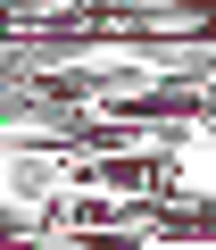 | 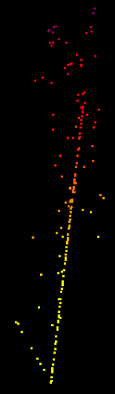 |

## Twitter, pre-"[strange reset](RESET_STRANGE_YD)": Series

<table>
<thead>
<tr class="header">
<th>
Video or series
</th>
<th>
2D composite
</th>
<th>
3D composite
</th>
</tr>
</thead>
<tbody>
<tr class="odd">
<td>
♐<a href="EL">EL</a>
</td>
<td>
 
Partial composite
</td>
<td></td>
</tr>
<tr class="even">
<td>
♐<a href="RIA">RIA</a>
</td>
<td>
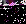 
Partial composite
</td>
<td></td>
</tr>
<tr class="odd">
<td>
♐<a href="LEE">LEE</a>
</td>
<td>
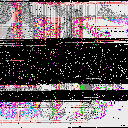 
Partial composite
</td>
<td></td>
</tr>
<tr class="even">
<td>
♐<a href="CAB">CAB</a>
</td>
<td><figure>
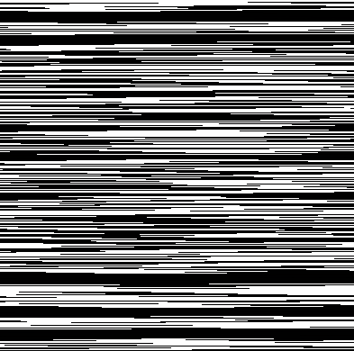<figcaption>CAB393.png</figcaption>
</figure></td>
<td></td>
</tr>
<tr class="odd">
<td>
♐<a href="MUL">MUL</a>
</td>
<td><figure>
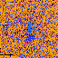<figcaption>MUL_composite.png</figcaption>
</figure></td>
<td></td>
</tr>
<tr class="even">
<td>
<a href="April_10_twitter_series">April 10 twitter series</a>
</td>
<td><figure>
<figcaption>April10square.png</figcaption>
</figure></td>
<td><figure>
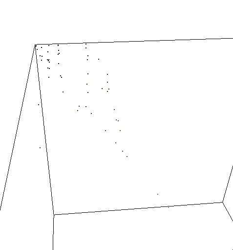<figcaption>April10_3-d_projection.png</figcaption>
</figure></td>
</tr>
<tr class="odd">
<td>
♐<a href="NIL">NIL</a>
</td>
<td><figure>
<figcaption>NIL_composite_combined.png</figcaption>
</figure></td>
<td></td>
</tr>
<tr class="even">
<td>
♐<a href="DEPTH">DEPTH</a>
</td>
<td><figure>
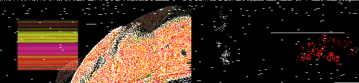<figcaption>DEPTH_composite.png</figcaption>
</figure></td>
<td></td>
</tr>
<tr class="odd">
<td>
♐<a href="POINT">POINT</a>
</td>
<td><figure>
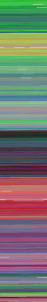<figcaption>POINT_composite.png</figcaption>
</figure></td>
<td><figure>
<figcaption>Point_-_3-d_composite_-_view_1.png</figcaption>
</figure></td>
</tr>
</tbody>
</table>

## Twitter, post-"[strange reset](RESET_STRANGE_YD)": Non-series videos

| Video or series                  | 2D composite                                 | 3D composite |
| -------------------------------- | --------------------------------------------- | ------------- |
| ♐[DDR DONE](DDR_DONE) |  |               |
| ♐[REVI](REVI)         |               |               |

## Twitter, post-"[strange reset](RESET_STRANGE_YD)": Series

| Video or series              | 2D composite                                                                                                          | 3D composite |
| ---------------------------- | ---------------------------------------------------------------------------------------------------------------------- | ------------- |
| ♐[FMI](FMI)       | 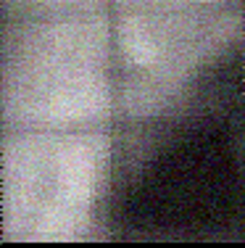                                                                             |               |
| ♐[SECOND](SECOND) | .jpg "Full_SECOND_composite_(reduced).jpg") |               |
| ♐[STRAND](STRAND) | 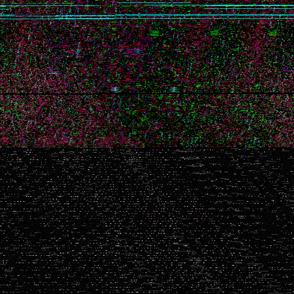                                                                    |               |

## OT

| Video or series   | 2D composite                                    | 3D composite                                    |
| ----------------- | ----------------------------------------------- | ----------------------------------------------- |
| [Loyal](LOYAL)    | 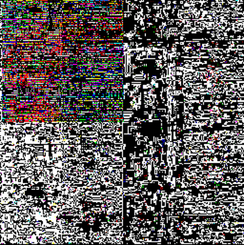    | 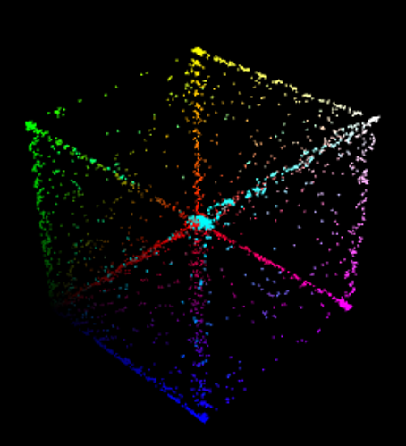                   |
| [Cullet](CULLET)  | 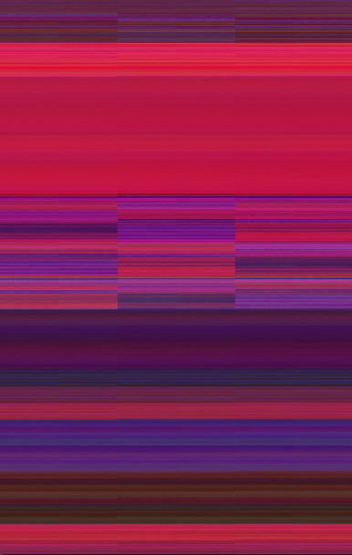  | 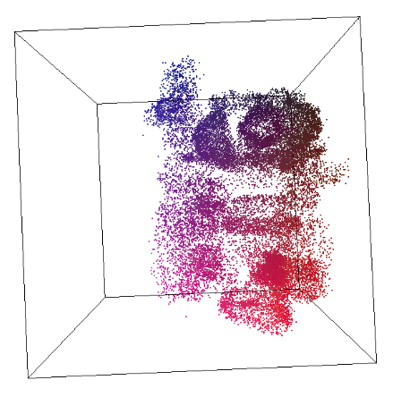  |
