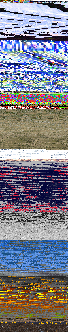

# Composite visual overview

## Introduction

Composites are images created by extracting frames (generally keyframes) from videos posted by Unfavorable Semicircle and arranging those extracted frames in a grid. The width of the grid used is usually established by internal evidence within an image (creating straight lines, for example).

***This page is a work in progress\!***

Blank spots on this chart could mean:

  - no composite has been made for that video
  - a composite has been made, but no image has been uploaded to this
    wiki
  - it wouldn't make sense to made a composite of that video
  
## Archive of composites

* a downloadable archive of 2D and 3D composites can be found [here](composites-2021-04-28.zip "wikilink").

## Original youtube channel: Non-series videos

| Video or series                                       | [2D composite](Video_Composites "wikilink") | [3D composite](3D_Composite "wikilink") |
| ----------------------------------------------------- | ------------------------------------------------------------------------------------------- | ------------- |
| ♐[LOCK](LOCK "wikilink")                              |                              |               |
| ♐[DELOCK](DELOCK "wikilink")                          |                                                                                             |               |
| [♐ (nameless video)](♐_\(nameless_video\) "wikilink") |                                                                                             |               |
| ♐[PER](PER "wikilink")                                |                                                                                             |               |
| ♐[BRILL B](BRILL_B "wikilink")                        |                                                                                             |               |
| ♐[QUOT](QUOT "wikilink")                              |  |               |

## Original youtube channel: Series

| Video or series                                               | 2-D composite                                                                                   | 3-D composite- |
| ------------------------------------------------------------- | ----------------------------------------------------------------------------------------------- | -------------- |
| [Original unnamed series](Original_unnamed_series "wikilink") |  |                |
| ♐[BRILL](BRILL "wikilink")                                    |                               |                |
| ♐[OR](OR "wikilink")                                          | *n/a*                                                                                           | *n/a*          |

## Second youtube channel: Non-series videos

<table>
<thead>
<tr class="header">
<th>
Video or series
</th>
<th>
2-D composite
</th>
<th>
3-D composite
</th>
</tr>
</thead>
<tbody>
<tr class="odd">
<td>
♐<a href="RELOCK" title="wikilink">RELOCK</a>
</td>
<td><figure>
<figcaption>RELOCK_composite.png</figcaption>
</figure></td>
<td></td>
</tr>
<tr class="even">
<td>
♐<a href="BRILL_49999" title="wikilink">BRILL 49999</a>
</td>
<td><figure>
<figcaption>BRILL49999_composite.png</figcaption>
</figure></td>
<td></td>
</tr>
<tr class="odd">
<td>
♐<a href="N*_BRILL" title="wikilink">N* BRILL</a>
</td>
<td><figure>
<figcaption>BRILLN_composite.png</figcaption>
</figure></td>
<td></td>
</tr>
<tr class="even">
<td>
♐<a href="REDLOC" title="wikilink">REDLOC</a>
</td>
<td><figure>
<figcaption>REDLOC_composite.png</figcaption>
</figure></td>
<td></td>
</tr>
<tr class="odd">
<td>
♐<a href="ZUFCHO" title="wikilink">ZUFCHO</a>
</td>
<td></td>
<td></td>
</tr>
<tr class="even">
<td>
♐<a href="LONE" title="wikilink">LONE</a>
</td>
<td></td>
<td></td>
</tr>
<tr class="odd">
<td>
♐<a href="WINGSET" title="wikilink">WINGSET</a>
</td>
<td></td>
<td></td>
</tr>
<tr class="even">
<td>
♐<a href="RETIO" title="wikilink">RETIO</a>
</td>
<td></td>
<td></td>
</tr>
<tr class="odd">
<td>
♐<a href="LIMIT" title="wikilink">LIMIT</a>
</td>
<td></td>
<td></td>
</tr>
<tr class="even">
<td>
♐<a href="SQEN" title="wikilink">SQEN</a>
</td>
<td></td>
<td></td>
</tr>
<tr class="odd">
<td>
♐<a href="RESQEN" title="wikilink">RESQEN</a>
</td>
<td></td>
<td></td>
</tr>
<tr class="even">
<td>
♐<a href="CREM" title="wikilink">CREM</a>
</td>
<td></td>
<td></td>
</tr>
<tr class="odd">
<td>
♐<a href="LOVE" title="wikilink">LOVE</a>
</td>
<td></td>
<td></td>
</tr>
<tr class="even">
  <td>
♐<a href="JALVINSACH" title="wikilink">JALVINSACH</a>
</td>
  <td></td>
  <td></td>
</tr>
<tr class="odd">
<td>
♐<a href="MAX_TEND" title="wikilink">MAX TEND</a>
</td>
<td></td>
<td></td>
</tr>
<tr class="even">
<td>
♐<a href="RECOVER" title="wikilink">RECOVER</a>
</td>
<td><figure>
<figcaption>Recover-still-frames-horizontal.png</figcaption>
</figure></td>
<td></td>
</tr>
<tr class="odd">
<td>
♐<a href="HARVEST" title="wikilink">HARVEST</a>
</td>
<td><figure>
<figcaption>HARVEST_composite.png</figcaption>
</figure></td>
<td></td>
</tr>
<tr class="even">
<td>
♐<a href="RAPID" title="wikilink">RAPID</a>
</td>
<td><figure>
<figcaption>RAPID_composite.png</figcaption>
</figure></td>
<td></td>
</tr>
<tr class="odd">
  <td>
♐<a href="CRIMP" title="wikilink">CRIMP</a>
</td>
  <td></td>
  <td></td>
</tr>
<tr class="even">
<td>
♐<a href="FOLD" title="wikilink">FOLD</a>
</td>
<td><figure>
<figcaption>FOLD_37.png</figcaption>
</figure></td>
<td></td>
</tr>
<tr class="odd">
<td>
♐<a href="STEM" title="wikilink">STEM</a>
</td>
<td><figure>
<figcaption>STEM_Composite_by_hellajt.png</figcaption>
</figure></td>
<td></td>
</tr>
<tr class="even">
<td>
♐<a href="UPRIGHT" title="wikilink">UPRIGHT</a>
</td>
<td>
<em>Impossible</em>
</td>
<td></td>
</tr>
<tr class="odd">
<td>
♐<a href="DIAGONAL" title="wikilink">DIAGONAL</a>
</td>
<td><figure>
<figcaption>Diagonal_-_horizontal_composite.png</figcaption>
</figure></td>
<td><figure>
<figcaption>DIAGONAL_-_screecap_of_vantjac%27s_3D_render.png</figcaption>
</figure></td>
</tr>
<tr class="even">
<td>
♐<a href="GOLDEN" title="wikilink">GOLDEN</a>
</td>
<td><figure>
<figcaption>GOLDEN.png</figcaption>
</figure></td>
<td></td>
</tr>
<tr class="odd">
<td>
♐<a href="HULL" title="wikilink">HULL</a>
</td>
<td></td>
<td>
 
Visualization of each frame's contents rather than mean RGB
</td>
</tr>
</tbody>
</table>

## Second youtube channel: Series

| Video or series                                               | 2-D composite                                                                                                 | 3-D composite-                                                                                                                 |
| ------------------------------------------------------------- | ------------------------------------------------------------------------------------------------------------- | ------------------------------------------------------------------------------------------------------------------------------ |
| ♐[BRINE](BRINE "wikilink")                                    |                                             |                                                                                                                                |
| ♐[FEND](FEND "wikilink")                                      |   |                          |
| ♐[FOND](FOND "wikilink")                                      |                                                |                          |
| [Numbered Videos](Numbered_videos_\(2nd_channel\) "wikilink") |  |                                                                                                                                |
| ♐[BROTHER](BROTHER "wikilink")                                |                                       |                                                                                                                                |
| ♐[SLIM](SLIM "wikilink")                                      |                                                |                                                                                                                                |
| ♐[LOCUS](LOCUS "wikilink")                                    |          |                                                                                                                                |
| ♐[CLEAN](CLEAN "wikilink")                                    |                       |                                                                                                                                |
| ♐[BREADTH](BREADTH "wikilink")                                |                                       |             |
| ♐[MOTH](MOTH "wikilink")                                      |                                                                                                               |                      |
| ♐[DUAL](DUAL "wikilink")                                      |                                                               |  |
| ♐[BROAD](BROAD "wikilink")                                    |                                                |                                                                                                                                |

## Stabilitory newing: Non-series videos

| Video or series          | 2-D composite                    | 3-D composite |
| ------------------------ | -------------                    | ------------- |
| ⊕[RATE](RATE "wikilink") |     | *none yet*    |

## Stabilitory newing: Series

| Video or series                | 2-D composite | 3-D composite |
| ------------------------------ | ------------- | ------------- |
| ⊕[BROTHER](BROTHER "wikilink") | *none yet*    | *none yet*    |
| ⊕[BELT](BELT "wikilink")       |               |               |

## [3rd youtube channel](3rd_youtube_channel "wikilink"): Non-series videos

| Video or series          | 2-D composite                                                                                     | 3-D composite                                                                                                |
| ------------------------ | ------------------------------------------------------------------------------------------------- | ------------------------------------------------------------------------------------------------------------ |
| ♐[PORT](PORT "wikilink") |    | *none yet*                                                                                                   |
| ♐[RUN](RUN "wikilink")   |                  | *none yet*                                                                                                   |
| ♐[NODE](NODE "wikilink") |    |  |
| ♐[SERN](SERN "wikilink") | *Impossible*                                                                                      | *Impossible*                                                                                                 |
| ♐[ZORO](ZORO "wikilink") | *Impossible*                                                                                      | *Impossible*                                                                                                 |
| ♐[COEF](COEF "wikilink") |  | *none yet*                                                                                                   |
| ♐[NEO](NEO "wikilink")   |                                                    |                                                                        |
| ♐[DIFF](DIFF "wikilink") |                                                                                                   |                                                                                                              |
| ♐[CFO](CFO "wikilink")   |                                       |                                                                  |
| ♐[GEN](GEN "wikilink")   |       |                                                                        |

## [3rd youtube channel](3rd_youtube_channel "wikilink"): Series

| Video or series        | 2-D composite                                                                                                          | 3-D composite                                 |
| ---------------------- | ---------------------------------------------------------------------------------------------------------------------- | --------------------------------------------- |
| ♐[AZO](AZO "wikilink") |  |  |

*images for ♐AZO currently show AZO 0 only*

## Twitter, pre-"[strange reset](RESET_STRANGE_YD "wikilink")": Non-series videos

| Video or series              | 2-D composite                                                         | 3-D composite                                   |
| ---------------------------- | --------------------------------------------------------------------- | ----------------------------------------------- |
| ♐[574016](574016 "wikilink") |  |  |

## Twitter, pre-"[strange reset](RESET_STRANGE_YD "wikilink")": Series

<table>
<thead>
<tr class="header">
<th>
Video or series
</th>
<th>
2-D composite
</th>
<th>
3-D composite
</th>
</tr>
</thead>
<tbody>
<tr class="odd">
<td>
♐<a href="EL" title="wikilink">EL</a>
</td>
<td>
 
Partial composite
</td>
<td></td>
</tr>
<tr class="even">
<td>
♐<a href="RIA" title="wikilink">RIA</a>
</td>
<td>
 
Partial composite
</td>
<td></td>
</tr>
<tr class="odd">
<td>
♐<a href="LEE" title="wikilink">LEE</a>
</td>
<td>
 
Partial composite
</td>
<td></td>
</tr>
<tr class="even">
<td>
♐<a href="CAB" title="wikilink">CAB</a>
</td>
<td><figure>
<figcaption>CAB393.png</figcaption>
</figure></td>
<td></td>
</tr>
<tr class="odd">
<td>
♐<a href="MUL" title="wikilink">MUL</a>
</td>
<td><figure>
<figcaption>MUL_composite.png</figcaption>
</figure></td>
<td></td>
</tr>
<tr class="even">
<td>
<a href="April_10_twitter_series" title="wikilink">April 10 twitter series</a>
</td>
<td><figure>
<figcaption>April10square.png</figcaption>
</figure></td>
<td><figure>
<figcaption>April10_3-d_projection.png</figcaption>
</figure></td>
</tr>
<tr class="odd">
<td>
♐<a href="NIL" title="wikilink">NIL</a>
</td>
<td><figure>
<figcaption>NIL_composite_combined.png</figcaption>
</figure></td>
<td></td>
</tr>
<tr class="even">
<td>
♐<a href="DEPTH" title="wikilink">DEPTH</a>
</td>
<td><figure>
<figcaption>DEPTH_composite.png</figcaption>
</figure></td>
<td></td>
</tr>
<tr class="odd">
<td>
♐<a href="POINT" title="wikilink">POINT</a>
</td>
<td><figure>
<figcaption>POINT_composite.png</figcaption>
</figure></td>
<td><figure>
<figcaption>Point_-_3-d_composite_-_view_1.png</figcaption>
</figure></td>
</tr>
</tbody>
</table>

## Twitter, post-"[strange reset](RESET_STRANGE_YD "wikilink")": Non-series videos

| Video or series                  | 2-D composite                                 | 3-D composite |
| -------------------------------- | --------------------------------------------- | ------------- |
| ♐[DDR DONE](DDR_DONE "wikilink") |  |               |
| ♐[REVI](REVI "wikilink")         |               |               |

## Twitter, post-"[strange reset](RESET_STRANGE_YD "wikilink")": Series

| Video or series              | 2-D composite                                                                                                          | 3-D composite |
| ---------------------------- | ---------------------------------------------------------------------------------------------------------------------- | ------------- |
| ♐[FMI](FMI "wikilink")       |                                                                              |               |
| ♐[SECOND](SECOND "wikilink") | .jpg "Full_SECOND_composite_(reduced).jpg") |               |
| ♐[STRAND](STRAND "wikilink") |                                                                     |               |
