# Composite visual overview
## Introduction
Composites are images created by extracting frames (generally keyframes) from videos posted by Unfavorable Semicircle and arranging those extracted frames in a grid. The width of the grid used is usually established by internal evidence within an image (creating straight lines, for example).

***This page is a work in progress\!***

Blank spots on this chart could mean:

  - no composite has been made for that video
  - a composite has been made, but no image has been uploaded to this
    wiki
  - it wouldn't make sense to made a composite of that video
  
## Archive of composites
* a downloadable archive of 2D and 3D composites can be found [here](composites-2021-04-28.zip).

## Original youtube channel: Non-series videos

| Video or series                                       | [2D composite](Video_Composites) | [3D composite](3D_Composite) |
| ----------------------------------------------------- | ------------------------------------------------------------------------------------------- | ------------- |
| ♐[LOCK](LOCK)                              |                              |  |
| ♐[DELOCK](DELOCK)                          |                                                                                             |               |
| [♐ (nameless video)](♐_\(nameless_video\)) |                                                                                             |               |
| ♐[PER](PER)                                |                                                                                             |               |
| ♐[BRILL B](BRILL_B)                        |                                                                                             |               |
| ♐[QUOT](QUOT)                              |  | 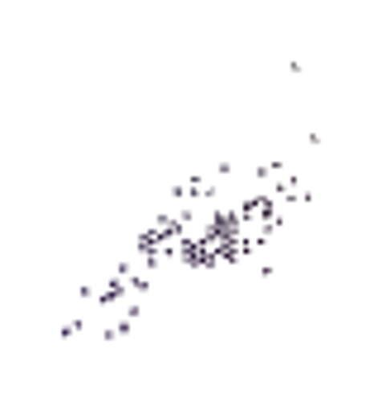 |

## Original youtube channel: Series

| Video or series                                    | 2D composite                                 | 3D composite- |
| -------------------------------------------------- | ---------------------------------------      | ------------- |
| [Original unnamed series](Original_unnamed_series) |       |  |
| ♐[BRILL](BRILL)                                    |  |               |
| ♐[OR](OR)                                          | *n/a*                                        | *n/a*         |

## Second youtube channel: Non-series videos

| Video or series  | 2D composite | 3D composite |
| ---------------- | ------------ | ------------ |
| ♐[RELOCK](RELOCK) |  |  |
| ♐[BRILL 49999](BRILL_49999) |  | |
| ♐[N*_BRILL](N*_BRILL) |  | 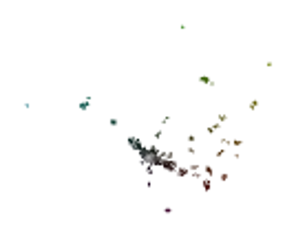 |
| ♐[REDLOC](REDLOC) |  | 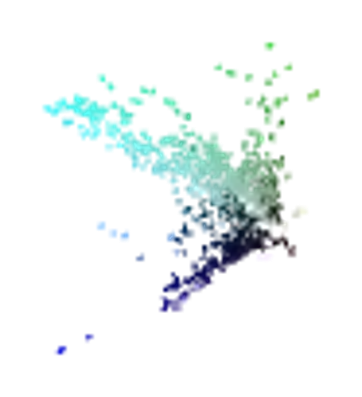 |
| ♐[ZUFCHO](ZUFCHO) | | |
| ♐[LONE](LONE) | | |
| ♐[WINGSET](WINGSET) | | |
| ♐[RETIO](RETIO) | | |
| ♐[LIMIT](LIMIT) | | |
| ♐[SQEN](SQEN) | | |
| ♐[RESQEN](RESQEN) | | |
| ♐[CREM](CREM) | | |
| ♐[LOVE](LOVE) | | |
| ♐[JALVINSACH](JALVINSACH) |  |  |
| ♐[MAX TEND](MAX_TEND) | | |
| ♐[RECOVER](RECOVER) |  | |
| ♐[HARVEST](HARVEST) |  | |
| ♐[RAPID](RAPID) |  | 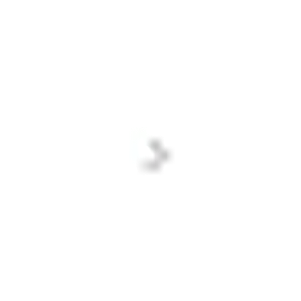 |
| ♐[CRIMP](CRIMP) |  | 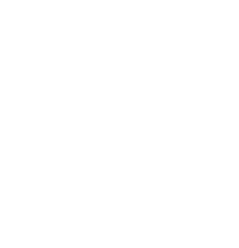 |
| ♐[FOLD](FOLD) |  |  |
| ♐[STEM](STEM) |  | 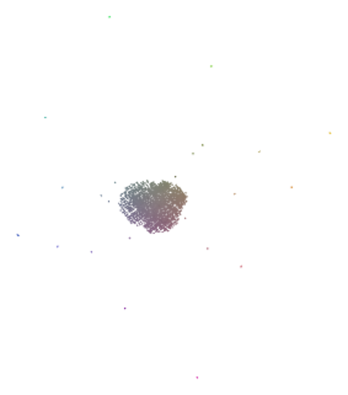 |
| ♐[UPRIGHT](UPRIGHT) | Impossible. | |
| ♐[DIAGONAL](DIAGONAL) |  |  |
| ♐[GOLDEN](GOLDEN) |  | |
| ♐[HULL](HULL) | |  (Visualization of each frame's contents rather than mean RGB). |

## Second youtube channel: Series

| Video or series                                               | 2D composite                                                                                                 | 3D composite-                                                                                                                 |
| ------------------------------------------------------------- | ------------------------------------------------------------------------------------------------------------- | ------------------------------------------------------------------------------------------------------------------------------ |
| ♐[BRINE](BRINE)                                    |                                             |  |
| ♐[FEND](FEND)                                      |   |                          |
| ♐[FOND](FOND)                                      |                                                |                          |
| [Numbered Videos](Numbered_videos_\(2nd_channel\)) |  | 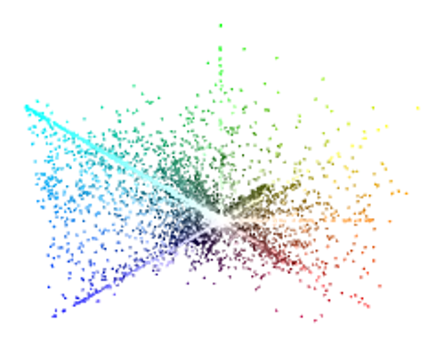 |
| ♐[BROTHER](BROTHER)                                |                                       |                                                                                                                                |
| ♐[SLIM](SLIM)                                      |                                                |                                                                                                                                |
| ♐[LOCUS](LOCUS)                                    |          |                                                                                                                                |
| ♐[CLEAN](CLEAN)                                    |                       |                                                                                                                                |
| ♐[BREADTH](BREADTH)                                |                                       |             |
| ♐[MOTH](MOTH)                                      |                                                                                                               |                      |
| ♐[DUAL](DUAL)                                      |                                                               |  |
| ♐[BROAD](BROAD)                                    |                                                |                                                                                                                                |

## [Stabilitory newing](Stabilitory_newing): non-series videos

| Video or series | 2D composite                  | 3D composite  | Column composite            |
| --------------- | ----------------------------- | ------------- | --------------------------- |
| ⊕[RATE](RATE)   |  | *none yet*    |  |

## [Stabilitory newing](Stabilitory_newing): series

| Video or series     | 2D composite  | 3D composite  | Column composite                  |
| ------------------- | ------------- | ------------- | --------------------------------- |
| ⊕[BROTHER](BROTHER) | -             | -             |  |
| ⊕[BELT](BELT)       | -             | -             |      |

## [3rd youtube channel](3rd_youtube_channel): Non-series videos

| Video or series          | 2D composite                                                                                     | 3D composite                                                                                                |
| ------------------------ | ------------------------------------------------------------------------------------------------- | ------------------------------------------------------------------------------------------------------------ |
| ♐[PORT](PORT) |    | *none yet*                                                                                                   |
| ♐[RUN](RUN)   |                  |                                                                                                    |
| ♐[NODE](NODE) |    |  |
| ♐[SERN](SERN) | *Impossible*                                                                                      | *Impossible*                                                                                                 |
| ♐[ZORO](ZORO) | *Impossible*                                                                                      | *Impossible*                                                                                                 |
| ♐[COEF](COEF) |  | *none yet*                                                                                                   |
| ♐[NEO](NEO)   |                                                    |                                                                        |
| ♐[DIFF](DIFF) |  |                                                                                                                                                         |
| ♐[CFO](CFO)   |                                       |                                                                  |
| ♐[GEN](GEN)   |       |                                                                        |
| ♐[ROOT](ROOT)  |       |                                                                        |

## [3rd youtube channel](3rd_youtube_channel): Series

| Video or series        | 2D composite                                                                                                          | 3D composite                                 |
| ---------------------- | ---------------------------------------------------------------------------------------------------------------------- | --------------------------------------------- |
| ♐[AZO](AZO) |  |  |

*images for ♐AZO currently show AZO 0 only*

## Twitter, pre-"[strange reset](RESET_STRANGE_YD)": Non-series videos

| Video or series              | 2D composite                                                         | 3D composite                                   |
| ---------------------------- | --------------------------------------------------------------------- | ----------------------------------------------- |
| ♐[574016](574016) |  |  |

## Twitter, pre-"[strange reset](RESET_STRANGE_YD)": Series

| Video or series | 2D composite | 3D composite |
| ♐[EL](EL) |  | 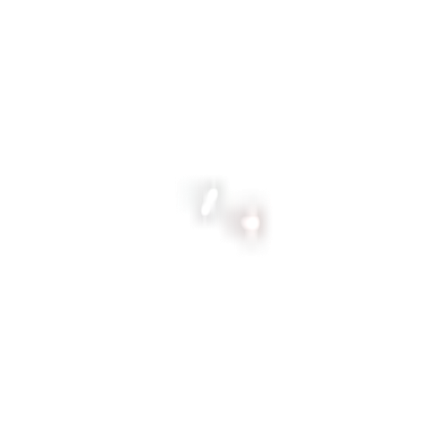 | 
| ♐[RIA](RIA) |  |  | 
| ♐[LEE](LEE) |  | 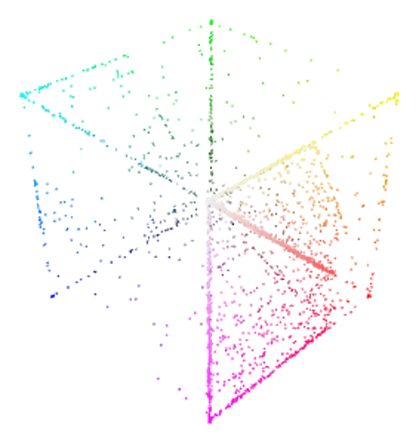 | 
| ♐[CAB](CAB) |  | | 
| ♐[MUL](MUL) |  | 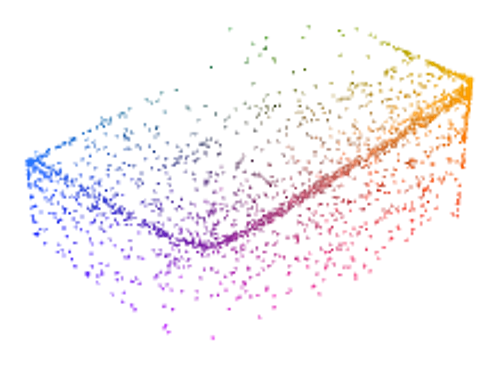 | 
| [April 10 twitter series](April_10_twitter_series) |  |  | 
| ♐[NIL](NIL) |  |  | 
| ♐[DEPTH](DEPTH) |  | | 
| ♐[POINT](POINT) |  |  |

## Twitter, post-"[strange reset](RESET_STRANGE_YD)": Non-series videos

| Video or series                  | 2D composite                                 | 3D composite |
| -------------------------------- | --------------------------------------------- | ------------- |
| ♐[DDR DONE](DDR_DONE) |  |               |
| ♐[REVI](REVI)         |               |  |

## Twitter, post-"[strange reset](RESET_STRANGE_YD)": Series

| Video or series              | 2D composite                                                                                                          | 3D composite |
| ---------------------------- | ---------------------------------------------------------------------------------------------------------------------- | ------------- |
| ♐[FMI](FMI)       |                                                                              |               |
| ♐[SECOND](SECOND) | .jpg "Full_SECOND_composite_(reduced).jpg") |  |
| ♐[STRAND](STRAND) |                                                                     | 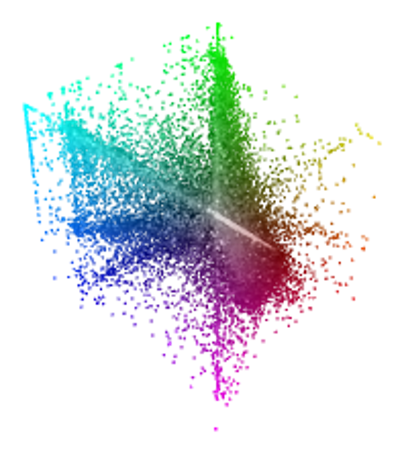 |

## OT

| Video or series   | 2D composite                                    | 3D composite                                    |
| ----------------- | ----------------------------------------------- | ----------------------------------------------- |
| [Loyal](LOYAL)    |     |                    |
| [Cullet](CULLET)  |   |   |
