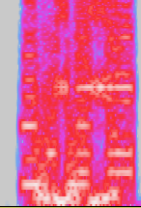
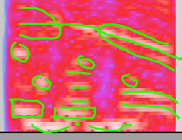
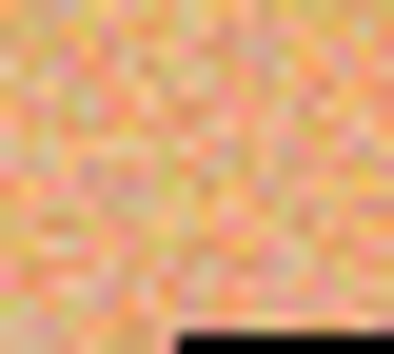
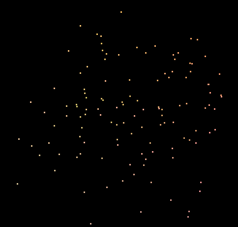

# DDR DONE

♐DDR\_DONE is a video posted by the Unfavorable Semicircle
[Twitter](Twitter "wikilink") account on December 6, 2017. It is 14
seconds long, and contains two separate
[handshakes](handshake "wikilink"), with a burst of noise-in between.

As with the ♐[FMI](FMI "wikilink") series, uploaded on the same date,
this video is the first to be posted after ♐[RESET STRANGE YD](RESET_STRANGE_YD "wikilink").

{{\#ev:youtube|www.youtu.be/rBz9bUTsRMM}}

## Questions of Authenticity

Since the Twitter account was been deleted and then reactivated, it
arises suspicion that this might not be the original author. In this
video, the handshake and sound style seem authentic but being a short
clip without audio in its entirety, the track could have been a
makeshift copy from older videos — with perhaps some minor alterations.

## Title

It has been raised several times that DDR could imply [double data rate](https://en.wikipedia.org/wiki/DDR_SDRAM), which would seem to
follow a trend of having technological terms present in video titles (or
at least terms that can be interpreted technologically) - such as
[PER](PER "wikilink"), [NIL](NIL "wikilink"), [RATE](RATE "wikilink"),
etc. It has also been pointed out that the refresh rate does seem fast
compared to other videos but it doesn't necessarily seem to be
particularly faster than some, such as [RELOCK](RELOCK "wikilink").

## Audio

Discord user Risto notes that this file contains a
[Handshake](Handshake "wikilink") with the same spectrograph image as
seen in other files:

They add of the handshake found at the end: "It looks like it just gave
up":

Discord user alexbassguy notes that the Handshake uses "absolutely the
same sample as heard in DEPTH and ZUFCHO."

## Composite

There are not very many frames in this file, and hence a very tiny
composite.

*composite by extra*

### 3d Composite

