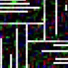

# ♐DELOCK

♐DELOCK is a video posted to the original UFSC YouTube channel on
December 29, 2015. It was the first video posted after a lengthy hiatus.
(The previous postings were the [OR](OR "wikilink") videos on August
8th.) This video in particular has garnered a larger amount of attention
as it was among the first non-series videos discovered on the original
account.

The ♐DELOCK visual is generally considered to be an iconic image in the
UFSC canon.

*A sped up GIF of ♐DELOCK*

## Description of video

The video is 2:52 in duration. The video shows a white grid-like shape
on a black background. Colored pixels shift around the grid.

## Audio

The video's audio track contains a dual mono audio track with
"calliope"/ragtime-type music, which had originally been compared to the
sounds in the cartoon [*Steamboat Willie*](https://youtu.be/BBgghnQF6E4). The [Unknown
Voice](Unknown_Voice "wikilink") spells out "IANNOP6" near the beginning
(similar to the spelling of "FREEBIRD3" in
[MAX\_TEND](MAX_TEND "wikilink")).

### Analysis + Re-creation of music

This is the analysis of Discord user alexbassguy: "After a careful
review, it's not Steamboat Willie. BUT - I can say with some confidence
that the audio is definitely like Steamboat Willie. I.e., early cartoon
music with sound effects. It could be from one of hundreds of old
cartoons. But I think it's audio from an old Tom and Jerry or something,
with sound effects over orchestral music in the background, very much
like Steamboat Willie."

To test this concept, he created a re-creation: "I... used a snippet of
Steamboat Willie to recreate what I hear in DELOCK, here's what I came
up with. It's close, and the techniques I employed here could (with some
variation) create DELOCK." [Media:DELOCK - RECONSTRUCTED.mp3](Media:DELOCK_-_RECONSTRUCTED.mp3 "wikilink")

### "Homesick"

On June 19, 2020, Discord user Freezepond observed that the music in ♐DELOCK appears to be a manipulated version of "[*Homesick*](https://youtu.be/Mw6n1LuMaBQ)", recorded by Bailey's Lucky Seven. (Gennett 4979, the b-side to “Carolina In The Morning”.)  This would seemingly be confirmed by (and explains) the hitherto-obscure comment "HOMESICKDELOCK" in the final [G+](Google_Plus "wikilink") post.

#### Possible significance of the audio

Both "Homesick" and “Away Down East In Maine” (the song used as the sound-source for [♐RETIO](RETIO "wikilink")) were on 78 RPM singles recorded in 1922. Discord user Unfavorablist observed that that year is "significant in terms of copyright. After the Disney/Steamboat Willie copyright extension, nothing after 1922 entered the public domain in the U.S. until recently." (Further discussion in [*this*](https://www.smithsonianmag.com/arts-culture/first-time-20-years-copyrighted-works-enter-public-domain-180971016/) article.)

## Relationship to original unnamed series

Some of the numbered videos from the [Original unnamed series](Original_unnamed_series "wikilink") appear to be snippets of
♐DELOCK. ([*reference*](https://www.reddit.com/r/UnfavorableSemicircle/comments/46ypm7/videos_from_dec_26th_2015_are_made_up_of_portions/))

*This screenshot by discord user Unfavorablist shows the audio from
♐DELOCK open at the bottom with several fragments from the [Original unnamed series](Original_unnamed_series "wikilink") aligned in
corresponding positions.*

## Significance and meaning

  - Due to the name it has long been suspected that this video is the
    key to deciphering any concealed messages that other videos might
    contain.

### Deadlock

Reddit user AvarisX31 has suggested that there might be a conceptional
relationship with the computation concept of
"[deadlock](https://en.wikipedia.org/wiki/Deadlock)", described as "a
state in which each member of a group is waiting for some other member
to take action, such as sending a message or more commonly releasing a
lock."

There is a visual affinity with the UFSC ♐DELOCK image and an
illustration of the concept in the wiki article:

*By Marble machine - Own work, CC BY-SA 4.0,
<https://commons.wikimedia.org/w/index.php?curid=47970297>*

## Contemporaneous Reddit Threads

  - [DELOCK sped up and slightly pitch adjusted](https://www.reddit.com/r/UnfavorableSemicircle/comments/46lbvl/delock_sped_up_and_slightly_pitch_adjusted/)
  - [Pretty interesting find by /u/Thick-McRunFast](https://www.reddit.com/r/UnfavorableSemicircle/comments/46s7d7/pretty_interesting_find_by_uthickmcrunfast/)
  - [Videos from Dec 26th, 2015 are made up of portions of DELOCK](https://www.reddit.com/r/UnfavorableSemicircle/comments/46ypm7/videos_from_dec_26th_2015_are_made_up_of_portions/)
  - [Has anyone tried combining the DELOCK and LOCK videos?](https://www.reddit.com/r/UnfavorableSemicircle/comments/47h4lj/has_anyone_tried_combining_the_delock_and_lock/)
  - [More Thoughts on Speed-Adjusted DELOCK Music](https://www.reddit.com/r/UnfavorableSemicircle/comments/47hbqk/more_thoughts_on_speedadjusted_delock_music/)
  - [Theory/observation: who ever is titling the videos is likely not a native English speaker.](https://www.reddit.com/r/UnfavorableSemicircle/comments/47k97y/theoryobservation_who_ever_is_titling_the_videos/)
  - [PSK and LOCK](https://www.reddit.com/r/UnfavorableSemicircle/comments/47y433/psk_and_lock/)
  - [Content ID Penetration Testing](https://www.reddit.com/r/UnfavorableSemicircle/comments/47z68w/content_id_penetration_testing/)
  - [A Pattern Recognition Copy-Cat? Vanity Project Mystery Doesn't Fit (IMHO)](https://www.reddit.com/r/UnfavorableSemicircle/comments/480q8o/a_pattern_recognition_copycat_vanity_project/)
  - [Delock at 2 speed](https://www.reddit.com/r/UnfavorableSemicircle/comments/481bpi/delock_at_2_speed/)
  - [Piet](https://www.reddit.com/r/UnfavorableSemicircle/comments/486taw/piet/)
  - [Delock music (\~160% speed)](https://www.reddit.com/r/UnfavorableSemicircle/comments/48dwik/delock_music_160_speed/)
  - [Analysis of DELOCK image durations](https://www.reddit.com/r/UnfavorableSemicircle/comments/48gv41/analysis_of_delock_image_durations/)
  - [Attempting to run DELOCK as a PIET code](https://www.reddit.com/r/UnfavorableSemicircle/comments/48n3p0/ufsc_attempting_to_run_delock_as_a_piet_code/)
  - [DELOCK Frame movement?](https://www.reddit.com/r/UnfavorableSemicircle/comments/490f0m/delock_frame_movement/)
  - [DELOCK](https://www.reddit.com/r/UnfavorableSemicircle/comments/4fvflf/delock/)
  - [GIF of DELOCK Keyframes](https://www.reddit.com/r/UnfavorableSemicircle/comments/4ggc55/gif_of_delock_keyframes/)
  - [So this thing I bought awhile ago looks like DELOCK.](https://www.reddit.com/r/UnfavorableSemicircle/comments/5ldzj7/so_this_thing_i_bought_awhile_ago_looks_like/)
  - [Delock means Deadlock](https://www.reddit.com/r/UnfavorableSemicircle/comments/85ihof/delock_means_deadlock/)
  - [DELOCK and REDLOC similarity](https://www.reddit.com/r/UnfavorableSemicircle/comments/89c4ey/delock_and_redloc_similarity/)
