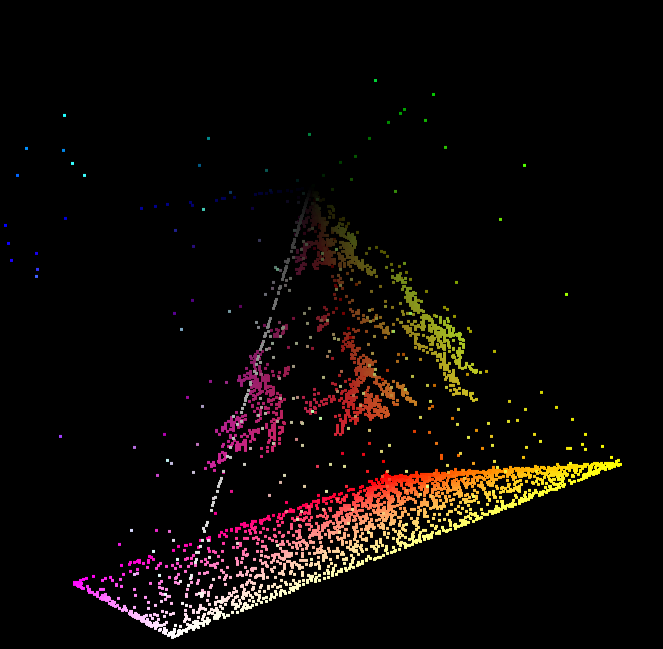

# DEPTH

♐DEPTH is a series of videos uploaded to the twitter account. The videos
were initially uploaded between June 16 and July 14, 2016. Additional
videos began to be posted on November 14, 2016, and the twitter account
stopped posting at ♐DEPTH
[30000](https://twitter.com/unfavorablesemi/status/801263953015881728)
on November 22nd.

{{\#ev:youtube|<https://youtu.be/k77jUxAMAo0>}}

(*a concatenation of twitter videos in this series — not including the
November tweets*)

## Description of videos

The videos in this series are two seconds long, with rapidly-changing
frames of a single color and the [Unknown Voice](Unknown_Voice) making a series of sounds that are not
the customary letters and numbers. Pieces of the
[Handshake](Handshake) appear occasionally
([example](https://twitter.com/unfavorablesemi/status/743637589274464261))

This series is well-preserved, and all of the videos have been scraped.
Several composites have been made of the videos.

## Composites

(*♐DEPTH composite — not including the November tweets*)

Main composite: <http://tomasf.se/projects/semi/DEPTH_composite.png>

Alternate composite:
<http://tomasf.se/projects/semi/DEPTH_composite_alt.png>

Flipped composite:
<http://tomasf.se/projects/semi/DEPTH_composite_flipped.png>

### 3d Composite

## Relationship with ♐[HARVEST](HARVEST)

The image in the DEPTH composite is visually similar to the top half of
the ♐[HARVEST](HARVEST) composite image. So far, no systemic
investigation has been made to determine whether they are exactly
similar. Likewise, it is otherwise unclear why or how the two series are
related.

*♐HARVEST composite by thomasf*

## Sound analysis

The ♐DEPTH videos contains sounds that seem to be audio from other
videos chopped into smaller slices. (It has been theorized that includes
the audio from ♐[CREM](CREM) and ♐[ZUFCHO](ZUFCHO)
amongst others.)

[Initial analysis](https://www.reddit.com/r/UnfavorableSemicircle/comments/4qpi6n/depth_videos_combined_interesting_audio/)
has indicated there are 100 discrete sounds used across the series, but
there is still work to be done finding the significance of that, such as
finding whether that comprises a codeset or if the pieces can be
arranged into a single continuous message.

An (incomplete) archive of the ♐DEPTH audio can be found here:
<https://www.dropbox.com/s/q9ah64v8rszhz3t/DEPTH_Audio.7z?dl=0>

## Links

Advanced twitter search of ♐DEPTH series:
<https://twitter.com/search?q=%E2%99%90DEPTH%20from%3Aunfavorablesemi&src=typd>
