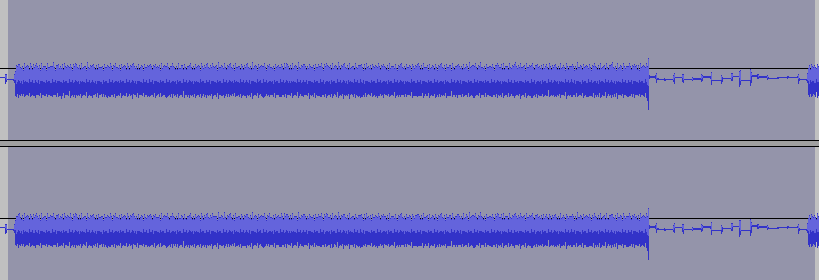
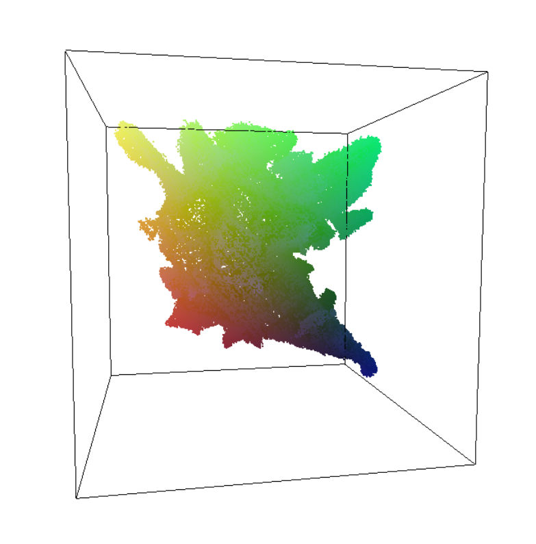

# DUAL

♐DUAL is series uploaded to the second YouTube account. ♐DUAL 0 was
posted on March 19, 2017 (the day after ♐[GOLDEN](GOLDEN "wikilink") was
posted). There are 10 videos in the series (♐DUAL 0 to ♐DUAL 9). ♐DUAL 9
was posted on March 24th, five days before ♐[HULL](HULL "wikilink") was
posted.

This video or series has a composite with an "interesting" [video scope](Video_scopes "wikilink").

## Description of videos

Regular ♐DUAL videos are 1:06:40 (4,000 seconds) in length and contains
a series of rapidly-flashing frames.

## Audio

The audio is a dual mono track of a whirring machine sound (with [DC offset](DC_offset "wikilink")) in bursts lasting approximately 2 minutes
48 seconds. The pattern changes at the end. The
[Handshake](Handshake "wikilink") can be heard at the start and end of
the audio.

Discord user Risto notes:
> the whirring is composed of identical sections with a 'steppy line level' silence afterwards:

> Interestingly, the handshake doesn't have an offset:

## Composites
### 2D composite
♐DUAL composite by Extra:

### 3D composite
Screen of full ♐DUAL 3-D composite (first view):

View 2:

The 3-D composite makes a roughly half-spherical shape, somewhat similar
to that of ♐[POINT](POINT "wikilink")'s 3-D composite. This (and other)
3-D composites are viewable
[here](https://lorpus.github.io/sketches/ufsc3d/).

## Links
* ♐DUAL 0, https://youtu.be/cmcweRQdj1w
* ♐DUAL 1, https://youtu.be/WOjLgReg8AE
* ♐DUAL 2, https://youtu.be/BGEZIUfLHjI
* ♐DUAL 3, https://youtu.be/RIoyGm9SfNM
* ♐DUAL 4, https://youtu.be/YSOFv2vpX7s
* ♐DUAL 5, https://youtu.be/yRm1LNID5sc
* ♐DUAL 6, https://youtu.be/Jj9Vl8kiQOM
* ♐DUAL 7, https://youtu.be/D3-0zG1D1C8
* ♐DUAL 8, https://youtu.be/7wWVFFnTfYY
* ♐DUAL 9, https://youtu.be/LRdFLCk-_d0
