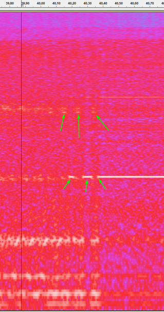
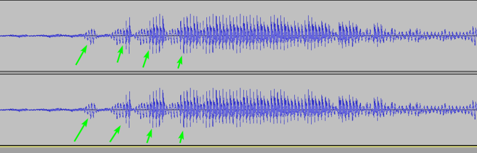
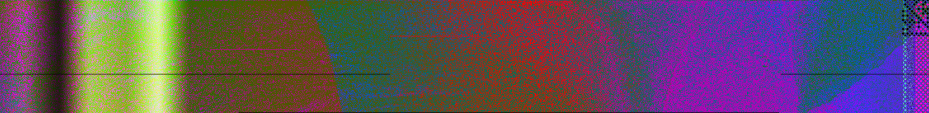
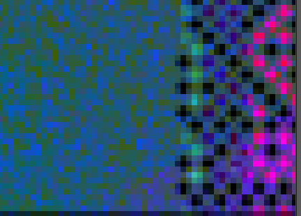

# ♐FORM

♐FORM is the final series of videos uploaded to the [3rd youtube channel](3rd_youtube_channel). The first video was posted on
December 31st, 2019, exactly one year after ♐[ROOT](ROOT) 0,
the channel's previous upload. This was the first content posted on the
channel after the [4th G+ post](Google_Plus#G.2B_post_4)
caused a re-appraisal of its authenticity. The second video (♐FORM 1)
was uploaded on January 2nd, 2020, making FORM a legitimate series,
unlike ♐ROOT.

Although it was theorized that a "full" series (based on analysis of the
composites) might include 24 videos, only three have been posted, with
nothing (yet) following the posting of ♐FORM 2 on January 5, 2020.

{{\#ev:youtube|<https://youtu.be/nfXy8nP6CLU>}}

## Characteristics

*more to follow!*

## Meaning of name

*more to follow!*

## Audio

Discord user Chris notes that, "FORM 2's audio really resembles
something that would be time stretched I can hear the stuttering and
rubber banding. The artifacts are visible on the spectrogram when one
section changes into another."

And adds: "At least they are something that audacity does with the low
quality time stretch. Here's a sample of my voice with the same
behaviour:"

## Composites

(*composite of ♐FORM 0, 1 + 2 1by discord user mark A Hidden Waffle, who
adds: "\[n\]ote that making a composite directly, they aren't all lined
up in the same spot, so I just moved parts around in gimp to make it
line up".*)

The composite forms a color gradient. mark mcmarkins observes, "if the
composite is meant to be a square then there will be 24 FORMs (also
assuming i got the width right)."

There is a pattern of some sort visible in the right edge of the
composite:

(*detail from ♐FORM 0*)

### 3-D Composite

*none yet\!*

## Videos in the series

♐FORM 0: <https://youtu.be/nfXy8nP6CLU>

♐FORM 1: <https://youtu.be/RrS0BtaOddc>
