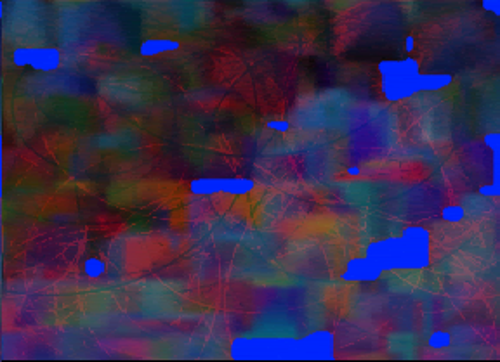
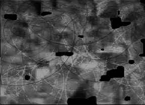

# GEN

♐GEN is a video posted to the [3rd youtube channel](3rd_youtube_channel) on October 14, 2018. It was
posted 58 days (or 1 month and 27 days) after ♐[CFO](CFO). It
is 38:07 in length and consists of a series of colored frames with
smoother transitions than usual. The ♐[ROOT](ROOT) series
would follow on December 31st, 2018.

## Audio
The audio track has a warbling, low-frequency sound with data noises.
The final 96 seconds look like a silent waveform, but as discovered by
Discord user Unstable Olding, "there is a lot of static/wind noise if
you amplify it".

## 2D composite
Composite by Discord user Markio:

The composite had blue "islands" over a magenta background. It has been
noted by Discord user unfavorablist that the image under that looks like
a slice of the "hair/grass" filaments in the ♐[RUN](RUN)
composite.

The hairs are most visible in the red channel of the image (as
discovered by Discord user crispyLettuce). Removing the other color
channels makes the curves more clear:

Discord user Raketemensch has noted that ♐GEN's 2-D composite looks like
a cloud chamber photo (or, similarly, a [bubble chamber](https://imgur.com/gallery/8uR3GK0/)).

## 3D composite
3D composite by Discord user Tukkek:

## Possible meanings of name
Gen can be short for *generation*.

## Links
* https://www.youtube.com/watch?v=gIAt8-XQIa0
