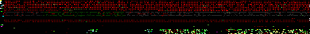
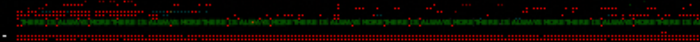
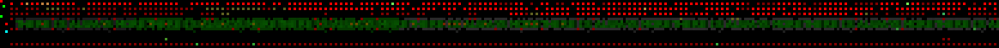
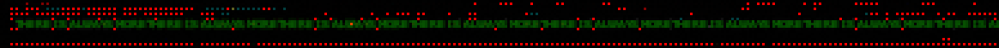

# GOLDEN

## Table of Contents
  * [Overview](#overview)
  * [Description of video](#description-of-video)
  * [Audio & analysis](#audio---analysis)
  * [Significance of name and relationship to other videos](#significance-of-name-and-relationship-to-other-videos)
  * [Composites](#composites)
    + [2-D Composite](#2-d-composite)
      - [Significant data in the composite](#significant-data-in-the-composite)
        * [Text in composite](#text-in-composite)
        * [Similarity to ♐[RAPID](RAPID "wikilink")?]
    + [3-D Composite](#3-d-composite)

## Overview

♐GOLDEN is a video posted to the second youtube account on March 18,
2017. It was the first video posted after an almost two-week break on
the youtube account (♐[MOTH](MOTH "wikilink") 55 was posted on March
4th) and the day before the start of the ♐[DUAL](DUAL "wikilink")
series.

## Description of video

The video is 5:33:49 in length. It has a series of flashing frames that create a 2-D composite.

## Audio & analysis

Unusually, the audio is different as played on youtube than in a
downloaded version. The downloaded version has a high-pitched tone in
the background throughout that is not audible when watching on youtube.

## Significance of name and relationship to other videos

There was no agreement as to the significance of the title after it was posted. The "\_OLDTHOUGHT" [tweet](June_2022_twitter_posts "wikilink") has linked it to the [Voyager Golden Record](https://en.wikipedia.org/wiki/Voyager_Golden_Record).

## Composites

### 2-D Composite

The composite creates a grid with four different images, similar to ♐[HARVEST](HARVEST "wikilink").

*♐GOLDEN Composite by ShadowMorphyn*

*♐GOLDEN Composite by @unfavorablesem*

#### Significant data in the composite

##### Text in composite

Similar to ♐[HARVEST](HARVEST "wikilink"), it appears that there is text encoded at the bottom of the top right quadrant. The small size made the text difficult to decipher. However, with the posting of @unfavorablesem's version of the composite in 2022, discord user && has theorized that the text reads "THERE IS ALWAYS MORE THERE IS ALWAYS MORE..." 

*closeup of text in ♐GOLDEN composite from community composite*

*version with pixel interpolation by alexanderpanos*

*text from "oldthought" version by &&*

*text from XOR analysis by &&*

##### Similarity to ♐[RAPID](RAPID "wikilink")?

The top-left quadrant has a schematic/wireframe look similar to
♐[RAPID](RAPID "wikilink"). It also looks possible that it can be
"folded" and re-aligned as with ♐[BROTHER](BROTHER "wikilink").

### 3-D Composite

*none yet\!*

