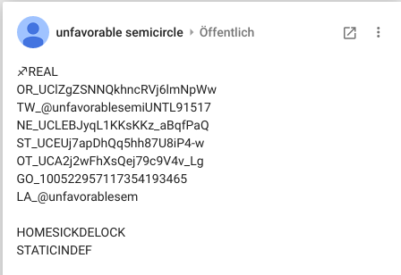

# Google Plus

Until the service's end in April 2019, Google/Youtube accounts also
included a Google Plus (G+) account. The UFSC G+ page belonged to the
same account as the second youtube account, and the messages on it are
assumed to be authentic messages from UFSC's creator(s).

## G+ post 1

The first post on the unfavorable semicircle [G+
page](Real_and_Fake_channels "wikilink") was posted on 2016-03-14. It
contained garbled text that contained links to the new youtube account
and the twitter account.

> At Mar 14, 2016, 12:11:50 PM AEDT A cryptic post was made to the
> Google+ page linked with the orginal youtube channel. This was decoded
> to point to the twitter page linked above.

* [*from the UFSC reddit page*](https://www.reddit.com/r/UnfavorableSemicircle/comments/4af177/ufsc_is_back/)

*screenshot of this post missing\! please add*

This post was removed shortly after it was discovered.

## G+ post 2

The second post on the unfavorable semicircle [G+
page](Real_and_Fake_channels "wikilink") was posted on 2016-03-15. The
only content was the word "MAX\_TEND".

A video named ♐[MAX\_TEND](MAX_TEND "wikilink") would later be posted to
the second youtube account on 2016-07-14.

This post was deleted some time between 2016-09-13 and 2016-09-16. A
[new, related, post](Google_Plus#G.2B_post_3 "wikilink"), reading
MAX\_TENDMALFORM was posted on 2016-09-23. Around the same time, the
video ♐[MAX\_TEND](MAX_TEND "wikilink") was renamed to ♐MAX\_TEND
MALFORM.

### Meaning of "MAX\_TEND"

*please expand\!*

## G+ post 3

The third post on the G+ page was posted on 2016-09-22.

The text read:

> MAX\_TENDMALFORM RETSPLIT&\#8853201639\#98082016239

At around the same time (although the precise timing is unclear)
♐[MAX\_TEND](MAX_TEND "wikilink") was renamed ♐MAX\_TEND MALFORM. The
next day, new videos (♐[RECOVER](RECOVER "wikilink") and
♐[BROTHER](BROTHER "wikilink")) started appearing after a two-month
hiatus.

### Interpretations of this post

The latter parts of the numbers can be interpreted as two dates:
2016-23-9 and 2016-3-9 (Year-Day-Month). These refer to the dates that
[Stabilitory newing](Stabilitory_newing "wikilink") and the new
unfavorable semicircle channel started posting new videos.

9808 is the unicode codepoint for ♐ in decimal, which precedes the
titles of all unfavorable semicircle videos. 8853 is ⊕ (CIRCLED PLUS)
([source](https://www.reddit.com/r/UnfavorableSemicircle/comments/545zv4/google_post/)), which precedes the titles of all [Stabilitory
newing](Stabilitory_newing "wikilink") videos.

⊕ may refer to

  - [exclusive OR (XOR)
    operation](https://en.wikipedia.org/wiki/Exclusive_or)
  - the astrological symbol for earth
  - the "[sun cross](https://en.wikipedia.org/wiki/Sun_cross)"
  - the [direct sum](https://en.wikipedia.org/wiki/Direct_sum) operation
    in abstract algebra

### Removal

Some time on 2019-03-27, this message (and all other content) on the G+
page was removed. This occurred several days before the service's
schedule shutdown on 2019-04-02.

## G+ post 4

After it was noticed that the third G+ post was deleted, a new post was
discovered on March 28. It was the first indisputable appearance of UFSC
on social media since the [Reset](RESET_STRANGE_YD "wikilink").

The text read:

> ♐REAL  
> OR\_UClZgZSNNQkhncRVj6lmNpWw  
> TW\_@unfavorablesemiUNTL91517  
> NE\_UCLEBJyqL1KKsKKz\_aBqfPaQ  
> ST\_UCEUj7apDhQq5hh87U8iP4-w  
> OT\_UCA2j2wFhXsQej79c9V4v\_Lg  
> GO\_100522957117354193465  
> LA\_@unfavorablesem  
>   
> HOMESICKDELOCK  
> STATICINDEF

### Possible interpretations

♐REAL may point out that the below given social media links are *real*
representations of UFSC, implying that the [3rd youtube
channel](3rd_youtube_channel "wikilink") and the post-reset incarnation
of [Twitter](Twitter "wikilink") are fake. (Or, to use a different vocabulary, a new "fork" of the project by a different creator.)

  - OR\_UClZgZSNNQkhncRVj6lmNpWw refers to the link of the the original
    youtube channel and its Youtube URL;
  - TW to the twitter handle (UNTL91517 = until 9/15/17 = the date of
    the [Reset](RESET_STRANGE_YD "wikilink"));
  - NE\_UCLEBJyqL1KKsKKz\_aBqfPaQ refers to the second youtube channel
    (NE=new?);
  - ST\_UCEUj7apDhQq5hh87U8iP4-w refers to the [Stabilitory
    newing](Stabilitory_newing "wikilink") Youtube account;
  - OT\_UCA2j2wFhXsQej79c9V4v\_Lg refers to a channel that the community
    previously regarded as fake - it reposted many old UFSC videos with
    a ♐♐ symbol as well as posted at least two original videos -
    ♐♐[LOYAL](LOYAL "wikilink") and ♐♐[CULLET](CULLET "wikilink").
    It was deleted some day before November 21, 2017 (OT=other?);
  - GO\_100522957117354193465 refers to the Google+ account of UFSC; and
  - LA\_@unfavorablesem refers to a [2nd
    Twitter](2nd_Twitter "wikilink") account.

### "Homesick" / ♐DELOCK

On June 19, 2020, Discord user Freezepond observed that the music in ♐[DELOCK](DELOCK "wikilink") appears to be a manipulated version of "[*Homesick*](https://youtu.be/Mw6n1LuMaBQ)", recorded by Bailey's Lucky Seven. (Gennett 4979, the b-side to “Carolina In The Morning”.)  This would seemingly explain the comment "HOMESICKDELOCK" in this post.
