# Handshake

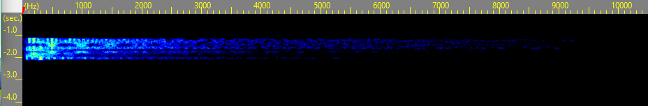

The **Handshake**, sometimes also referred to as **Sign-off** or
**Log-off** is a short sound clip, typically lasting shorter than one
second, that can be heard in several of Unfavorable Semicircle's videos.
The sound is mostly heard at the end of audio tracks, consisting of what
is likely a low, distorted sine wave that increases in frequency.

## Purpose

Judging by the Handshake's location in the audio tracks, which is
typically at the very end, it is likely that this is a header to mark
the end of a portion of data. Occasionally, the Handshake appears at the
start of the audio, possibly implying a sort of connection between other
occurrences of the Handshake. It is also possible that this is a
notification sound that could indicate the function of a computer
program, such as a signal to begin or stop audio recording.

## Appearances

  - [574016](574016 "wikilink") (At audio start)
  - [DEPTH](DEPTH "wikilink")
  - [MOTH](MOTH "wikilink") (At audio start, all videos)
  - [NIL](NIL "wikilink") *(example?)*
  - [RAPID](RAPID "wikilink")
  - [UPRIGHT](UPRIGHT "wikilink")
  - [LONE](LONE "wikilink")
  - [ZUFCHO](ZUFCHO "wikilink") (First appearance?)
  - [DUAL](DUAL "wikilink")
  - [FOLD](FOLD "wikilink")
  - [DDR\_DONE](DDR_DONE "wikilink") (At audio start; clearest sample;
    contains possible counterpart)

## Similar Features

A similar low, bass noise can be heard in
[♐574016](http://www.unfavorablesemicircle.com/wiki/574016) after each
spoken character. The noise heard between characters appears to be a
sort of reverb feedback. It may also be important to notice that the
Handshake appears in its normal form at the beginning of this video's
audio.

During the last second of [DDR\_DONE](DDR_DONE "wikilink"), uploaded to
Twitter, a second bass noise can be heard. This occurrence features a
descending tone unlike the Handshakes found in many other videos. It is
possible that the entire length of the sound was clipped due to the
video ending abruptly. Within the same video, what sounds like white
noise captured by a microphone can be heard about eleven seconds in,
having a rising frequency similar to that of the traditional Handshake.

## The "Handshake Symbol"

*Please note that this section includes analysis of materials from
[Un-REAL\_UFSC](Un-REAL_UFSC "wikilink").*

Discord user alexbassguy discovered "what appears to be a symbol in the
middle" of the handshake when the sound is viewed in a waterfall
sonogram:

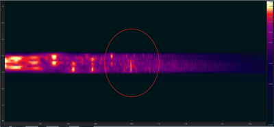

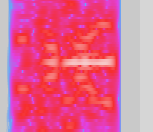

*detail of spectrogram image by discord user Risto*

alexbassguy's commentary notes: "You NEVER see symmetrical frequency
patterns like that in audio, it's just not how audio works. The spooky
thing? I found it by scaling the view in my spectro software to 18k,
which is right where I've always seen this odd shelf in UFSC audio.
There's audio information that sometimes spikes up to 20k in all of the
audio I've looked at, but there's always this weird 'dead zone' above
18k."

Risto noted overtones in the spectrogram:

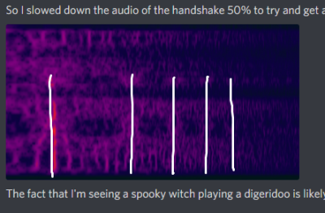

(alexbassguy concurred: "they're second-order harmonics, usually caused
by distortion, of which there's plenty.")

### Recreating the image

alexbassguy "was able to create this \[image\] using a sine generator
and some extensive distortion processing. This is the sonogram, closeish
but not exact."

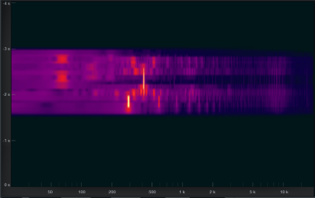

It had been noted that the symbol in the spectrogram image is similar to
♓️, the astrological symbol for Pisces, so "on a lark, I \[alexbassguy\]
grabbed an image of the Pisces symbol, and ran it through an
image-to-audio converter... With some tweaking and using distortion
tools, I was able to get this. It's not centered on the right frequency
but it also looks very, very similar to the handshake."

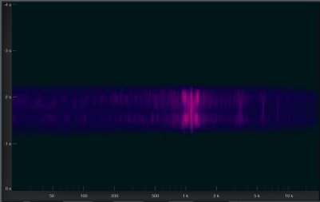

### Proposed Definitions

#### Risto

Discord user Risto proposes: "Let's define Handshake's frequency as the
frequency of the 'Pisces line'":

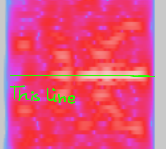

Risto continues: "The default handshake frequency then probably is
exactly 490 Hz. RAPID's handshake is 490Hz." Additionally, half of the
symbol appears in the handshake at the start, and the other half at the
end:

| start of file                                                                         | end of file                                                                     |
| ------------------------------------------------------------------------------------- | ------------------------------------------------------------------------------- |
| 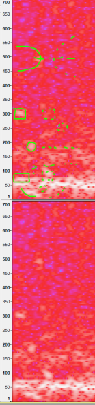 | 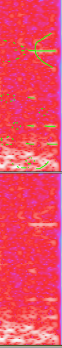 |

#### ShadowMorphyn

Discord user ShadowMorphyn proposes that the symbol is, in fact, a
visualization of the Sagittarius symbol, noting, "I drew what I can see
in the handshake. Add a line and it's a bow.

| 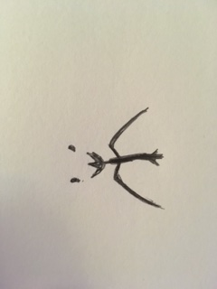 | 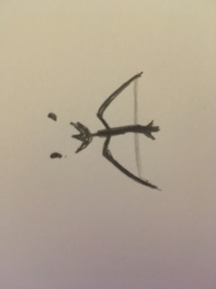 |
| ---------------------------------------------------------------------------- | ---------------------------------------------------------------------------- |

## DC offset

It has been observed by Discord user Risto that in at least one case
that the handshake doesn't have a [DC offset](DC_offset "wikilink") when
the rest of the audio does:

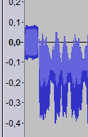

*Handshake + DC offset audio in ♐DUAL*

