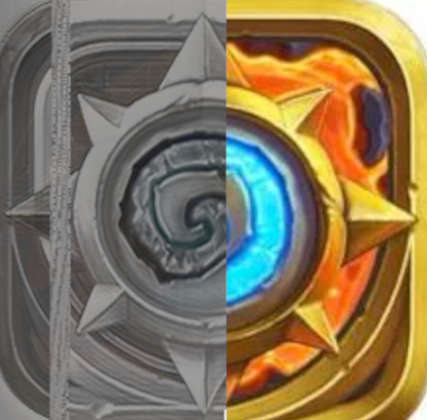
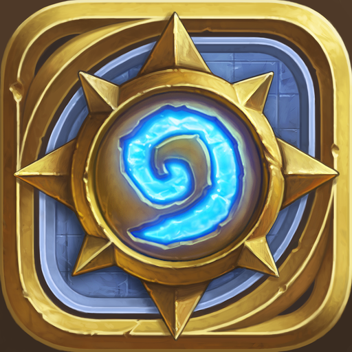
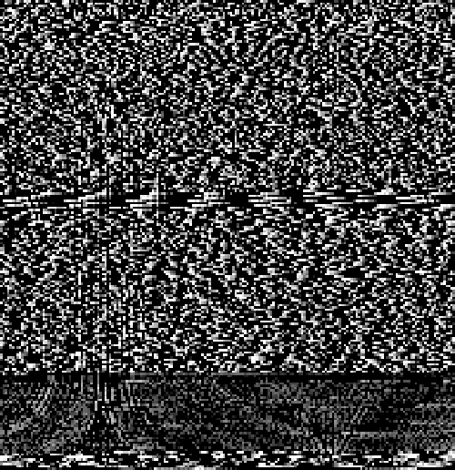

# Hearthstone 

Hearthstone is a 2014 online collectible card-game by Blizzard Entertainment. In February 2024, investigation of [audio composites](audio_composites "wikilink") revealed that the game's icon, a stylized compass was contained within [♐LOCK](LOCK "wikilink")'s audio data, which Discord user `Piecat` then identified as being from Hearthstone through a reverse-image-search on Google.

A collage with a section of ♐LOCK's audio composite on the left and one version of the IOS game logo on the right:

## Further investigation

Discord user `ShinyQuagsire` has pin-pointed the 2015 IOS icon to be the exact version used, which was likely to be the current one at the time ♐LOCK was uploaded:

> Dom: here's the best image I could come up with after repairing the clipped peaks, removing DC offset, sampling the high point of each 128 length block, adding 56 black pixels after the voice interlude, and lining everything up \[visually\] by hand.
> 
> Based on visual comparison, I'd say this is the red channel of the hearthstone logo, not a true black and white version

> Dom: Found another copy of hearthstone logo in LOCK
> 
> Easiest to see at the bottom, where the noise is least. You can also see the vertical lines along the left side.
> 
> This one is found immediately after the first, and it has a width of 192 pixels, the first was 256 pixels.

## Other similarities

Since this discovery, many similarities between the game and UFSC have been found, including:

* A card named Spell Lock.
* [Brill](BRILL "wikilink") is the name of an in-universe town.
* A card named Star Aligner whose flavor text mentions Sagittarius.
* Christie [Golden](GOLDEN "wikilink") wrote novels for World of Warcraft, which is in the same fictional universe as Hearthstone.
* There are also "golden" cards in Hearthstone
* A card named [Freebird](MAX_TEND "wikilink").
* In the MMORPG World of Warcraft, also by Blizzard Entertainment the hearthstone core item can be used to transport the player from anywhere in the game world to their user-set "home location". "Homesick" was a song featured in [♐DELOCK](DELOCK "wikilink") - with a possible thematic connection between LOCK with DELOCK and being-home (or returning-home) with being-homesick.

# See also

* [♐BROAD](BROAD "wikilink") may have a reference to a hero in DOTA, a game originally released as a modification of Warcraft 3 (also by Blizzard Entertainment).
