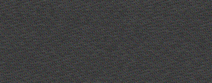
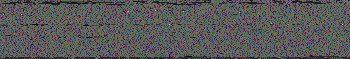

*summarized from Discord conversation 2017-05-18*

*technical work by extra; ideas + transcription by unfavorablist*

## Concept

Can we extract data from the shifting "histogram" images in [Stabilitory newing](Stabilitory_newing "wikilink") videos?

The images have fifty "pillars" or columns that can have a height from
0-35.

## Method

extra assigned the heights in the "pillars" alphanumerically, A-Z and
0-9. (36 unique values)

Here's each unique frame from BELT 1 with each line being one frame:
<https://pastebin.com/raw/X82VLNA9>

This data can be saved (in a text editor) as a .data file, and that file
can be opened in GIMP (or other image editor).

The image rendered by GIMP reveals a certain pattern:

This pattern exists in a dataset derived from RATE as well.

Adjusting the width to 572 gives this:

### Is this random or coincidental?

To compare, I grabbed a random book (in plain txt format) from the
Gutenberg Project, and saved that to a .data file. When I opened that in
GIMP, it looks like this:

## Follow-ups / next steps

Doing this with all of SN's BROTHER seems like a reasonable step.

## extra's script

here: <https://hastebin.com/ficubivoze.py>

  - uses python 3 and all you have to do is "python a.py
    <folder with frames>"
  - it's probably the best idea to download in webm format. also
    duplicate images are handled so you don't have to worry about that
  - shl is the y position of the always-there horizontal line, I dont
    think it ever changes
