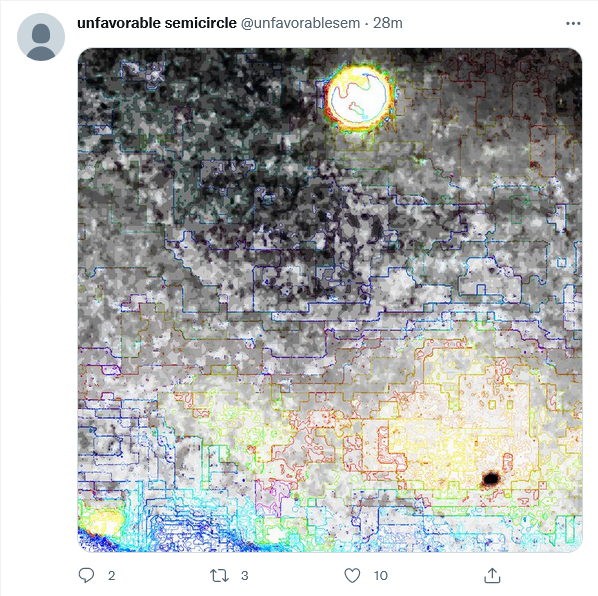
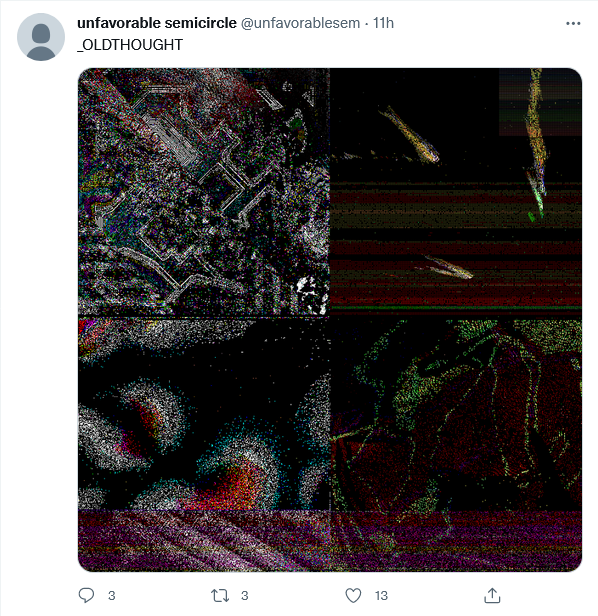
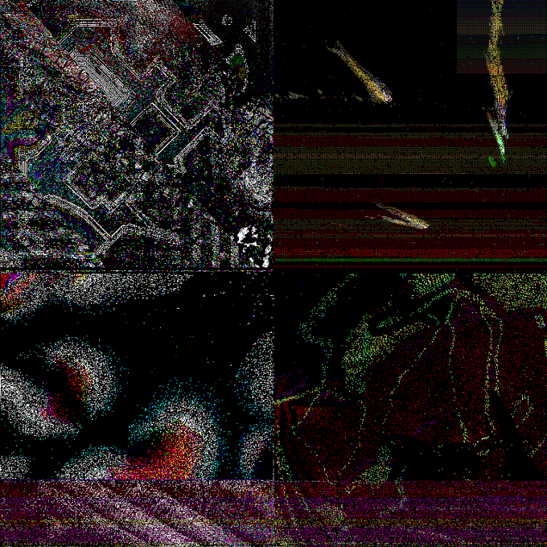
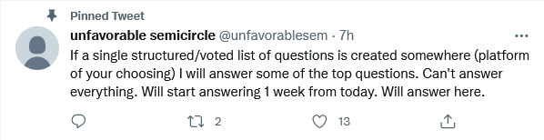

# June 2022 twitter posts

On June 1, 2022, the Unfavorable Semicircle twitter account ([@unfavorablesem](https://twitter.com/unfavorablesem)) became active for the first time since its founding in March 2019, posting a series of tweets in a short period of time.

It is unclear if the person posting to the twitter account is an actual author of UFSC or merely someone who has assumed control of the account.

## Tweets and interpretation

### Tweet #1

> I  think if an alien were to communicate with us it'd be like UFSC. Totally unhuman way of communication and thought.
> 
> (I'm not saying UFSC is an actual alien lol)

#### Analysis

The first tweet is a direct quotation from [a post](https://discord.com/channels/193619269794267137/842288203150655488/918303627532185650
) from December 8, 2021 by discord user scottywiththebody in the #astrology channel.

### Tweet #2

> got it basically right. outsider art, some puzzle some arg. webdriver inspired. a fine line between comprehensible and noise. stream of conscious, vague meanings. programming project & nothing exciting. meaningless poem unfound. not sure can be. nice work to all involved!♐️

#### Analysis

A largely straightforward comment, although the reference to the "meaningless poem unfound" is unclear.

### Tweet #3

> love this

This tweet included [a youtube link](https://youtu.be/68C1Gc4De7c) to the song "The Most Beautiful Day" by Professor Kliq. The lyrics of the song describe UFO's arriving at Earth:

> And once it came close enough I knew
> 
> That all these tiny little things
> 
> That all these tiny little things
> 
> That all these tiny little things
> 
> I realised that they were UFOs
> 
> I realised that we were being invaded by aliens
> 
> On the most beautiful day that I've ever seen

#### Analysis

Discored user ShadowMorphyn posited that "that song they posted is definitely the sound for ♐[SQEN](SQEN "wikilink")".

### Tweet #4

- an image that appears to be a more complete version of the various composites found in the [BRILL group](BRILL_Composite "wikilink").

#### Analysis

(to follow!)

### Tweet #5

- contains a link to the [wikipedia article](https://en.wikipedia.org/wiki/Voyager_Golden_Record) for the Voyager Golden Record, as well as an image of the ♐[LOCK](LOCK "wikilink") composite.

#### Analysis

This is an obvious assertion that the image in the ♐LOCK composite is of the Voyager Golden Record.

The image posted is a 250x250 version of the ♐LOCK composite, which has apparenly not been previously posted in the community.

### Tweet #6

> \_OLDTHOUGHT

#### Analysis

The meaning of "\_OLDTHOUGHT" is unclear. The tweet includes an image of the ♐[GOLDEN](GOLDEN "wikilink"), as a resolution of 680x680. This would seem to tie this compososite, like ♐LOCK, to the Voyager golden record.

### Tweet #7

> If a single structured/voted list of questions is created somewhere (platform of your choosing) I will answer some of the top questions. Can't answer everything. Will start answering 1 week from today. Will answer here.

#### Analysis

This tweet was pinned in the twitter account. It is pretty straightforward, and efforts began immediately to respond with questions of authentiicity and method.
