# LOCK
## Overview
♐LOCK is a video posted to the original UFSC YouTube channel on July 18, 2015. Analysis of the video lead to the creation of the first [composite image](Composite_visual_overview "wikilink").

## Description of video
♐LOCK is mostly black with colors occasionally flashing and revealing a
single black pixel within each frame.

## Audio
At the start of the video, the [Unknown Voice](Unknown_Voice "wikilink")
spells out the word "LOCK". The audio is in stereo with many strange
sounds, heard separately in the left and right channels.

Unusually, this is the only known UFSC video at a 48K sample rate (as
opposed to 44.1K)

### Morse code
On January 2022, Discord user `Princeton King` has made the following claim:

> Guys the audio in lock its reads fear in Morse code 
> 
> `••-• • •- •-•`
> 
> play the video at 0.25x
> 
> Then you can see the flashes and hear the sound how they line up It's easier to  line them up

### Direct-current offset
> Dom: It seems like the DC offset of LOCK's left channel is correlated with the amplitude of the signal. Here's a few snippets from the section with [the hearthstone composite](Hearthstone "wikilink"):

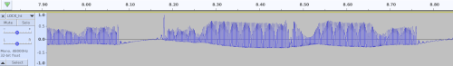

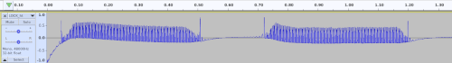

> When there is no signal (in the blank space near the left and right side of the image), the waveform is centered around 0, or slightly higher. As the signal comes in, the DC offset increases and the whole waveform gets lower. Seems like it has some inertia to it, and it eventually reaches a steady position if the signal is constant in amplitude, as it is in the first image.
>
> Also worth noting the waveform for basically the entire track looks like this. Google calls it a "half-wave rectified sine". Even the voice has this waveform

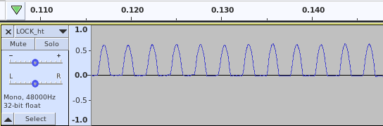

> Mike & Rich: Yeah thats basically a unipolar sine wave, a simpler name for it

#### Red-shift
Red-shifting is a concept in physics, especially important to the field of astronomy, when it comes to measuring the distance and speed of deep-space objects or radiation. The Oxford dictionary defines it as:

> The displacement of spectral lines toward longer wavelengths (the red end of the spectrum) in radiation from distant galaxies and celestial objects.

The DC offset here may have a similar effect. It has been observed that ♐LOCK's Hearthstone icon seems to be a copy of the original image's red channel (rather than the entire red-green-blue image). Since one of UFSC's themes is astrology (or astronomy), it is possible that this is a delberate technical-aesthetical choice.

### GSM
On November 2024, Discord user `N25_CT13` wrote:

> Lock's right audio channel is most likely raw data read as GSM 6.10 "format" which is present in Audacity and the left channel's DC offset could have been removed due to the GSM encoding removing DC offset for some reason (could be due to compression).

A comparison of raw-data encoded as GSM (provided by `N25_CT13`) and LOCK's audio:

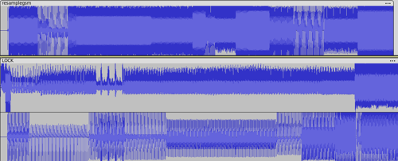

The next month: GSM-like audio was also discovered in 40 videos in the [original unnamed series](Original_unnamed_series).

In January 2025, user `Fufeng Industries` says:

> Fufeng Industries LLC: Imported small EXE into Audacity using GSM 6.10. It ended up with the characteristic DC offset as seen in LOCK. A bit more chaotic and all over the place, but it does bear very much resemblance.
>
> tukkek: does it sound like UFSC too? Considering its likely the [audio-composite](audio_composites) icons are also from EXEs (different sizes repeat), this makes a lot of sense.
>
> Fufeng Industries LLC: Yes, very much. It sounds exactly like the videos in [the original numbered series](Original_unnamed_series), and when slowed to 0.013 of the original speed it sounds like LOCK (repeating "wump, wump, wump" noises).

## Significance
- Along with [♐DELOCK](DELOCK "wikilink"), due to its name it has long
  been suspected that this video is of special significance in
  deciphering any concealed messages that other videos might contain.

### Frame composite discovery
On April 20, 2016, Reddit user tomasf.se discovered that when each individual frame of the video is combined into an image with a width of 197 pixels, a picture appears. The subject of this image was subject to intense debate over several years (_see below_). In June 2022, @unfavorablesem [posted](https://twitter.com/unfavorablesem/status/1532221038372786177) a new version of the composite image alongside a link to the wikipedia article on the [Voyager Golden Record](https://en.wikipedia.org/wiki/Voyager_Golden_Record).

## Composite images
Regular Size: <http://tomasf.se/projects/semi/LOCK_composite.png>  
Huge Size: <http://tomasf.se/projects/semi/LOCK_composite_huge.png>

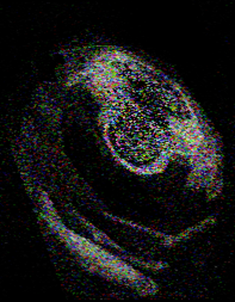

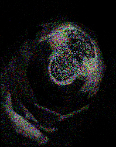

(_alternative ♐LOCK composite with width of 197.36 pixels that does not need to be shifted to the left like the previous one (which may be skewed_)

(_version [posted to twitter](June_2022_twitter_posts "wikilink") by @unfavorablesem_)

### 3D Composite
The later discovery of 3D Composited lead to retrospective analysis of earlier videos, but there is nothing particularly "interesting" in this video's 3D composite.

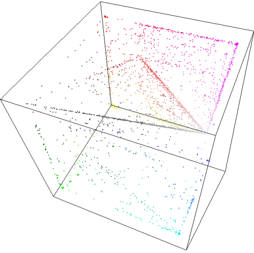

By Lukidot:

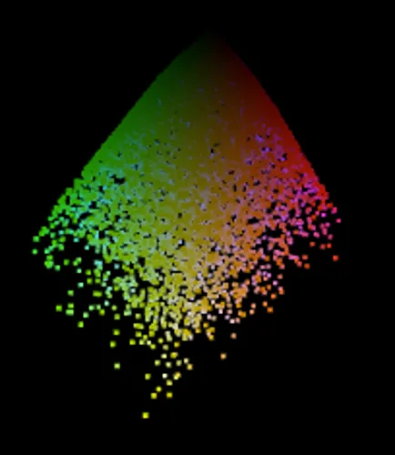
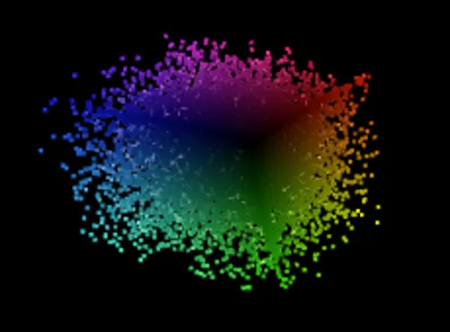

The arrow-tip shape is similar to [Run](RUN).

## "black dots" and "bars"
Many frames in ♐LOCK contain a single black pixel at different locations in the 50 x 50 image. (The small image size means that there is an 8 x 8  compression artifact around the dot.) Some frame also have a "bar" across the bottom. Discord user Dom has noted "some frames have a dot, some have a bar, and some have both. Darker frames tend to have neither."

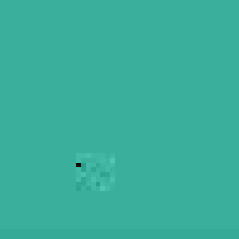

**An enlarged frame from LOCK (original 50x50). Note the 8x8 artifact and the 2x50 bar.**

*This image has been adjusted the contrast for visibility (normally the artifacts are much more subtle, especially the bar).*

*Image by Discord user Dom.* 

It has long been debated as to whether the the positions of the dots are random or represent meaningful data.

## Theories and possible explanations
### Observations on the ♐LOCK image
Many users have proposed that the image decoded from the video contains
various things. Possibilities mentioned by users include:

  - A Watch
  - A Skull
  - Text reading "MGM 1900" (*also seen as MGK or MCM*)
  - Some kind of coin
  - Mushroom cloud from an atomic explosion
  - Hurricane radar image
  - A Galaxy or dark nebula
  - [Saturn's hexagon](https://en.wikipedia.org/wiki/Saturn%27s_hexagon)
  - An ultrasound image
  - A hand holding a pokeball
  - A deformed pokeball
  - A grey hair
  - A lock
  - A look-alike of MC Escher's "Hand With Reflecting Sphere"

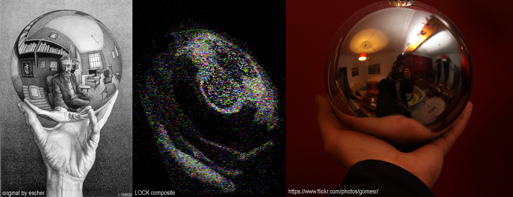

### Other possible theories
- a compilation of individual pixels from other UFSC videos
- an SSTV broadcast image
- a result of a computer program attempting to create music
- speaker feedback sounds

## See also
- [Max](Max "wikilink") (software)
- [♐CRIMP](CRIMP "wikilink") and [♐RECOVER](RECOVER "wikilink") may also have a lock-and-key dynamic

## Contemporaneous Reddit threads
Arranged roughly in chronological order:
- [♐LOCK](https://www.reddit.com/r/UnfavorableSemicircle/comments/464sfd/lock/)
- [LOCK sped up and pitch adjusted](https://www.reddit.com/r/UnfavorableSemicircle/comments/46lhie/lock_sped_up_and_pitch_adjusted/)
- [Has anyone made a text transcription of Lock / Delock?](https://www.reddit.com/r/UnfavorableSemicircle/comments/476x6i/has_anyone_made_a_text_transcription_of_lock/)
- [At certain parts, LOCK sounds a lot like a printer](https://www.reddit.com/r/UnfavorableSemicircle/comments/477u29/at_certain_parts_lock_sounds_a_lot_like_a_printer/)
- [PSK and LOCK](https://www.reddit.com/r/UnfavorableSemicircle/comments/47y433/psk_and_lock/)
- [LOCK Audio](https://www.reddit.com/r/UnfavorableSemicircle/comments/48914s/lock_audio/)
- [RELOCK similar premise to LOCK](https://www.reddit.com/r/UnfavorableSemicircle/comments/4blgaa/relock_similar_premise_to_lock/)
- [Attempting to decode LOCK audio](https://www.reddit.com/r/UnfavorableSemicircle/comments/4btk38/attempting_to_decode_lock_audio/)
- [LOCK frames combined into one image\!](https://www.reddit.com/r/UnfavorableSemicircle/comments/4fo16c/lock_frames_combined_into_one_image/)
- [About LOCK](https://www.reddit.com/r/UnfavorableSemicircle/comments/47hzvj/about_lock/)
- [audio on LOCK](https://www.reddit.com/r/UnfavorableSemicircle/comments/47jqia/audio_on_lock/)
- [Unlocking the ♐LOCK - WIP](https://www.reddit.com/r/UnfavorableSemicircle/comments/48q7yt/ufsc_unlocking_the_lock_wip/)
- [The LOCK frame composite is a coin.](https://www.reddit.com/r/UnfavorableSemicircle/comments/4fu6bw/the_lock_frame_composite_is_a_coin/)
- [LOCK image comparison to Saturn's Hexagon](https://www.reddit.com/r/UnfavorableSemicircle/comments/4g1qcq/lock_image_comparison_to_saturns_hexagon/)
- [Lock composite as a spiral](https://www.reddit.com/r/UnfavorableSemicircle/comments/4gomnd/lock_composite_as_a_spiral/)
- [Steganalysis On Large-Sized LOCK Composite?](https://www.reddit.com/r/UnfavorableSemicircle/comments/4hyvgu/steganalysis_on_largesized_lock_composite/)
- [Hey there, just wanted to contribute an idea.](https://www.reddit.com/r/UnfavorableSemicircle/comments/59ll1h/hey_there_just_wanted_to_contribute_an_idea/)
- [Steganalysis Results on Incomplete BRINE, & LOCK Composites](https://www.reddit.com/r/UnfavorableSemicircle/comments/4khjim/steganalysis_results_on_incomplete_brine_lock/)
- [Looking further into the LOCK composite](https://www.reddit.com/r/UnfavorableSemicircle/comments/5nzja2/looking_further_into_the_lock_composite/)
- [Have we considered that the LOCK composite may be a black hole?](https://www.reddit.com/r/UnfavorableSemicircle/comments/5nzn3u/have_we_considered_that_the_lock_composite_may_be/)
- <https://www.reddit.com/r/UnfavorableSemicircle/comments/6ydeo1/does_anyone_else_think_the_lock_composite_image/>
