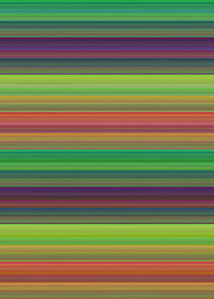
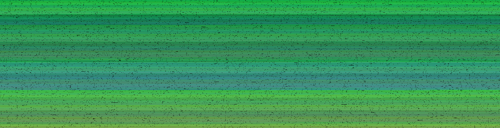
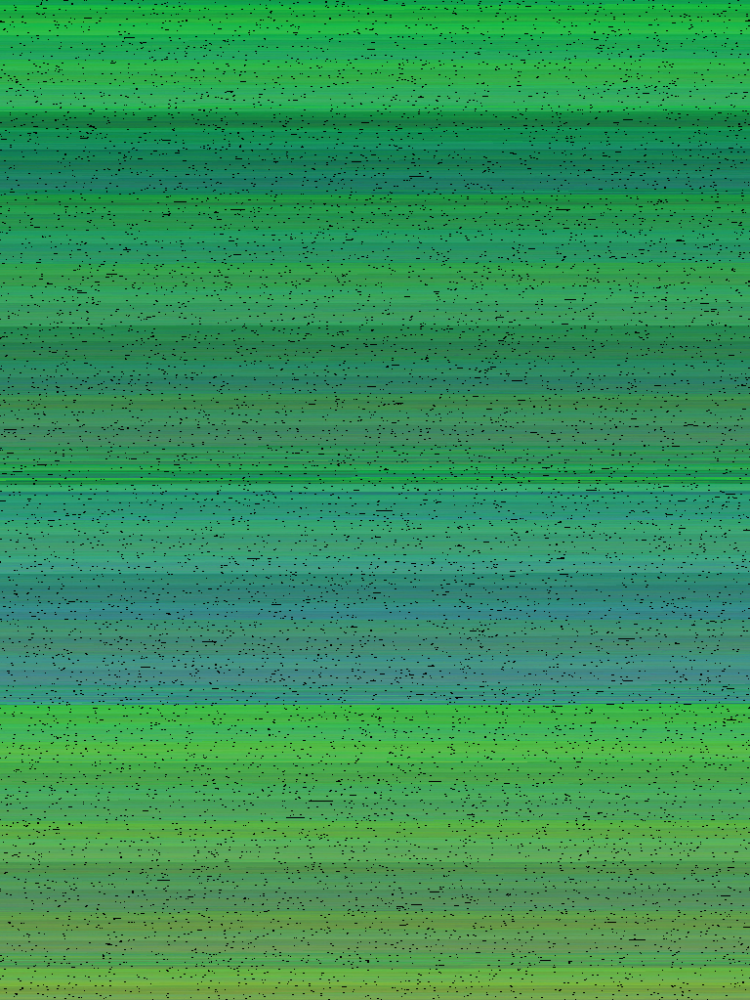
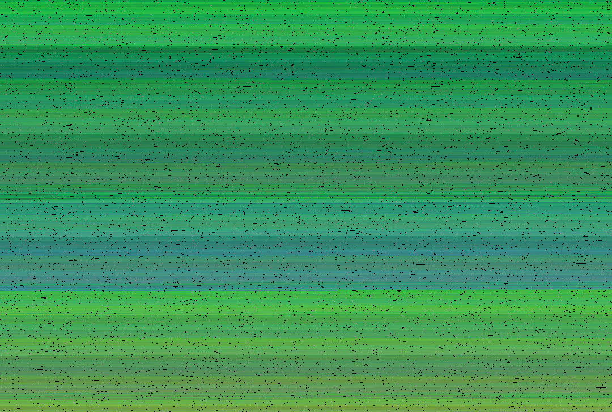
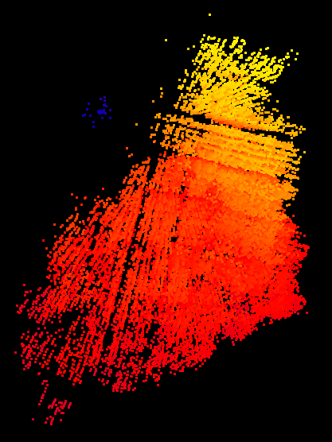

# LOCUS
## Overview
♐LOCUS is a series of videos uploaded to the second YouTube account.
♐LOCUS 0 was posted on October 16, 2016 (approximately three hours
after ♐[BROTHER](BROTHER "wikilink") 22). There are sixteen videos in
the series, and posting ended with ♐LOCUS 15 on November 24th (the day
before ♐[CRIMP](CRIMP "wikilink") was posted). Unusually, the first
seven videos were posted concurrently on youtube with the end of the
♐[BROTHER](BROTHER "wikilink") series.

This video or series has a composite with an "interesting" [video scope](Video_scopes "wikilink").

## Description of videos
♐LOCUS videos are 7:16:46 in length. They contains a series of
rapidly-flashing colored frames. ♐LOCUS 0 contains a mono audio track of
a rumbling "rock tumbler" sound. Discord users Unfavorablist and hellajt
observed that if the speed is increased to the length of other videos
like [FOND](FOND "wikilink") or [MAX TEND](MAX_TEND "wikilink"), it had
a familiar "data transmission" sound. (*further examination is required
regarding similarity of audio for videos within the series*)

## Significance of name
Locus is defined as "a particular position, point, or place" in
vernacular speech and more specifically refers to "a curve or other
figure formed by all the points satisfying a particular equation of the
relation between coordinates, or by a point, line, or surface moving
according to mathematically defined conditions" in mathematics.
(*compare to other UFSC titles that relate to mathematical concepts*.)

## Composites
### 2D Composites
Full LOCUS composite (0 to 15) by Tomas F:

♐LOCUS 0 composite by Hellajt:

♐LOCUS 0 composite by Shadow Morphyn (width of 768 pixels):

♐LOCUS 0 composite by Shadow Morphyn (width of 1,080 pixels):

The nature of the pattern (or [patternicity](https://en.wikipedia.org/wiki/Apophenia)) make it unclear what width should be used for making 2-D composites.

Tomas' full composite of the series (*large file!*) is [here](http://tomasf.se/projects/semi/LOCUS_composite.png).

### 3D composites
Creating a [3D\_composite](3D_Composite "wikilink") from the LOCUS videos reveals a clearly defined shape.

The .stl of Thomas' 3-D composite can be found [here](http://tomasf.se/projects/semi/LOCUS_composite3D.stl) and a video of it [here](http://tomasf.se/projects/semi/LOCUS_composite3D_recording.mp4).

Vantjac also has a composite [here](http://vanjac.github.io/sketches/ufsc3d/).

(These composites are large and may cause distress to your computer if you try to open them)!

## Audio
> ben's fractals: I noticed that when you speed up the audio in the LOCUS series by a lot (around 20 times) it turns out that it's actually a really low-passed static
> 
> It does sound like it has something encoded in it though

https://github.com/ufscwiki/Unfavorable-Semicircle-Wiki/tree/master/docs/locus0speedup20.wav

> The same audio is also present on [ROOT](ROOT)
>
> Very similar to [BRINE](BRINE)'s audio (same garbled noise that vaguely resembles a sort of transmission) 
>
> Also you can isolate the voice in it since the static is completely mono but panned by ~40% to the left
>
> I'm pretty sure it's the same audio as in [574016](574016)

## Links
* ♐LOCUS 0, https://youtu.be/DdUGUsoBD8o
* ♐LOCUS 1, https://youtu.be/Ops6Uug6P5c
* ♐LOCUS 2, https://youtu.be/P7AJOCrJJMc
* ♐LOCUS 3, https://youtu.be/sQApUD4U2Hc
* ♐LOCUS 4, https://youtu.be/cAXosCSUYeA
* ♐LOCUS 5, https://youtu.be/G13-2-LBIzA
* ♐LOCUS 6, https://youtu.be/npzdVfviGQI
* ♐LOCUS 7, https://youtu.be/NmX0v3bH164
* ♐LOCUS 8, https://youtu.be/348x0zlo9wI
* ♐LOCUS 9, https://youtu.be/TsJ5GuD50o8
* ♐LOCUS 10, https://youtu.be/KsLb7hqz7kU
* ♐LOCUS 11, https://youtu.be/8RI-9rWkqUs
* ♐LOCUS 12, https://youtu.be/PZOFovTHi3c
* ♐LOCUS 13, https://youtu.be/Y8Kvt3eqbVE
* ♐LOCUS 14, https://youtu.be/c0ndu7bz8Xs
* ♐LOCUS 15, https://youtu.be/8b_8hHdsISU
