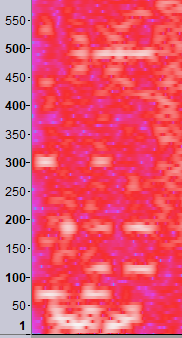

♐LONE is a video posted to the [second YouTube
account](Real_and_Fake_channels "wikilink") on March 26, 2016. It was
posted the day after ♐[ZUFCHO](ZUFCHO "wikilink"), during a busy period
for UFSC that included ♐[WINGSET](WINGSET "wikilink"),
♐[RETIO](RETIO "wikilink") and ♐[LIMIT](LIMIT "wikilink") (as well as
the ♐[CAB](CAB "wikilink") and ♐[MUL](MUL "wikilink") series on
twitter).

{{\#ev:youtube|<https://www.youtube.com/watch?v=z5tEB24D4Lc>}} [Original
Link](https://youtu.be/k_HC_6gdnxk)

## Description of video

The video is 1:20 in duration. The image is primarily black, with some
pulsating purple pixels.

## Audio

`It contains a mono audio track of heavily-distorted sounds, including the `[`Handshake`](Handshake "wikilink")`. ([`<https://www.youtube.com/watch?v=zl5K7Xs9jtA>`| Noise reduction] can reveal some of the sounds behind the distortion.)`

### Audio Analysis

Discord user Risto notes that ♐LONE "has a nice and clear handshake at
490 Hz, both at the beginning and end":

#### For further research

Risto notes, "there is a fragment of what could be a voice, but that
would require denoising."
