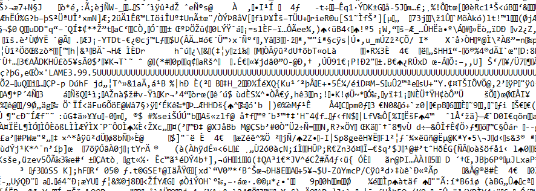
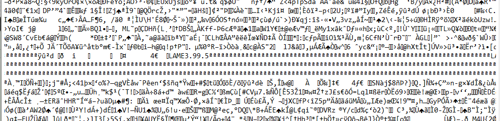

# LOVE
♐LOVE is a video posted to the [second YouTube account](Real_and_Fake_channels "wikilink") on June 11, 2016. It was
posted a week after the ♐[FEND](FEND "wikilink") series ended and posted
just before the ♐[FOND](FOND "wikilink") series began.

{{\#ev:youtube|<https://www.youtube.com/watch?v=Q20vJdocgwU>}}

## Description of video
The video is 1:51 in duration, although due to (possibly deliberate)
encoding errors, it only plays for 0:22. the video has pulsating white
pixels on a black background.

## Description of audio
Although the video in the file only lasts 22 seconds, there is a
full-length mono audio track. It sounds (possibly) like
heavily-distorted speech.

When the audio is slowed down (for example, from one minute and fifty
seconds to one hour and fifty minutes) there are morse-like bips
throughout.

## LAME tags
On September 14, 2017, Discord user [unstable olding](unstable_olding "wikilink") mentioned finding *LAME3.99.5*
strings in the LOVE text files. This is
the metadata tag of [a famous MP3 file encoder](http://lame.sourceforge.net/), in it's latest version as of the
date (3.99.5, released back in 2012). This could be evidence that either
this encoder was used to generate the audio tracks for the video or that
the video carries a [hidden payload](https://en.wikipedia.org/wiki/Payload_\(computing\)) of one or
more MP3 files (also encoded with LAME, presumably, not necessarily by
UFSC himself). They could also be an artifact of YouTube re-encoding the
audio tracks on the video.

-----

# Glitches
User Lukidot reports the video crashing VLC (version 3.0.21 on Windows 8.1), with a crash reporter oponing on relaunching VLC:

https://github.com/ufscwiki/Unfavorable-Semicircle-Wiki/blob/master/docs/love.crash.mp4

A user with VLC 3.0.22 on Linux could not reproduce the crash.
