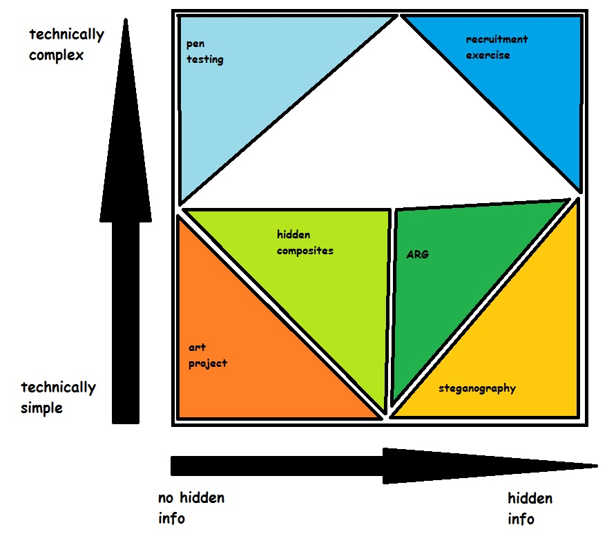

## Introduction on theories

Because so little is understood about UFSC relative to the massive
amount of content, theories as the meaning of the project and the intent
of the creator(s) abound. This is made more complex because it is not
conclusively proven, for example, whether or not there is hidden
information encoded in the videos. The very act of creating and
distributing such a large number of videos might be the "point" of the
project — or they could each be pieces of a massively complicated
puzzle.

*UFSC theories, visually represented*

## Possible Theories

### Outsider art

Unfavorable Semicircle exhibits some elements of [outsider art](https://en.wikipedia.org/wiki/Outsider_art) — an elaborate "world"
whose meaning and internal logic are opaque to external observers. The
"art" may be an attempt to relate or explain the author's worldview, or
it may solely be created to satisfy the author's creative urges. (See,
for example, the works of [Henry Darger](https://en.wikipedia.org/wiki/Henry_Darger),
[Jandek](https://en.wikipedia.org/wiki/Jandek) and the maker of the
[Toynbee tiles](https://en.wikipedia.org/wiki/Toynbee_tiles).)

UFSC's videos have a remarkable similarity to
[Max](Max "wikilink")-based works.

### Steganography

Steganography is the act of hiding information in plain sight, more or
less "Security through obscurity". What good is knowing how to crack any
conceivable code if you don't know the code exists in the first place?

A feasible example of Steganography would be [hiding images within other images](Composite_visual_overview "wikilink") using "least significant
bit" encoding. The LSB of each color is changed slightly, the changes
are not perceivable, but are only revealed when an original and almost
identical image is XORed with the modified image.

#### Modern number station

Due to the "eerie factor" alone the similarity with [number stations](https://en.wikipedia.org/wiki/Numbers_station) has been
brought up many times, which is another phenomena that was found and
studied for decades before eventually surfacing as a method of secure
long-distance communication. The fact that UFSC uses public platforms
such as [YouTube](YouTube "wikilink") and [Twitter](Twitter "wikilink")
and that the would-be-messages are nonsensical to anyone simply
stumbling upon it by chance make it virtually the same as a bona-fide
number station.

It would also be a superior alternative to a traditional number station
due to being hosted in a third-party service (no cost or maintenance
needed), being harder to trace back to the original person or group
uploading videos and also load-balanced and relying on geographical
content-delivery networks as a way of being immediately accessible 24/7
anywhere in the world that is connected to the Internet (so pretty much
any civilized location anywhere in the globe).

Some videos also feature a [handshake](handshake "wikilink") and actual
numbers being spoken - both obvious features from traditional number
stations.

### Penetration testing

  - The idea is that the video may be carrying a payload or is affecting
    memory elsewhere when played through memory leaks. This would be a
    significant exploit and would be a huge deal.
  - Idea by /u/FesterCluck
  - More specifically, FesterCluck believed the entity behind UFSC is
    pen-testing for a GPU RAM exploit via YouTube (or video content in
    general).
  - This is a bit of a controversial theory. Many of us are not sure how
    this would work, or if it is even possible, but as of now hasn't
    been proven either way.
  - Original reddit post and discussion here
    <https://www.reddit.com/r/UnfavorableSemicircle/comments/54pxyw/ive_done_it_and_it_is_truly_amazing/>
  - More info on Discord user festercluck's [theories on Stagefright and Rowhammer exploits](UFSC,_Stagefright_and_Rowhammer_exploits "wikilink").
  - The videos have been shown to cause strange behavior in some cases,
    such as playing after the [YouTube](YouTube "wikilink") duration bar
    is over or causing Android phones to shut down their screens.
    Whether this is intended or a byproduct of the custom process used
    in creating videos is unknown.
  - Another possibility is that the author(s) are trying to
    reverse-engineer YouTube internals (or Twitter, for that particular
    account) by creating scenarios that would target specific systems
    such as transcoding, storage or copyright identification.

### Recruitment puzzle or test

There have been some cryptic recruitment puzzles happening in the modern
web so it's only natural that this comparison would be made -
[Cicada 3301](https://en.wikipedia.org/wiki/Cicada_3301) being the most
notorious example. The apparent technical complexity and [cryptographic elements](Composite_visual_overview "wikilink") of UFSC only further
such comparisons.

### ARG

Unfavorable Semicircle may be an [alternate reality game](https://en.wikipedia.org/wiki/Alternate_reality_game).

### LTSM

[Long short-term memory](https://en.wikipedia.org/wiki/Long_short-term_memory) (LSTM) is
a recurrent neural network (RNN) architecture. Some analysis on its
possible relationship to UFSC can be found [here](LSTM_Theory "wikilink").

### Work of a disturbed mind

The fact that there seems to be no rhyme or reason to UFSC's body of
work naturally raises suspicion that this is the outcome of a deranged
mind, possibly
[schizophrenic](https://en.wikipedia.org/wiki/Schizophrenia). It's
important to note though, that even if that's the case, whatever process
is used to create the videos shows a refined technical understanding of
video encoding and production - some videos being simpler while others
being quite elaborate. Thus, even if insanity is a possibility, it
should be thought of in a proper context, not necessarily meaning this
work is without a purpose or intention as has been discussed thus far.

### Experiment of human interpretation

In Season 3, Episode 6 of Vsauce's *Mind Field* series, titled "How to
Talk to Aliens," Michael discussed the Arecibo Message and questioned if
any civilization would be able to decipher it. To gauge the possibility
of any civilization receiving, deciphering, and even understanding the
message, he created an experiment in which five participants were given
an audio file similar in structure to the Arecibo Message, but rather
than containing any data, it was only noise. The participants
successfully reconstructed the image, but they were quick to come to the
conclusion that the message was just noise.

It is possible that Unfavorable Semicircle was created for a similar
purpose: testing how well humans could make sense of an enigmatic
audio/visual medium that may not truly mean anything at all. The hidden
data was revealed thanks to the creation of the composites, but since
then, a greater meaning to Unfavorable Semicircle's existence has not
been understood.

If to assume that this is a study conducted by actual scientists or a
university, this theory becomes less likely as time progresses. Since
the beginning of Unfavorable Semicircle's existence in 2015 and its
arguable "ending" in 2017, there have been no published studies
referencing Unfavorable Semicircle or its experimental purpose.

## Unlikely Theories

### UFSC is a viral advertising campaign

  - Unlikely due to the length of the project and seeming lack of
    purpose.

### Trolling

  - Same as above

## Debunked theories with evidence

### UFSC is a test by or affiliated with google, much like Webdriver Torso

  - The first YouTube channel was banned on (date) due to multiple terms
    of service violations.
  - Unfavorable Semicircle also created a twitter account, so we know
    that it isn't YouTube specific.

### UFSC is a script run amok

  - Not likely due to the human behaviors it is exhibiting, and
    deliberately hidden messages like
    [composites](Video_Composites "wikilink").
  - UFSC was able to create new accounts, has new content, and switch
    platforms. They have also deliberately tried to lead people to their
    other channels and platforms.

## Other extreme theories

### UFSC is an alien message from Sagittarius

  - All videos of the current channels have got the Sagittarius symbol.

<!-- end list -->

  - All further mentions of aliens WILL be removed.
