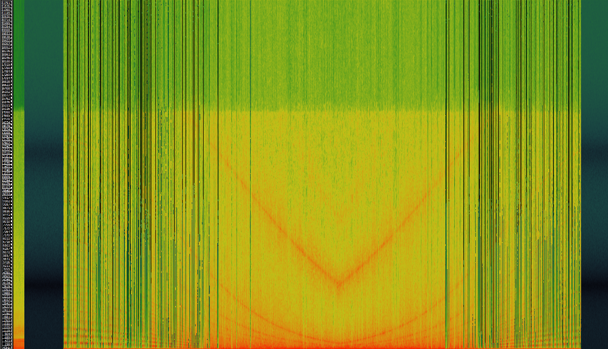
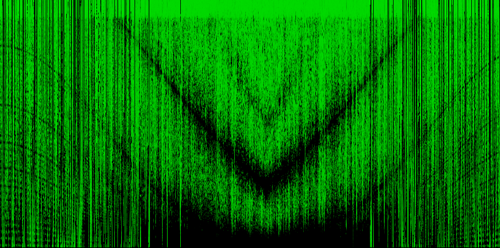
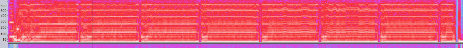
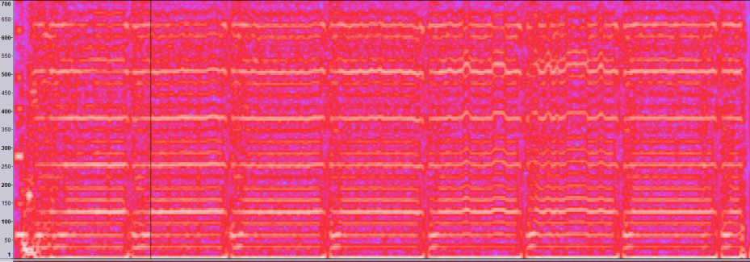
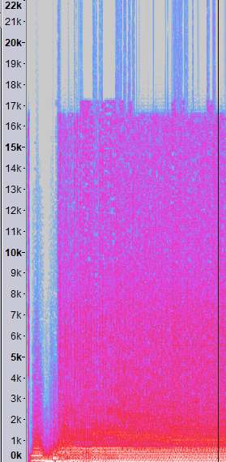
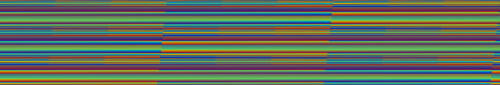
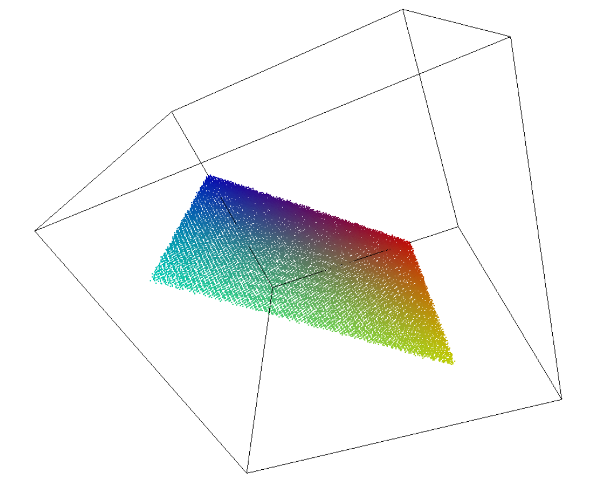

# MOTH

## Overview
♐MOTH is a [series](List_of_Series "wikilink") that was uploaded to the second Youtube account. The series started on January 29th, 2017, the same day as ♐[POINT](POINT "wikilink") started on Twitter. The series ended on March 9, 2017 with ♐MOTH 55. After the end of the series, the account was quiet for two weeks before posting ♐[GOLDEN](GOLDEN "wikilink").

♐MOTH is the series with the longest total video time.

## Description of videos
Each ♐MOTH video is 9:15:33 (33333 seconds) long at 30 fps, making it a million frames per video.

It is assumed that the audio in all ♐MOTH videos is identical. The first six videos have all been tested and are identical; ♐MOTH 32 has been tested and is identical to ♐MOTH 0.

### Irregularities
* ♐MOTH 46 was skipped in the uploading order and the series continued after it.
* ♐MOTH 47 was uploaded on 2017-03-01 and was slightly shorter than a regular video on this series at 9:14:38 (33,278 seconds). Although it seems substantially similar to the regular audio, differences in processing or possibly deliberate tampering have made it very slightly different so that it does not invert and cancel cleanly with the audio from other MOTH videos.
* ♐MOTH 55 has a length of 8:15:23 (29,723 seconds).

## Audio
MOTH videos have a [Handshake](Handshake "wikilink") at the start.

### Spectrographic image
The audio in ♐MOTH 0 contains a distinct visual pattern when viewed as a spectrograph (image by Salo):

Pattern high-light by Tukkek:

### Further analysis
Discord user Risto notes:
> This bit in ♐MOTH 0 stretches until about 15 seconds

> Those tones stretch up to 600 Hz." This is a zoomed-in view of the pattern above

Discord user Alex Bass Guy observes the changes are:
> more like 120ish hertz apart but evenly spaced; not exponentially spaced so they're not overtones.

Risto further notes:
> The audio caps at about 16.5 kHz

> The vertical lines are spectral leakage, because spectrograms
are not perfect.

## 2D composite

## 3D composite
Two screencaps of ♐MOTH 3-D composite by Vantjac:

Note that due to the immense number of data points this is not the complete series. However all points from further videos fall within the same plane.

This composite can be browsed in a 3-D projection [here](http://vanjac.github.io/sketches/ufsc3d/).

The [3D composite](3D_Composite "wikilink") of MOTH is a plane.

## Appearances elsewhere
Discord user Shadow Morphyn has noted that the ["other"](Real_and_Fake_channels "wikilink") [unfavorable semicircle](https://www.youtube.com/channel/UCA2j2wFhXsQej79c9V4v_Lg/) channel has apparently used a ♐MOTH video as the basis of [♐♐CULLET](https://www.youtube.com/watch?v=JZcmftIz-HM).

## Links
* ♐MOTH 0, https://www.youtube.com/watch?v=ajEWrLnaQfQ.
* ♐MOTH 1, https://www.youtube.com/watch?v=2lBifS_KPFU.
* ♐MOTH 2, https://www.youtube.com/watch?v=9ri8b7PPihU.
* ♐MOTH 3, https://www.youtube.com/watch?v=Dd2QxK76zYs.
* ♐MOTH 4, https://www.youtube.com/watch?v=VKsBpuOwNEU.
* ♐MOTH 5, https://www.youtube.com/watch?v=Nd4uu6bueh4.
* ♐MOTH 6, https://www.youtube.com/watch?v=BWBs6rtpsA0.
* ♐MOTH 7, https://www.youtube.com/watch?v=NriHXreRGCE.
* ♐MOTH 8, https://www.youtube.com/watch?v=OKRnRImMG7I.
* ♐MOTH 9, https://www.youtube.com/watch?v=vzYoDKtzhXw.
* ♐MOTH 10, https://www.youtube.com/watch?v=jNVlz_Ybdo8.
* ♐MOTH 11, https://www.youtube.com/watch?v=izRTDvLAp6I.
* ♐MOTH 12, https://www.youtube.com/watch?v=mmD7D3UDS94.
* ♐MOTH 13, https://www.youtube.com/watch?v=0YUUfLh1Gx8.
* ♐MOTH 14, https://www.youtube.com/watch?v=HLMX5BpIQBE.
* ♐MOTH 15, https://www.youtube.com/watch?v=h6CF4oME7yQ.
* ♐MOTH 16, https://www.youtube.com/watch?v=J5fGb6zDTPg.
* ♐MOTH 17, https://www.youtube.com/watch?v=LCgWVCB66A0.
* ♐MOTH 18, https://www.youtube.com/watch?v=8lwua9VOkjE.
* ♐MOTH 19, https://www.youtube.com/watch?v=DwVSv-aOPio.
* ♐MOTH 20, https://www.youtube.com/watch?v=s0_9kNviX5o.
* ♐MOTH 21, https://www.youtube.com/watch?v=MavLdJs54OU.
* ♐MOTH 22, https://www.youtube.com/watch?v=cl5Knwa7BFE.
* ♐MOTH 23, https://www.youtube.com/watch?v=V5rzESdHT_Q.
* ♐MOTH 24, https://www.youtube.com/watch?v=SQ7kiL8m63U.
* ♐MOTH 25, https://www.youtube.com/watch?v=8o8TEd831Bc.
* ♐MOTH 26, https://www.youtube.com/watch?v=TQSg6f-5AyA.
* ♐MOTH 27, https://www.youtube.com/watch?v=fyoHe8iitLc.
* ♐MOTH 28, https://www.youtube.com/watch?v=q_IlKofjsUI.
* ♐MOTH 29, https://www.youtube.com/watch?v=C8DpcFejdXs.
* ♐MOTH 30, https://www.youtube.com/watch?v=L11z6mZZk0k.
* ♐MOTH 31, https://www.youtube.com/watch?v=zz7A0BvIoGo.
* ♐MOTH 32, https://www.youtube.com/watch?v=51kkZYBRyEI.
* ♐MOTH 33, https://www.youtube.com/watch?v=NZHEaLId1NQ.
* ♐MOTH 34, https://www.youtube.com/watch?v=219Ka4rEKNw.
* ♐MOTH 35, https://www.youtube.com/watch?v=iFJ_hPPvEsE.
* ♐MOTH 36, https://www.youtube.com/watch?v=uVoWQ6dcd4g.
* ♐MOTH 37, https://www.youtube.com/watch?v=bgyC7SjRXjQ.
* ♐MOTH 38, https://www.youtube.com/watch?v=Jsn0l8BZMGM.
* ♐MOTH 39, https://www.youtube.com/watch?v=tvEfXJVIAP0.
* ♐MOTH 40, https://www.youtube.com/watch?v=PO3n_Z_Y_zc.
* ♐MOTH 41, https://www.youtube.com/watch?v=gou_ycFd7oU.
* ♐MOTH 42, https://www.youtube.com/watch?v=o1r8rTFQLGM.
* ♐MOTH 43, https://www.youtube.com/watch?v=X1sH8ABiDZY.
* ♐MOTH 44, https://www.youtube.com/watch?v=jses5NG7kb8.
* ♐MOTH 45, https://www.youtube.com/watch?v=xeKv6Gl6FkU.
* ♐MOTH 46 was not uploaded.
* ♐MOTH 47, https://www.youtube.com/watch?v=F2Z8wAX79hw.
* ♐MOTH 48, https://www.youtube.com/watch?v=bQux5Zaxb5g.
* ♐MOTH 49, https://www.youtube.com/watch?v=HhXXg9DtVLY.
* ♐MOTH 50, https://www.youtube.com/watch?v=3b-Y9TBhdXg.
* ♐MOTH 51, https://www.youtube.com/watch?v=D-nI3ddZByQ.
* ♐MOTH 52, https://www.youtube.com/watch?v=BzIdVU4NqiY.
* ♐MOTH 53, https://www.youtube.com/watch?v=mBxIli40TFY.
* ♐MOTH 54, https://www.youtube.com/watch?v=WjTrN7aqKtQ.
* ♐MOTH 55, https://www.youtube.com/watch?v=4J8WBi3Npwo.
