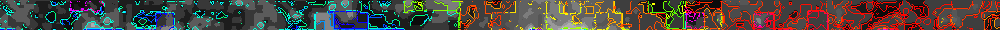
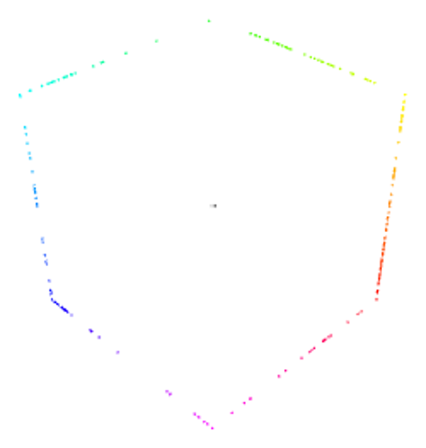

# NIL
♐NIL is a series of videos that was uploaded to the twitter account
between April 10 and June 6, 2016. It is a large series of over thirty
thousand videos.

After posting an [unnamed series](April_10_twitter_series) of
tweets, ♐NIL was posted in fits and starts, sometimes stopping for hours
and then days before resuming.

♐NIL 30661 was posted on May 15 (shortly before the
♐[BRINE](BRINE) series began on youtube) but the final ♐NIL
tweet
[♐NIL 30662](https://twitter.com/unfavorablesemi/status/743498928180563968)
wasn't posted until June 16, alongside two unnamed videos (♐658427 +
♐[574016](574016)).

The videos in this series are in the "classic" UFSC style, three second
long videos, with frames of a single color and the [Unknown Voice](Unknown_Voice) saying a letter or number. The vast
majority (or, although is not proven, all) of the videos are 3134 bytes.

This series is well preserved, and the videos have been scraped.
Composites have been made.

## Composites
NIL is part of the [BRILL Composite](BRILL_Composite) group.
NIL's composite is almost identical to [BRILL](BRILL), with
the exception of colored lines, which divide the composite up into
different portions (?)

Combined NIL composite:

Unaltered: <http://tomasf.se/projects/semi/nil/composite.png>

Brightness:
<http://tomasf.se/projects/semi/nil/NIL_composite_brightness.png>

Hue: <http://tomasf.se/projects/semi/nil/NIL_composite_hue.png>

Combined: <http://i.imgur.com/AbJboYf.png>

3D composite by Lukidot:

## Relationship of composites

NIL's composite is very similar to [BRILL's](BRILL). And [it has been postulated](https://www.reddit.com/r/UnfavorableSemicircle/comments/4hw7q0/end_of_nil/)
that the NIL composite is the same image as ♐[N\* BRILL](N*_BRILL) and ♐[BRILL 49999](BRILL_49999),
depicting the same topological structure, but at different zoom levels.
The features are larger in some of them and smaller in others.

## Transcription
A transcription of all the videos is available
[here](http://tomasf.se/projects/semi/nil/).

### Possible cipher data
The transcription corresponds closely with a [Bifid cipher](https://en.wikipedia.org/wiki/Bifid_cipher) using a 6×6 Polybius
square, according to a [cipher comparison utility](http://bionsgadgets.appspot.com/gadget_forms/refscore_extended.html).

For more investigation, a brute force or dictionary attack can be done
using the
[CryptoCrack](https://sites.google.com/site/cryptocrackprogram/home)
utility.

## Links
* Curiously, an advanced Twitter search of the ♐NIL series only returns the final tweet, https://twitter.com/search?q=%E2%99%90nil%20from%3Aunfavorablesemi&src=typd.
