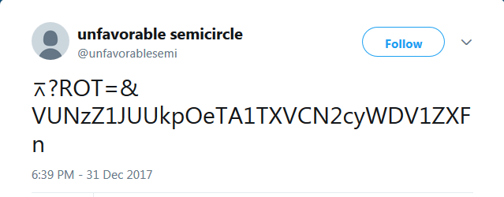

# NYE tweet

A tweet with cryptic text was
[posted](https://twitter.com/unfavorablesemi/status/947613244260343808)
to the [Twitter](Twitter) account on December 31, 2017 at
6:39 PM EST. (This was four days after ♐[REVI](REVI) was
posted to the twitter account.) Decoding this lead to the discovery of
of the [3rd youtube channel‎](3rd_youtube_channel‎).

The text of the tweet is:

> ⌅?ROT=\&VUNzZ1JUUkpOeTA1TXVCN2cyWDV1ZXFn

## Meaning of the text

The symbol ⌅ can be used to mean [Projective space](https://en.wikipedia.org/wiki/Projective_space).

## Decoding the text

It was discovered by Discord user Peter that the text string is encoded
in base64, which decodes to the string"UCsgRTRJNy05MuB7g2X5ueqg". That
string of characters appears in the address of the [3rd youtube channel‎](3rd_youtube_channel‎).
