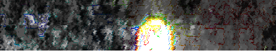

This is a series posted to the new youtube account between July 12 and
13, 2016. There are ten videos in the series, named with 6-digit
numbers.

## Videos

  - ♐260265
  - ♐673624
  - ♐160096
  - ♐629096
  - ♐544105
  - ♐537539
  - ♐953125
  - ♐254167
  - ♐347862
  - ♐113450

## Composite

<http://tomasf.se/projects/semi/numbered_2016-07-12_composite.png>

The composite is visually similar to the [BRILL-based composites](BRILL_Composite "wikilink"), but the colors are altered.
Specifically, the hue is mirrored across the 120 / 300 degrees axis
(green / magenta).

Here is the image with the hue altered to match other BRILL-based
composites:

