# Original Unnamed Series

The "original unnamed series" consists of over 48,000 videos uploaded to the [first YouTube channel](Real_and_Fake_channels "wikilink") between April 5, 2015 and February 25, 2016. It includes the first known video posted to the channel (♐980708) as well as the last (♐612831). All titles in this series consist of the Sagittarius symbol (♐) followed by a seemingly randomly generated number ranging from 23 to 999997. Many videos share the same titles. 26 distinct sub-series (seasons) have been identified within the original unnamed series. The audio and visual content of these videos has been the subject of much analysis.

48258 videos from this series have been [archived](archives "wikilink"), though it is unknown if this constitutes the full extent of the series.

## Video and Audio Analysis

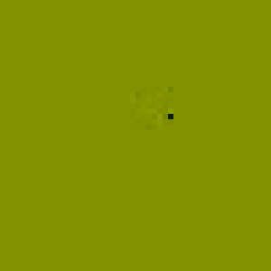

All videos in this series have a resolution of 50 x 50 and play at 30 fps. The vast majority are 4 seconds long, though some are considerably longer. Videos feature a solid background color with a single black pixel (dot) at a seemingly random location. A compression artifact is typically seen around the dot, and in some videos the dot is obscured or absent entirely. Both the background color and dot location remain static throughout the video duration.

Many videos feature readings by [the unknown voice](Unknown_Voice "wikilink"). Audio heard in this series includes:
  - a single letter or digit spoken aloud
  - a full set of letters (A-Z) and digits (0-9) spoken aloud
  - thumping or mic bump sounds
  - fragments from the "calliope" music heard in [♐DELOCK](DELOCK "wikilink"), played at various speeds
  - various tones and distorted sounds
  - silence

[Extracted data for each archived video can be found here!](og_manifest.csv "wikilink")

### GSM

In December 2024, after the discovery of GSM-like audio in [Lock](LOCK): Discord user `Fufeng Industries` says:

> "example.wav" is the exact same sound from the numbered series, I will find it and repost it here so it will be easier to compare.
>
> There are 40 videos in the numbered series that have this specific sound in them.
>
> I have slowed the audio from the numbered series video "♐337321-aVuE7bgfPuI" and have been granted LOCK-esque wubbs:

[Audio](OUS_SLOWED0.013.mp3).

> I took the LOCK audio, separated the right channel and sped it up 77 times. Behold, this is the GSM-type sound that was just discussed:

[Audio](OUS_LOCK_SPED_RIGHT.mp3).

## Seasons

Reddit user u/McSweepyPants first noted in [a post on the subreddit](https://www.reddit.com/r/UnfavorableSemicircle/comments/46zwat/breakdown_of_todays_findings_february_22nd_2016/) the existence of several sub-series within the original unnanmed series, which he dubbed "seasons". Further analysis of upload dates, composites, and transcripts has led to the identification of 26 distinct seasons within the original unnamed series.

| Number | Upload Date | Number of Videos | Composite | Audio | Notes
| :-: | :-: | :-: | :-: | :-: | --- |
| 1 | April 5, 2015 | 1247 | 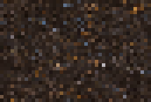 | Silence | |
| 2 | April 7, 2015 | 150 |  | Letters, digits | |
| 3 | April 7, 2015 | 565 | 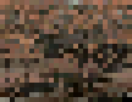 | Letters, digits| |
| 4 | April 8-9, 2015 | 6135 | 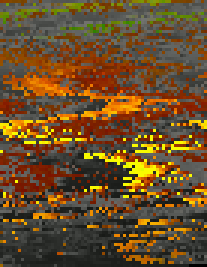 | Letters, digits| There is a 1 hour gap in the uploading of this season. |
| 5 | April 9-10, 2015 | 5301 | 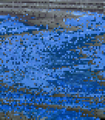 | Letters, digits| This season was uploaded less than 4 hours after the previous season's conclusion. |
| 6 | April 13, 2015 | 4102 | 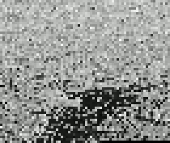 | 1s and 0s | |
| 7 | April 17-20, 2015 | 7382 | 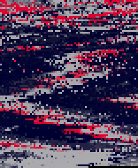 | 1s and 0s (first 270), letters, digits | There are multi-hour gaps in the uploading of this series. |
| 8 | April 22, 2015 | 261 | 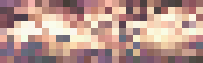 | Letters, digits | |
| 9 | May 27-28, 2015 | 1424 |  | 1s and 0s. | There are small gaps in the uploading of this series. |
| 10 | May 28 - June 10, 2015 | 5897 | 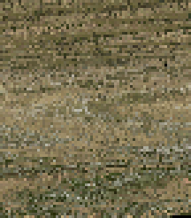 | 1s and 0s | |
| 11 | June 12, 2015 | 411 | 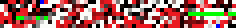 | Letters, digits | This season has not been fully transcribed. |
| 12 | June 12, 2015 | 302 |  | Thumping, scraping, long silences, 3 | Auto-hashing identifies a spoken "3" in some videos, but this may be a transcription error. |
| 13 | June 17, 2015 | 807 | 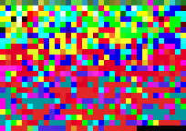 | Letters, digits | This season has not been fully transcribed. |
| 14 | June 18, 2015 | 596 | 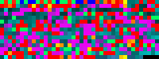 | Letters, digits | This season has not been fully transcribed. |
| 15 | August 10, 2015 | 396 | 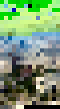 | Distorted sounds, tones | |
| 16 | August 11, 2015 | 7507 | 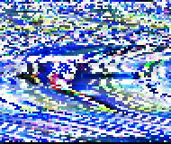 | Letters, digits | This season has not been fully transcribed. |
| 17 | August 12, 2015 | 5367 | 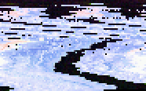 | Digits | |
| 18 | August 14, 2015 | 3 |  | Letters, digits | |
| 19 | December 25, 2015 | 5 |  | Letters, digits | |
| 20 | December 26, 2015 | 173 | 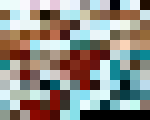 | Odd music, letters, digits| |
| 21 | December 28, 2015 | 23 |  | Loud tones | All videos in this season feature similar audio, possibly the exact same. |
| 22 | December 28, 2015 | 75 | 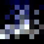 | Silence | |
| 23 | January 6, 2016 | 100 |  | Silence | |
| 24 | February 5, 2016 | 6 |  | NA | This season has not been fully transcribed. |
| 25 | February 5, 2016  | 9 |  | NA | This season has not been fully transcribed. |
| 26 | February 20-25, 2016 | 15 | 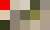 | NA | This season has not been fully transcribed. |

## Audio composite

In July 2024, user `N25_CT13` found and colorized this [audio composite](audio_composites) from ♐970558:

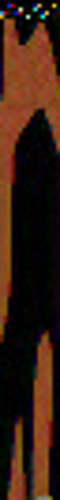

## 3D composites
Created by Lukidot.

All seasons:

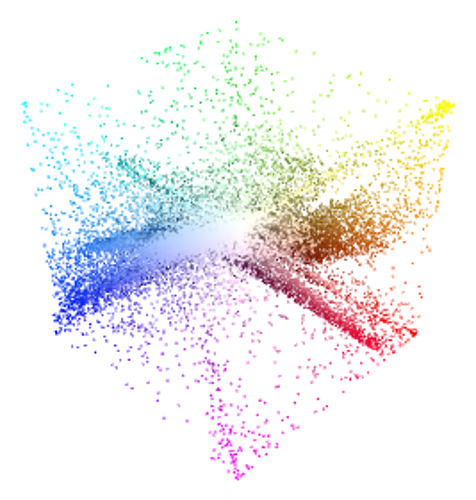

Season 1:

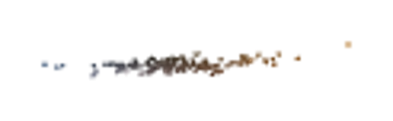

Season 2:

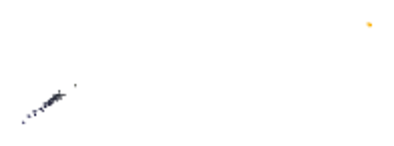

Season 3:

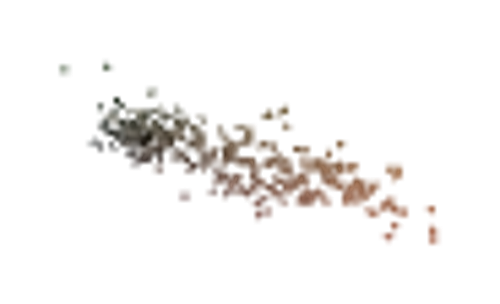

Season 4:

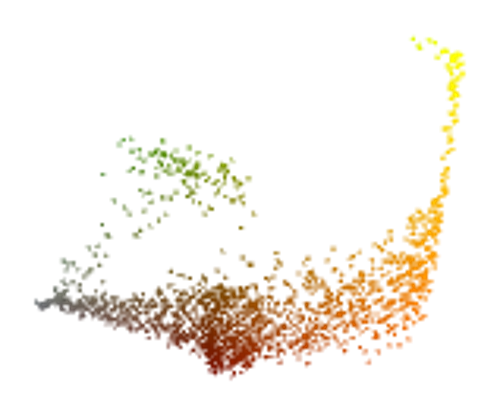

Season 5:

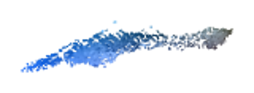

Season 6:

Season 7:

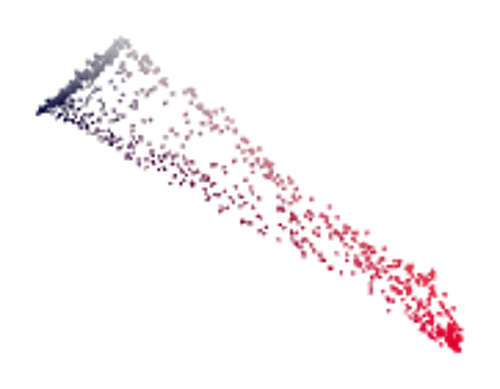

Season 8:

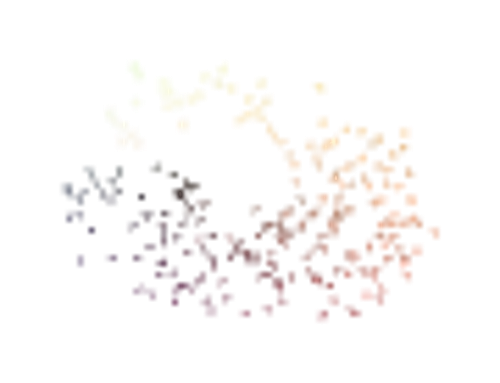

Season 9:

Season 10:

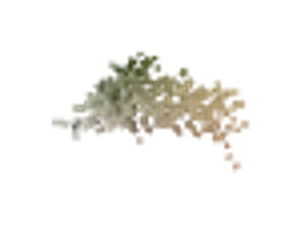

Season 11:

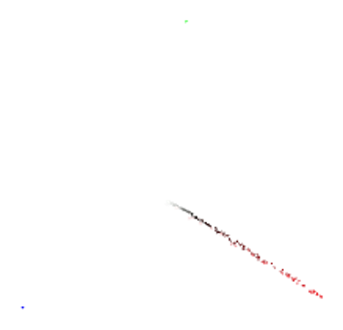

Season 12:

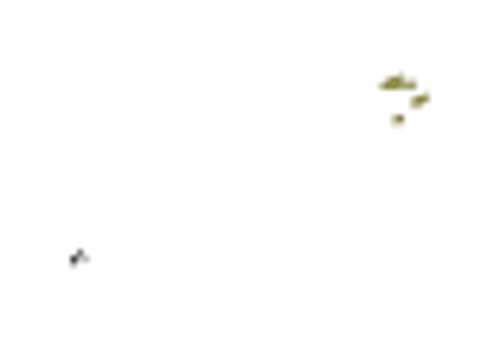

Season 13:

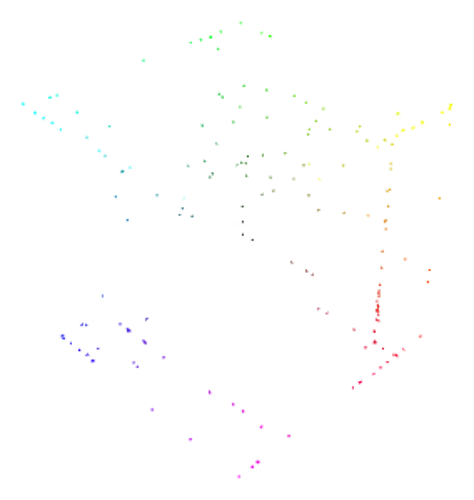

Season 14:

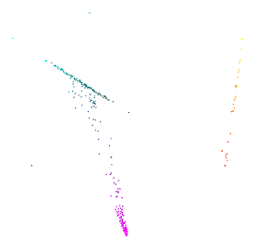

Season 15:

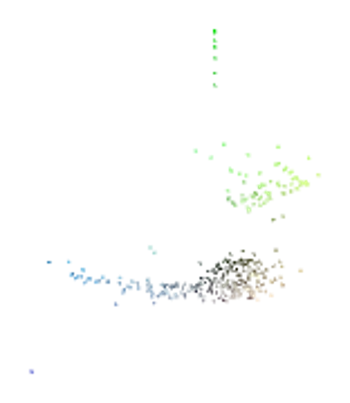

Season 16:

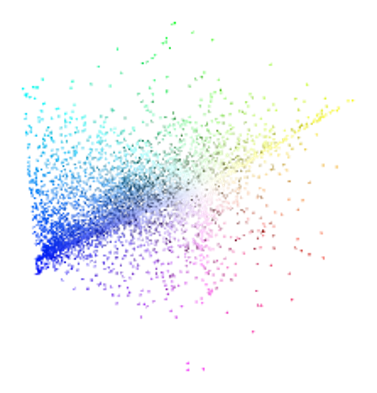

Season 17:

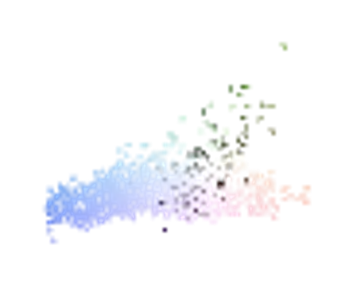

Season 18:

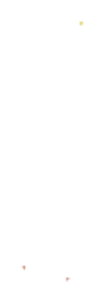

Season 19:

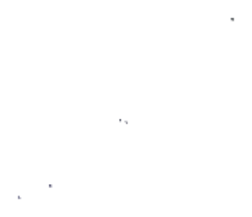

Season 20:

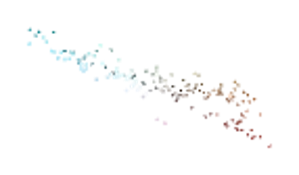

Season 21:

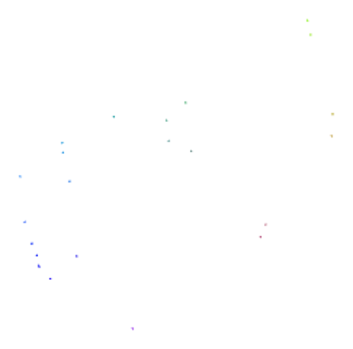

Season 22:

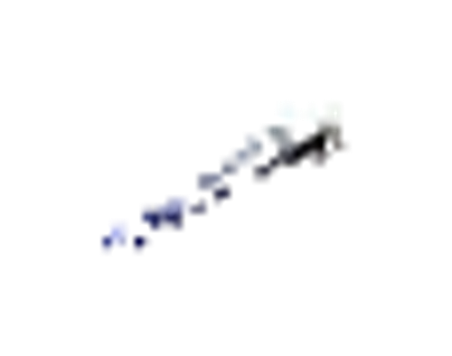

Season 23:

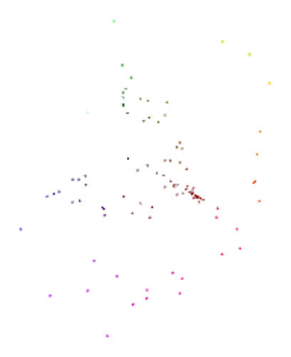

Season 24:

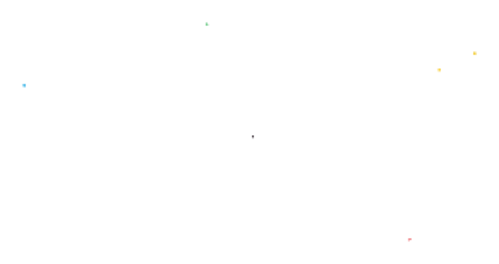

Season 25:

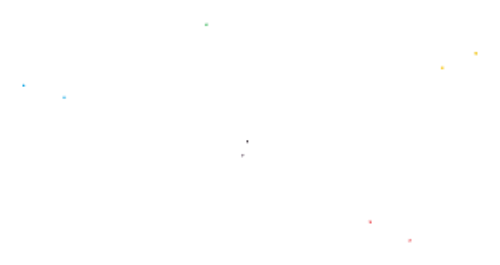

Season 26:

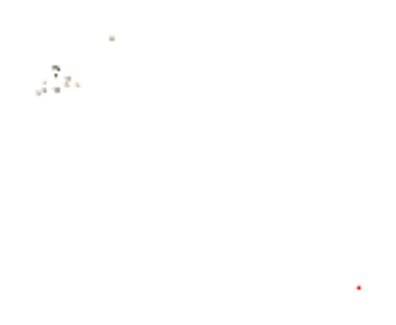
