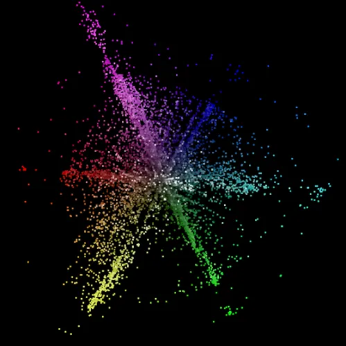
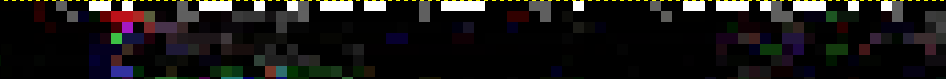
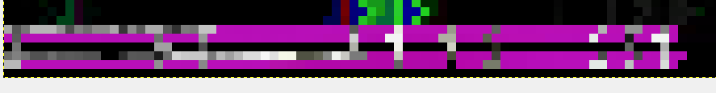
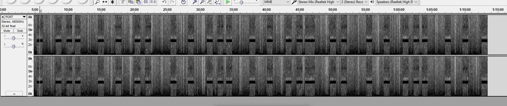

# PORT

♐PORT is a video posted to the [3rd youtube channel](3rd_youtube_channel) account on December 31, 2017.
It is 1:13:38 (however due to encoding errors it only shows up as
1:13:29) long and contains a series of moving images. The 3rd youtube
channel was opened on December 10th, but undiscovered until decrypting
the [New Year's Eve tweet](NYE_tweet) on January 1, 2018.

## Title
The word "port" has [multiple meanings](https://en.wikipedia.org/wiki/Port_\(disambiguation\)), but
most interestingly it could refer to:

  - [adapting software from one platform to another](https://en.wikipedia.org/wiki/Porting)
  - several nautical terms (similar to ♐[HULL](HULL) and
    ♐[BRINE](BRINE)) (*observed by Discord user yam00*)

## 2D composite
Composite by Discord user Extra:

## 3D composite

### Details in composite
User [unstable olding](unstable_olding) noticed there are
"dots and dashes" (similar to ♐[DEPTH](DEPTH)) in the top
left corner that could be Morse Code:

This has been decoded by Discord user ShadowMorphyn as "NDMTEGD".

There appears to be a string of letters and numbers in the bottom left
corner:

Discord user Unfavorablist spotted the two "1"'s in the centre-right
portion. The entire string might be "5 T 1 1 S S 5 1".

## Audio analysis
There is an intermittent high-pitched tone throughout the audio track.
Visual analysis of the spectrogram shows 28 such bursts:

Spectrogram by Discord user Shadow Morphyn:

Closer observation shows there are, in fact, four high-frequency
"spikes" in the audio: the largest at 2815 Hz, and then at roughly 5600
Hz, 8490 Hz and 14200 Hz.

Frequency analysis by Discord user Unfavorablist:

(An audio sample with those high frequencies removed can be heard
[here](https://clyp.it/0pvvwt0g).)

Also of note is that it appears that all audio frequencies above 13,000
Hz have been cut.

Underneath that high tone and throughout the track is a sputtering
stereo track with almost musical features that may or may not be looped
throughout the duration of the file. Near the end of the track, there is
the normal audio but with a higher pitch.

## Links
* https://youtu.be/ATWYnH7yFfE.
