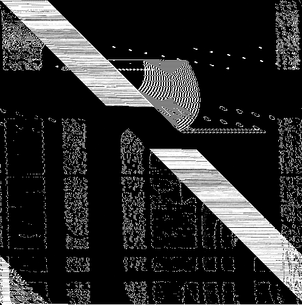
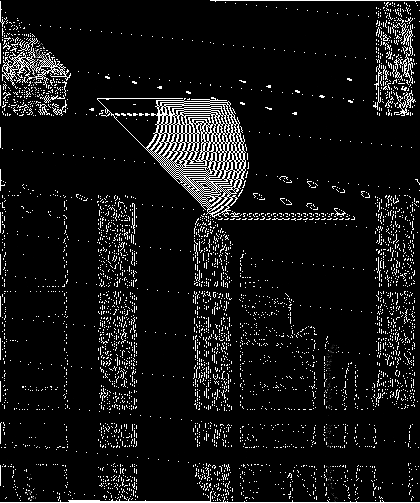

# RAPID
♐RAPID is a video posted to the second youtube account on November 11, 2016.

## Description of video
At 9:43:20 (35,000 seconds), this is one of the longest videos posted by
Unfavorable Semicircle. The visuals contain a flickering series of
monochrome frames.

The audio is a mono track with a variety of data transmission type
sounds throughout.

## Audio analysis
The audio is a mono track with heavily-distorted spoken words. It is
difficult to confirm if it is the [Unknown Voice](Unknown_Voice) or not.

Discord user ErasablePotato has observed the words sound like the [NATO phonetic alphabet](https://en.wikipedia.org/wiki/NATO_phonetic_alphabet), as used
in
[HFGCS](https://en.wikipedia.org/wiki/High_Frequency_Global_Communications_System)
messages. (*[sample](https://www.youtube.com/watch?v=Xi6d7F0Z3I0)*)

The audio has a distorted [Handshake](Handshake) at the start
and at the end. Discord user Risto has observed that that creates one
half of the "Pisces symbol" in the initial Handshake, and the other half
at the end:

| start of file                                                                         | end of file                                                                     |
| ------------------------------------------------------------------------------------- | ------------------------------------------------------------------------------- |
|  |  |

## Significance of posting date
♐RAPID was posted on November 11th, known as Veterans Day in the U.S.A.
and Remembrance Day in Commonwealth nations. It's worth noting that many
non-series videos were posted on holidays, such as HARVEST being posted
on Canadian Thanksgiving and BRILL B being posted on Valentine's day.

## Composites
♐RAPID composite by Thomas F:

There is some variability in the alignment of the image depending on the
width used in constructing the composite. Here is the composite with a
width of 497 instead of 498.

A sub-section of the composite pixel-shifted by `+0.00233`:

3D composites by Lukidot:

## Links
* https://youtu.be/kvNPLt9dp_8.
