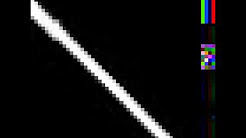

♐RECOVER is a video posted to the second youtube account on September
23, 2016. It was the first video posted since
♐[MAX\_TEND](MAX_TEND "wikilink") on July 14th.

{{\#ev:youtube|<https://youtu.be/bA3et1jJVuM>}} [Original
Link](https://youtu.be/On5s_K6u104)

## Description of video

The video is 0:07 in duration. The visuals contain black and white
horizontal lines before a flickering series of vertical lines (first
black and white, later blue and cyan.)

the audio is a stereo track with totally separate information in each
channel. The left has a "lockgroove" sound, like a record needle, which
appears to be the same sound repeated 3 2/3rds times (the file ends
during the 4th repetition). The right channel has two "pure" tones,
similar to data or test tones. The second, higher one has a significant
amount of [DC offset](DC_offset "wikilink").

## Composite

A composite of the various frames illustrates how the lines are
continuous with each other.

*RECOVER composite, frames re-arranged horizontally*

## See also

  - [Max](Max "wikilink") (software)
