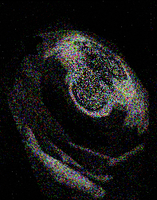
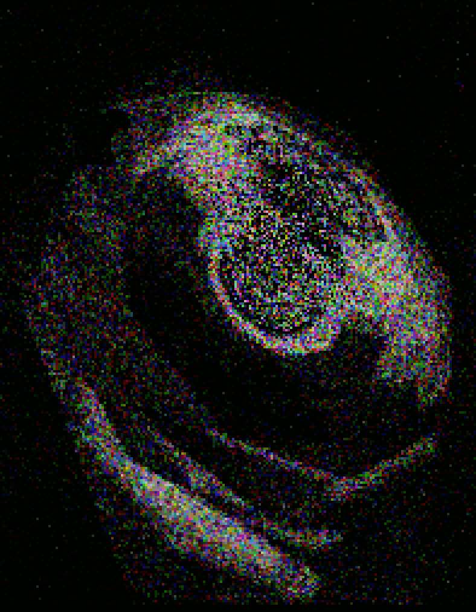

♐RELOCK is a video posted to the [second youtube account](Real_and_Fake_channels "wikilink") on February 21, 2016. It was
the first video posted to the new youtube account.

  - Original link (deleted)
    <https://www.youtube.com/watch?v=9pV9mwnaeVA>
  - Mirror
    <https://goblinrefuge.com/mediagoblin/u/dances-with-shills/m/relock/>

## Description of video

The video is 27:25 in duration. It contains a stereo audio track of
buzzing electronic noises. It was noted the beginning of the video
contains faint "music" like sound similar to that of DELOCK and RETIO.
The visuals contain a series of frames.

### audio observations

Discord user ahiddenwaffle has noted that there are "sections" in the
audio, with gaps of silence roughly every 8 seconds.

## Composite Image

The composite of RELOCK is very similar, but not identical, to
[LOCK](LOCK "wikilink").

<http://tomasf.se/projects/semi/RELOCK_composite.png>

This animation shows the difference between the RELOCK and LOCK
composite. RELOCK has additional noise in the background, and in LOCK
many of the pixels extend one pixel to the right.

