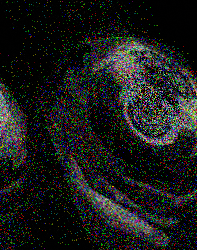
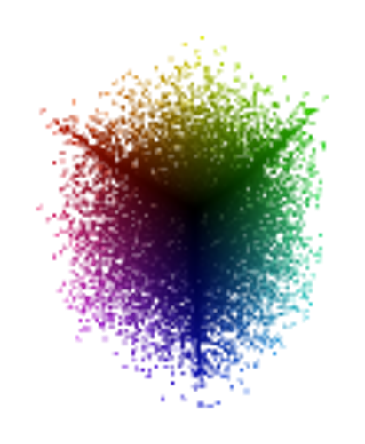
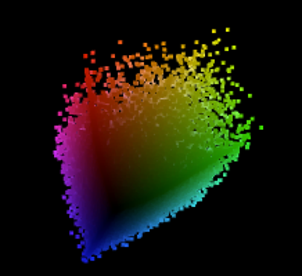

# RELOCK
♐RELOCK is a video posted to the [second youtube account](Real_and_Fake_channels "wikilink") on February 21, 2016. It was
the first video posted to the new youtube account.

## Description of video
The video is 27:25 in duration. It contains a stereo audio track of
buzzing electronic noises. It was noted the beginning of the video
contains faint "music" like sound similar to that of DELOCK and RETIO.
The visuals contain a series of frames.

### Audio observations
Discord user ahiddenwaffle has noted that there are "sections" in the
audio, with gaps of silence roughly every 8 seconds.

## 2D composite
The composite of RELOCK is very similar, but not identical, to
[LOCK](LOCK "wikilink").

This image highlights the mismatching pixels between LOCK and RELOCK, with the differences being too subtle to notice through a visual inspection only.

## 3D composites 

By Lukidot:

By Tukkek:

## Links
* Original link (deleted), https://www.youtube.com/watch?v=9pV9mwnaeVA.
* Mirror, https://goblinrefuge.com/mediagoblin/u/dances-with-shills/m/relock/.
