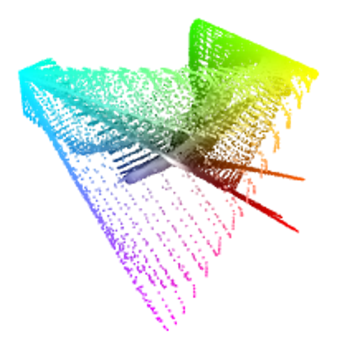

# REVI
♐REVI is a video
[posted](https://twitter.com/unfavorablesemi/status/946188691042684929)
by the Unfavorable Semicircle [Twitter](Twitter "wikilink") account on
December 27, 2017 at 8:18 PM EST. It is 41 seconds long. It was posted
four days after the ♐[STRAND](STRAND "wikilink") series. The twitter
account was silent until posting four days later on [New Year's Eve](NYE_tweet "wikilink").

{{\#ev:youtube|<https://youtu.be/UY7M225eQ8A>}} (*backup of video posted
to youtube by discord user unstable olding*.)

## Title
It has been noted by Discord user scottywiththebody that *Yom Reviʻi*
(יום רביעי‬ \[abbr. יום ד׳‬\], meaning "fourth day" and corresponding
to Wednesday) is a day in the Hebrew calendar. (see also
♐[ZUFCHO](ZUFCHO "wikilink").) ♐REVI was posted on December 27, 2017
which was, in fact, a Wednesday.

"Revi" is also the username name of a wikipedia steward, and is the name
of a miraheze staff member.

## Composite

(*composite at width of 37 pixels by discord user extra*)

This short video makes a small composite that doesn't seem to make a
specific image.

Discord user unfavorablist has noted that the horizontal red lines in
the top half are reminiscent of ♐[CREM](CREM "wikilink").

3D composite by Lukidot:

