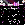
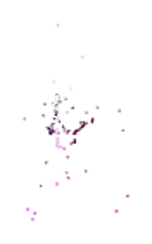

# RIA
♐RIA is a series of videos that was uploaded to the twitter account
between March 12 and March 13, 2016. It is the second series posted in
the twitter account, following ♐[EL](EL).

The videos in this series are in the "classic" UFSC style, three second
long videos, with frames of a single color and the [Unknown Voice](Unknown_Voice) saying a letter or number.

This series has been partially preserved (214/624 videos)
[here](https://mega.nz/#!lnh0jQ6A!L22kcSuCJDYV4vuL0btcdjsNP7BHdCcibLUgNwxYAv4).

## Composites
This composite was made with 214 out of the known 624 videos:

The same composite pixel-shifted by `+0.04` and manually realigned:

3D composite by Lukidot:

