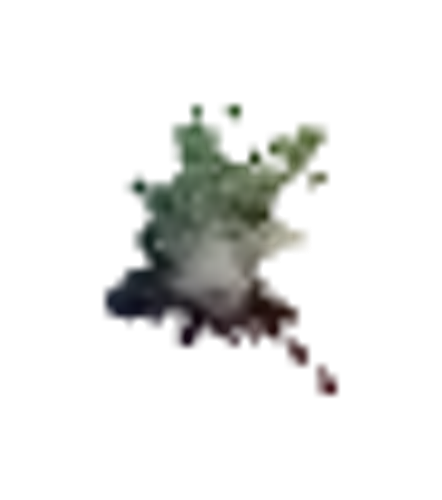
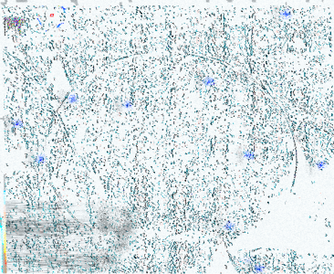

# SECOND
♐SECOND is a "double series" of videos currently uploaded to the
[Twitter](Twitter "wikilink") account. It began on December 9th, 2017 at
2:27 PM EST and was the second post
"[reset](RESET_STRANGE_YD "wikilink")" series, following
♐[FMI](FMI "wikilink"). Videos with increasing numbers were uploaded
to
[♐SECOND 926](https://twitter.com/unfavorablesemi/status/939728823721000960)
(posted at 12:29 AM EST on December 10th), and then two minutes later
posting resumed, starting once again at
[♐SECOND 0](https://twitter.com/unfavorablesemi/status/939729238529323009).

It appears that the "second" ♐SECOND series (which is also referred to
as SECOND II) has different content than the first, and the series has a
greater number of videos. As has been seen previously on the twitter
account, bursts of tweets have alternated with periods of inactivity
(possibly imposed because of twitter's posting limits). For example, the
second series added videos continuously until posting
[♐SECOND 1807](https://twitter.com/unfavorablesemi/status/940026397648711680)
at 8:12 PM on December 10th. After that, an additional ♐SECOND 771 was
posted at 8:14 PM, and deleted shortly thereafter before posting
resumed. After
[♐SECOND 1980](https://twitter.com/unfavorablesemi/status/940075767521669120)
there was a substantial break of over 18 hours.

After ♐SECOND 4899 was posted at 5:24 PM EST on December 13, 2017
posting stopped. Posting to the twitter account resumed ten days later
with the ♐[STRAND](STRAND "wikilink") series.

## Characteristics and Questions of Authenticity
Videos were tweeted continuously (generally every 40 seconds) during the
afternoon/evening (EST) of December 9th, and then steadily when not
taking breaks. All videos are 72 seconds long (1:12).

Discord user extra notes:
- the videos are 72 seconds long, and therefore should have had 72\*30
  (2160) frames per video;
- however, there are only 1800 frames, which could only happen at 25
  fps, even though VLC says they are encoded at 30 fps

At 1:12, ♐SECOND videos are longer than past twitter series. This could
be the sign of a different "author" or simply UFSC taking advantage of
twitter allowing longer embedded videos than in the past (the maximum
length was changed to 140 seconds from 30 on June 21, 2016).

Some numbers (82, 249, 623, and 847 in the first series; 38, 48, 117,
218, 981, 1060, 1191, 1873, 1749, 1608 in the second) were skipped
during the posting (and please note this list is probably incomplete).
This is noteworthy for two reasons:
- This has been generally rare behavior by UFSC, leading credence to
  the theory that post-♐[RESET STRANGE YD](RESET_STRANGE_YD "wikilink") is not the same creator as before.
  The only evidence of skipped numbers comes from
  ♐[LEE](LEE "wikilink") and ♐[MOTH](MOTH "wikilink") (and later,
  ♐[STRAND](STRAND "wikilink")).
- An open question has always been how much of the workflow of
  producing and uploading the videos is automated. Many factors point
  out that it is, at least, partly automated: for example, the precise
  uploads every 40 seconds (for this series) and the time spent
  uploading such a large number of videos in sequence, which would be
  unfeasible for a human to keep up with. On the other hand, computer
  programs and tools don't "skip" numbers unless explicitly instructed
  to do so. Since the numbers in question seem entirely random, this
  should point out to some form of human mistake or intervention -
  perhaps some quality assurance determining that number 82 and 249
  weren't up to expectations (or perhaps the process that creates
  videos just failed for those particular steps, maybe by having
  invalid parameters or resulting in pipeline execution errors).

## Audio
There appears to be a smaller number of audio tracks that are reused
many times.

Videos 246 and 247 seems to have an audio track shorter than the full
length of the video itself.

The audio is notably different than that of pre-Reset series. They have
been described as more aggressive, louder and scarier - as if previous
videos were "creepy" because they sounded entirely abstract but with
these new ones actually making an effort to be offensive to the senses.

Some patterns are repeated, like the high-pitched "alarm" noises in
[♐SECOND 503](https://twitter.com/unfavorablesemi/status/939659564466786304)
and
[♐SECOND 506](https://twitter.com/unfavorablesemi/status/939660051660328960).

## Title
"Second" most likely would mean that this is the second series after
♐[RESET STRANGE YD](RESET_STRANGE_YD "wikilink") (after
♐[FMI](FMI "wikilink")). It could also mean that the author is not the
original one but the "second" UFSC - someone who was asked to replace
the first or just stepped up to the task after reclaiming the Twitter
account - even if this latest series has a definite authentic feel to
it, more so than the latest series.

## Implications of two series
UFSC has previously had complementary series and videos, most notably
♐[BROTHER](BROTHER "wikilink") and ⊕BROTHER. There have also been
"replacements" (such as ♐[RESQEN](RESQEN "wikilink") for
♐[SQEN](SQEN "wikilink")). Although the latter seems more clearly a
"fixed" replacement version, the relationship between the two BROTHER
series in unclear — and it is unclear whether the second SECOND series
is meant to be a contrast/comparison of some sort, or a restart after
correcting errors.

## Composites

(*composite of series II by extra. Note that due to wiki limitations
this is currently being posted in a lossy jpg version.*)

3D composite by Lukidot:

### Details in composites

(Detail of "square" section, from an earlier version of the composite).

There is a richness of detail in this composite, especially in the
"square" section of the image, including what may be hidden patterns.

- there is an intruiging "constellation" of red dots in this area that
  can be better seen in this inverted/color adjusted edit (by discord
  user ShadowMorphyn) where the dots appear in blue:

this has been observed to possibly correspond with the stars in the
constellation Sagittarius.

## Links
* [November 25th tweet‎‎](November_25th_tweet‎‎ "wikilink")
