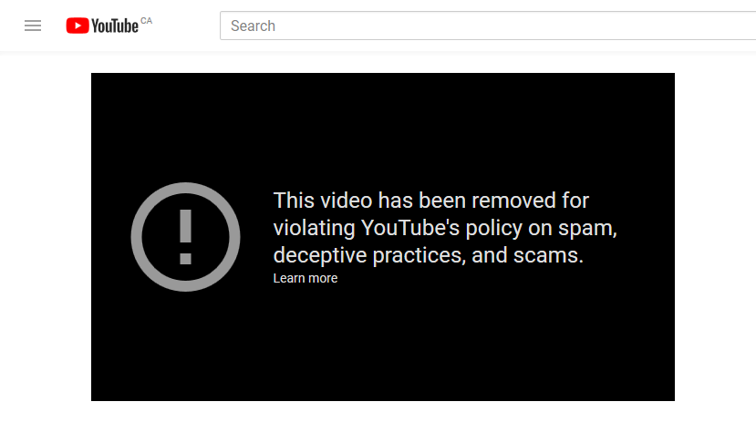

# SERN

♐SERN is a video posted to the [3rd youtube channel](3rd_youtube_channel) account on January 26, 2018. It
is 1:01:12 long and contains a single image (held constant through 1239
frames — *confirm\!*). It was posted 4 days after
♐[NODE](NODE). The video was removed by Youtube on or
before February 19, 2018.

{{\#ev:youtube|<https://youtu.be/ISP-W5W8g9w&t>}}

## Audio

The audio track is mostly silent, except for sounds at the very
beginning and end:

  - at the start there is a distorted "UFO"/warble sound
  - at 1:00:58 the [Unknown Voice](Unknown_Voice) speaks the
    following letters: GUOEN3S (*the letter "G" sounds unclear, but it
    has been checked and confirmed against the alphabet set from the
    original youtube channel. The remaining letters sound correct but
    have not been confirmed with waveforms yet.*.)

Those sounds, with the silence between them removed can be heard
[here](https://clyp.it/kqlvecd5).

## Video

As a single, still image, SERN is similar to
♐[MAX\_TEND](MAX_TEND), ♐[BRILL B](BRILL_B), [♐
(nameless video)](♐_\(nameless_video\)),
♐[SQEN](SQEN), ♐[RESQEN](RESQEN),
♐[LIMIT](LIMIT), ♐[LONE](LONE),
♐[HOLDOUT](HOLDOUT),
♐[RESET\_STRANGE\_YD](RESET_STRANGE_YD),
♐[ZUFCHO](ZUFCHO) and ♐[OR](OR).

## Meaning of Title

Although SERN does have a meaning in [the field of rocketry](https://en.wikipedia.org/wiki/SERN), there are more
interesting connections with
[sern.js](https://github.com/dannyvassallo/sernjs), "a Full-Stack
Javascript for an easy starting point with SequelizeJS, ExpressJS,
PassportJS, ReactJS and NodeJS based applications", as this ties in
conceptually with the previous third account youtube titles
(♐[NODE](NODE), ♐[RUN](RUN), and
♐[PORT](PORT)).

## Composite

With a constant image, this is an unsuitable candidate for making a
composite.

## Removal

On or before February 19, 2017, ♐SERN was removed "for violating
YouTube's policy on spam, deceptive practices, and scams." This removal
was first observed by Discord user Peter on February 19, 2017.

Just over a week before the removal of the video, UFSC was listed at \#2
in a [popular youtube video](https://youtu.be/JNWwVDkj24g) by The
Infographics Show called "What Are The Weirdest Unsolved Internet
Mysteries?", which lead to a surge of interest and new viewers. Whether
this attention is related to the removal of ♐SERN is unclear, but it is
possible.
