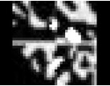

# ♐SQEN

♐SQEN is a video that was posted to the second youtube account on May 3, 2016. Unusually, it was deleted shortly thereafter and replaced by the similar ♐[RESQEN](RESQEN "wikilink").

Screenshot:

## Description of video

The video is 0:53 in duration. It has a still image of grey and white pixels against a black background. It contains a mono audio track of buzzing distorted noises.

## Audio & analysis

The third [tweet from June 2022](June_2022_twitter_posts "wikilink") included [a youtube link](https://youtu.be/68C1Gc4De7c) to the song "The Most Beautiful Day" by Professor Kliq. The lyrics of the song describe UFOs arriving on Earth. Discord user ShadowMorphyn posted that "that song they posted is definitely the sound for ♐[SQEN](SQEN "wikilink")".

## Significance of name and relationship to other videos

Maybe SQEN is a draft-video and the next is RESQEN. But the content isn't so similar. What do you think?

## Composites

_this style of video does not have a composite embedded._
